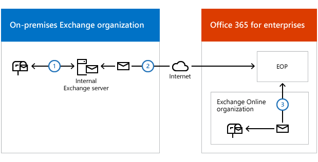
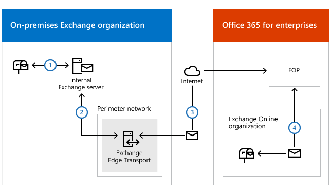

# Edge Transport servers with hybrid deployments

The Edge Transport server role is an optional role that's typically deployed on a computer located in an Exchange organization's perimeter network and is designed to minimize the attack surface of the organization. The Edge Transport server role handles all internet-facing mail flow, which provides SMTP relay and smart host services for the internal on-premises Exchange servers in your organization.

## Edge Transport servers in Exchange-based hybrid deployment organizations

Exchange 2016 organizations that want to use Edge Transport servers have the option of deploying Edge Transport servers running the latest release of Exchange 2010 or later. Use Edge Transport servers if you don't want to expose internal Exchange servers directly to the internet. When you deploy an Edge Transport server in a hybrid deployment, Exchange Online, via the Exchange Online Protection service, will connect to your Edge Transport server to deliver messages. The Edge Transport server will then deliver messages to the on-premises Exchange Mailbox server where the recipient mailbox is located.

> [!IMPORTANT]
> Don't place any servers, services, or devices that process or modify SMTP traffic between your on-premises Exchange servers and Microsoft 365 or Office 365. Secure mail flow between your on-premises Exchange organization and Microsoft 365 or Office 365 depends on information contained in messages sent between the organization. Firewalls that allow SMTP traffic on TCP port 25 through without modification are supported. If a server, service, or device processes a message sent between your on-premises Exchange organization and Microsoft 365 or Office 365, this information is removed. If this happens, the message will no longer be considered internal to your organization and will be subject to anti-spam filtering, transport and journal rules, and other policies that may not apply to it.    An Edge subscription is required for Exchange hybrid. If you have other Exchange Edge Transport servers in other locations that won't handle hybrid transport, they don't need to be upgraded to support a hybrid deployment. However, if in the future you want EOP to connect to additional Edge Transport servers for hybrid transport, they must be running the latest release of Exchange 2010 or later.

## Adding an Edge Transport server to a hybrid deployment

Deploying an Edge Transport server in your on-premises organization when you configure a hybrid deployment is optional. When configuring your hybrid deployment, the Hybrid Configuration wizard allows you to either select one or more internal on-premises Exchange servers, or to select one or more on-premises Edge Transport servers to handle hybrid mail transport with the Exchange Online organization.

When you add an Edge Transport server to your hybrid deployment, it communicates with EOP on behalf of the internal Exchange servers. The Edge Transport server acts as a relay between the internal Exchange servers and EOP for outbound messaging from the on-premises organization to the Exchange Online organization. The Edge Transport server also acts as a relay between the internal Exchange servers for inbound messaging from the Exchange Online organization to the on-premises organization. All connection security previously handled by internal Exchange servers is handled by the Edge Transport server. Recipient lookup, compliance policies, and other message inspection, continue to be done on the internal Exchange servers.

If you add an Edge Transport server to your hybrid deployment, you don't need to route mail sent between on-premises users and internet recipients through it. Only messages sent between the on-premises and Exchange Online organizations will be routed through the Edge Transport server.

> [!IMPORTANT]
> If you need to delete and recreate an Edge subscription that's used to communicate between your on-premises organization and Exchange Online, make sure to run the Hybrid Configuration wizard again. Recreating an Edge subscription removes configuration changes that are needed for your on-premises organization to talk to Exchange Online. Re-running the Hybrid Configuration wizard applies those changes again.

### Mail flow without an Edge Transport server

The following process and diagram describes the path messages take between an on-premises organization and Exchange Online when there isn't an Edge Transport server deployed:

1. Outbound messages from the on-premises organization to recipients in the Exchange Online organization are sent from a mailbox on an internal Exchange server.

2. The Exchange server sends the message directly to EOP .

3. EOP delivers the message to the Exchange Online organization.

Messages sent from the Exchange Online organization to recipients in the on-premises organization follow the reverse route.

**Mail flow in a hybrid deployment without an Edge Transport server deployed**

### Mail flow with an Edge Transport server

The following process describes the path messages take between an on-premises organization and Exchange Online when there is an Edge Transport server deployed. Messages from the on-premises organization to recipients in the Exchange Online organization are sent from the internal Exchange server:

1. Messages from the on-premises organization to recipients in the Exchange Online organization are sent from a mailbox on an internal Exchange server.

2. The Exchange server sends the message to an Edge Transport server running a supported version and release of Exchange.

3. The Edge Transport server sends the message to EOP.

4. EOP delivers the message to the Exchange Online organization.

Messages sent from the Exchange Online organization to recipients in the on-premises organization follow the reverse route.

> [!NOTE]
> Installing an Edge server and establishing an Edge subscription will impact your mail flow. This process automatically creates two Send connectors for internet mail flow: one to send e-mail to all internet domains, and another to send email from the Edge Transport server to the internal Exchange organization. Please review the connectors and mail flow if this is not your intended mail flow scenario.

**Mail flow in a hybrid deployment with an Edge Transport server deployed**

[Exchange Server Deployment Assistant](https://assistants.microsoft.com/)
