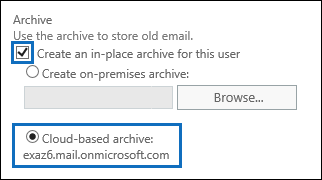
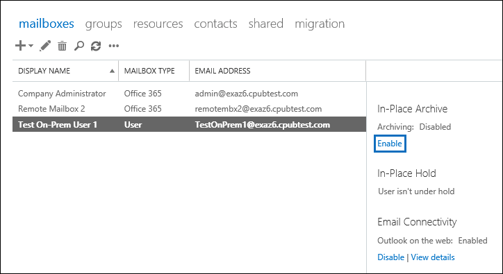
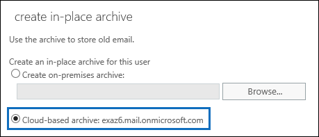

# Create a cloud-based archive for an on-premises primary mailbox in an Exchange hybrid deployment

In an Exchange hybrid deployment, you can configure an on-premises primary mailbox with a cloud-based archive mailbox in Exchange Online.

## Before you begin

- The user with the on-premises primary mailbox must have a user account in your Office 365 organization.

- The Office 365 user account must be assigned an Exchange Online Archiving for Exchange Server license. The steps for assigning a license are included in the procedures in Step 1.

- After you enable the cloud-based archive mailbox in Step 1, it might take up to 30 minutes for the cloud-based archive mailbox to be provisioned. This is because the cloud-base archive mailbox is created by the process of directory synchronization, where your on-premises Active Directory is synchronized with Azure Active Directory (Azure AD) in Office 365. By default, directory synchronization runs once every 30 minutes.

## Step 1: Enable a cloud-based archive mailbox for a primary on-premises mailbox

Use one of the following procedures to enable a cloud-based archive mailbox for an on-premises primary mailbox. Perform these steps in the Exchange admin center in your on-premises Exchange organization and in the Microsoft 365 admin center.

- [Create a cloud-based archive mailbox for a new user](#create-a-cloud-based-archive-mailbox-for-a-new-user)

- [Create a cloud-based archive mailbox for an existing user](#create-a-cloud-based-archive-mailbox-for-an-existing-user)

### Create a cloud-based archive mailbox for a new user

1. In the EAC in your on-premises organization, go to **Recipients** \> **Mailboxes**.

2. Click **New** \> **User mailbox**.

3. On the **New user mailbox** page, create a mailbox for a new or existing user. For more information about creating a user mailbox, see [Create User Mailboxes](https://technet.microsoft.com/library/51a8b4c6-a53e-41c5-8bb1-ea4c0eaa0174.aspx).

4. Click **More options** to enable a cloud-based archive mailbox.

5. Under **Archive**, click the **Create an in-place archive for this user** check box, and then click **Cloud-based archive**. The name of the domain that the archive mailbox will be provisioned in is displayed.

    

6. Click **Save** to create the mailbox and the cloud-based archive.

   Note on the **Mailboxes** page, the value **User (Archive)** is displayed in the **Mailbox type** column for the selected mailbox.

7. Wait up to 30 minutes for directory synchronization to create a corresponding user account in Office 365.

    > [!TIP]
    > In the Microsoft 365 admin center, go to **Health** \> **Directory sync status** to see the last time that directory synchronization occurred.

8. After verifying that directory synchronization has occurred after you created the new on-premises mailbox, in the admin center, go to **Users** \> **Active users**, and then select the new Office 365 user account that was created for the new on-premises mailbox.

9. On the user properties page that's displayed, click **Edit** in the **Product licenses** section.

    

10. Under the **Location** drop-down menu, select a location for the user.

11. Expand the list of Office 365 Enterprise licenses, and then assign the **Exchange Online Archiving for Exchange Server** license, and then save the changes.

    In the **Status** column in the list of users, notice that a license is assigned to the user.

12. Once again, wait up to 30 minutes for directory synchronization to provision a cloud-based archive mailbox. Go to Step 2 to see how to verify that the cloud-based archive mailbox has been created. After the archive mailbox is created, the user can access it by using Outlook or Outlook on the web.

### Create a cloud-based archive mailbox for an existing user

1. In the admin center, go to **Users** \> **Active users**, and then select the user account that you want to create a cloud-base archive mailbox for.

2. On the user properties page that's displayed, click **Edit** in the **Product licenses** section.

    

3. Under the **Location** drop-down menu, select a location for the user.

4. Expand the list of Office 365 Enterprise licenses, and then assign the **Exchange Online Archiving for Exchange Server** license, and then save the changes.

    In the **Status** column in the list of users, notice that a license is now assigned to the user.

5. In the EAC in your on-premises organization, go to **Recipients** \> **Mailboxes**.

6. In the list of mailboxes, select the user that you assigned the license to.

7. In the details pane, under **In-Place Archive**, click **Enable**.

    

8. On the **Create in-place archive** page, click **Cloud-based archive**, and then click **Ok**. The name of the domain that the archive mailbox will be provisioned in is displayed.

    

    Note on the **Mailboxes** page, the value **User (Archive)** is displayed in the **Mailbox type** column for the selected mailbox.

9. Wait up to 30 minutes for directory synchronization to create the cloud-based archive mailbox. Go to Step 2 to see how to verify that the cloud-based archive mailbox has been created. After the archive mailbox is created, the user can access it by using Outlook or Outlook on the web.

    > [!TIP]
    > In the admin center, go to **Health** \> **Directory sync status** to see the last time that directory synchronization occurred.

## Step 2: Verify that the cloud-based archive mailbox is created

As previously explained, there might be a delay between the time that you enable a cloud-based archive mailbox and when the cloud-based archive mailbox is created. This is because directory synchronization has to run to create the cloud-based archive mailbox. Here are some ways to verify that the cloud-based archive mailbox has been created.

In your Exchange Online organization, run the following PowerShell command to display properties related to an on-premises user's cloud-based archive mailbox. To connect to Exchange Online using remote PowerShell, see [Connect to Exchange Online PowerShell](https://go.microsoft.com/fwlink/?/linkid=396554).

```PowerShell
Get-MailUser <cloud mail user> | FL *archive*
```

The following screenshots show the properties that are returned when the provisioning of the cloud-based archive mailbox is pending and after the cloud-based archive mailbox has been created.

### Mail user properties before the cloud-based archive mailbox is provisioned by directory synchronization


Before directory synchronization provisions the cloud-based archive, the _ArchiveStatus_ property is set to `None`. Also note that the _ArchiveGuid_ and _ArchiveName_ properties are empty.

### Mail user properties after the cloud-based archive mailbox is provisioned by directory synchronization


After directory synchronization provisions the cloud-based archive, the _ArchiveStatus_ property is set to `Active`, and the _ArchiveGuid_ and _ArchiveName_ properties are populated. At this point, the user is able to access their cloud-based archive mailbox in Outlook or Outlook on the web.


You can also run the following PowerShell command in your on-premises Exchange organization to display properties related to the cloud-based archive mailbox of an on-premises user.

```PowerShell
Get-Mailbox <on-premises user mailbox> | FL *archive*
```

#### On-premises mailbox properties before the cloud-based archive mailbox is provisioned by directory synchronization**


Before directory synchronization provisions the cloud-based archive, the _ArchiveStatus_ property is set to `None` and the _ArchiveState_ property is set to `HostedPending`.

#### On-premises mailbox properties after the cloud-based archive mailbox is provisioned by directory synchronization**


After directory synchronization provisions the cloud-based archive, the _ArchiveStatus_ property is set to `Active` and the _ArchiveState_ property is set to `HostedProvisioned`. At this point, the user is able to access their cloud-based archive mailbox in Outlook or Outlook on the web.

## (Optional) Run directory synchronization

As previously explained, the cloud-base archive mailbox is created by the process of directory synchronization. By default, your on-premises Active Directory is synchronized with Azure AD in Office 365 once every 30 minutes. You can see when the last time directory synchronization occurred by going to **Health** \> **Directory sync status** in the Microsoft 365 admin center.

Sometimes you may want to start directory synchronization to provision the cloud-based archive mailbox before the next scheduled synchronization. You can do this by running the following PowerShell command on the server where Azure AD Connect is installed.

```PowerShell
Start-ADSyncSyncCycle -PolicyType Delta
```

For more information, see [Azure AD Connect sync: Scheduler](https://go.microsoft.com/fwlink/p/?linkid=836813).
