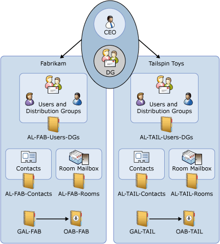

# Address book policies

Learn how you can segment your global address list into specific groups to create customized GALs in Outlook and Outlook on the web.
  
Global address list (GAL) segmentation (also known as GAL segregation) is the process whereby administrators can segment users into specific populations to provide customized views of their organization's GAL. Address book policies (ABPs) allow you to segment users into specific groups to provide customized views of your organization's global address list (GAL). When creating an ABP, you assign a GAL, an offline address book (OAB), a room list, and one or more address lists to the policy. You can then assign the ABP to mailbox users, providing them with access to a customized GAL in Outlook and Outlook Web App. The goal is to provide a simpler mechanism to accomplish GAL segmentation for on-premises organizations that require multiple GALs. .
  
> [!NOTE]
> ABPs are intended to optimize the GAL and address lists for each group of users, not make it difficult for them to see each other or to communicate with other users in your organization. ABPs create only a virtual separation of users from a directory perspective, not a legal separation. 
  
## How ABPs Work

ABPs contain the following lists:
  
- One GAL
    
- One OAB
    
- One room list (for booking purposes)
    
- One or more address lists
    
In the following figure, Address Book Policy A consists of a subset of the various address objects that exist in the organization (shown in the bottom half of the figure). The resulting scope of an ABP is equal to that of the GAL contained in the policy, in this case GAL1. When the ABP is created and assigned to a user, the address objects in the ABP become the scope of the objects the user is able to view.
  

  
 You can use the following methods to assign ABPs to individual mailbox users: 
  
|**New or existing mailbox?**|**Shell**|
|:-----|:-----|
|New    |[new-Mailbox](http://technet.microsoft.com/library/42dbb25a-0b23-4775-ae15-7af62c089565.aspx) cmdlet with the  _AddressBookPolicy_ parameter    |
|Existing    |[Set-Mailbox](http://technet.microsoft.com/library/a0d413b9-d949-4df6-ba96-ac0906dedae2.aspx) cmdlet with the  _AddressBookPolicy_ parameter    |
   
ABPs take effect when a user's client application connects to a Client Access server in Exchange Server. If you change the ABP, the updated ABP doesn't take effect until the user restarts or reconnects their client or until you restart the RPC Client Access servers on the Exchange Mailbox server.
  
### Address book policy routing agent

In an Exchange organization that doesn't use ABPs, the following things occur when an email is created in Outlook or Outlook Web App and sent to another recipient in your Exchange organization:
  
1. The email address resolves. For example, if you type kweku@contoso.com in the **To** field, the SMTP email address would resolve to the user's display name **Kweku Ako-Adjei**. 
    
2. You can view the other person's contact card. After the name resolves, you can double-click the user's name and view their contact information, such as office and phone number.
    
If you're using ABPs, and you don't want users in separate virtual organizations to view each other's potentially private information, you can turn on the Address Book Policy Routing agent. The ABP Routing agent is a Transport agent that controls how recipients are resolved in your organization. When the ABP Routing agent is installed and configured, users that are assigned to different GALs appear as external recipients in that they can't view external recipients' contact cards.
  
For details about how to turn on the ABP Routing agent in Exchange Online, see [Turn on address book policy routing](turn-on-address-book-policy-routing.md). 
  
For details about how to turn on the ABP Routing agent in Exchange Server, see [Install and Configure the Address Book Policy Routing Agent](http://technet.microsoft.com/library/20e8a43d-4508-4388-a2c9-aa3073593cc2.aspx).
  
## ABP Example

In the following diagram, Fabrikam and Tailspin Toys share the same Exchange organization and the same CEO. The CEO is the only employee common to both companies. 
  

  
This configuration contains three ABPs:
  
- One contains Fabrikam employees and the CEO
    
- One contains Tailspin Toys employees and the CEO
    
- One contains only the CEO
    
The ABPs adhere to the following rules:
  
- The users in Tailspin Toys can only see Tailspin Toys employees and the CEO when they browse the GAL.
    
- The users in Fabrikam can only see Fabrikam employees and the CEO when they browse the GAL.
    
- The CEO can see all Fabrikam and Tailspin Toys employees when browsing the GAL.
    
- Users who view the CEO's group membership can see only groups that belong to the user's company. They won't see groups that exist in the other company.
    
## Entourage, Outlook for Mac, and ABPs

ABPs won't function for Entourage users or Outlook for Mac users who are connected to their corporate network. When inside the corporate network, Entourage and Outlook for Mac clients connect directly to the global catalog server and query Active Directory directly instead of using the Client Access server. However, Outlook for Mac 2011 clients that connect from the Internet can use an OAB or Exchange Web Services (EWS). As a result, these clients can search the GAL based on the assigned ABP. To learn more about administering Outlook for Mac 2011, see [Planning for Outlook for Mac 2011](https://go.microsoft.com/fwlink/p/?LinkId=231878)
  
## For more information

[Scenario: Deploying Address Book Policies](http://technet.microsoft.com/library/6ac3c87d-161f-447b-afb2-149ae7e3f1dc.aspx)
  
[Address book policy procedures](address-book-policy-procedures.md)
  

