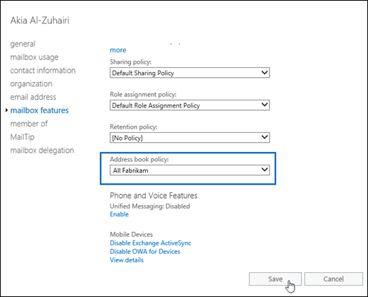
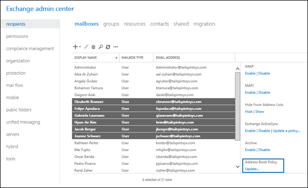

# Assign an address book policy to users in Exchange Online

Address book policies (ABPs) allow you to segment users into specific groups to give them customized global address lists (GALs) in Outlook and Outlook on the web (formerly known as Outlook Web App). For more information about ABPs, see [Address book policies in Exchange Online](address-book-policies.md).

Users aren't automatically assigned an ABP when you create mailboxes. If you don't assign an ABP to a mailbox, the GAL for your entire organization is visible to the user in Outlook and Outlook on the web. Furthermore, a user that's assigned an ABP needs to exist in the GAL that's specified for the ABP, see [Considerations and best practices for address book policies](https://docs.microsoft.com/Exchange/email-addresses-and-address-books/address-book-policies/abp-scenarios?view=exchserver-2019#considerations-and-best-practices-for-address-book-policies).

To identify your virtual organizations for ABPs, we recommend that you use the **CustomAttribute1** to **CustomAttribute15** attributes on mailboxes, contacts, and groups, because these attributes are the most widely available and manageable for all recipient types.

To assign ABPs to mailboxes, you select the ABP in Exchange admin center (EAC), or specify the ABP in Exchange Online PowerShell.

## What do you need to know before you begin?

- Estimated time to complete: Less than 5 minutes.

- By default, the Address List role isn't assigned to any role groups in Exchange Online. To use any cmdlets or features that require the Address List role, you need to add the role to a role group. For more information, see [Modify role groups](../../permissions-exo/role-groups.md#modify-role-groups).

- To open the Exchange admin center (EAC), see [Exchange admin center in Exchange Online](../../exchange-admin-center.md). To connect to Exchange Online PowerShell, see [Connect to Exchange Online PowerShell](https://docs.microsoft.com/powershell/exchange/connect-to-exchange-online-powershell).

- For information about keyboard shortcuts that may apply to the procedures in this topic, see [Keyboard shortcuts for the Exchange admin center](../../accessibility/keyboard-shortcuts-in-admin-center.md).

> [!TIP]
> Having problems? Ask for help in the Exchange forums. Visit the forums at [Exchange Online](https://social.technet.microsoft.com/forums/msonline/home?forum=onlineservicesexchange) or [Exchange Online Protection](https://social.technet.microsoft.com/forums/forefront/home?forum=FOPE).

## Use the EAC to assign an ABP to a mailbox

1. In the EAC, go to **Recipients** \> **Mailboxes**.

2. In the list of mailboxes, find the mailbox that you want to modify. You can:

   - Scroll through the list of mailboxes.

   - Click **Search**  and enter part of the user's name, email address, or alias.

   - Click **More options**  \> **Advanced search** to find the mailbox.

    Once you've found the mailbox that you want to modify, select it, and then click **Edit** .

3. On the mailbox properties page that opens, click **Mailbox features**.

4. Click the drop-down arrow in **Address book policy**, and select the ADP that you want to apply.

   

   When you're finished, click **Save**.

## Use the EAC to assign an ABP to multiple mailboxes

1. In the EAC, go to **Recipients** \> **Mailboxes**.

2. In the list of mailboxes, find the mailboxes that you want to modify. For example:

   1. Click **More options**  \> **Advanced search**.

   2. In the **Advanced search** window that opens, select **Recipient types** and verify the default value **User mailbox**.

   3. Click **More options**, and then click **Add a condition**.

   4. In the **Select one** drop-down box that appears, select the appropriate **Custom attribute 1** to **Custom attribute 15** values that defines your virtual organizations.

   5. In the **Specify words or phrases** dialog that appears, enter the value that you want to search for, and then click **OK**.

   6. Back on the **Advanced search** window, click **OK**. In the EAC at **Recipients** \> **Mailboxes**, click **More options**  \> **Advanced search** to find user mailboxes.

3. In the list of mailboxes, select multiple mailboxes of the same type (for example, **User**) from the list. For example:

   - Select a mailbox, hold down the Shift key, and select another mailbox that's farther down in the list.

   - Hold down the CTRL key as you select each mailbox.

    After you select multiple mailboxes of the same type, the title of the details pane changes to **Bulk Edit**.

4. In the details pane, scroll down and click **More options**, scroll down to **Address Book Policy**, and then click **Update**.

   

5. In the **Bulk assign address book policy** window that opens, select the ABP by clicking the drop-down arrow in **Select Address Book Policy**, and then click **Save**.

## Use Exchange Online PowerShell to assign an ABP to mailbox users

There are three basic methods you can use to apply an ABP to mailboxes:

- **Individual mailboxes**: Use the following syntax:

  ```PowerShell
  Set-Mailbox -Identity <MailboxIdentity> -AddressBookPolicy <ABPIdentity>
  ```

  This example assigns the ABP named All Fabrikam to the mailbox joe@fabrikam.com.

  ```PowerShell
  Set-Mailbox -Identity joe@fabrikam.com -AddressBookPolicy "All Fabrikam"
  ```

- **Filter mailboxes by attributes**: This method uses the unique filterable attribute that defines the virtual organization (for example, the **CustomAttribute1** through **CustomAttribute15** attribute value).

  The syntax uses the following two commands (one to identify the mailboxes, and the other to apply the ABP to the mailboxes):

  ```PowerShell
  $<VariableName> = Get-Mailbox -ResultSize unlimited -Filter <Filter>
  ```

  ```PowerShell
  $<VariableName> | foreach {Set-Mailbox -Identity $_.MicrosoftOnlineServicesID -AddressBookPolicy <ABPIdentity>}
  ```

  This example assigns the ABP named All Fabrikam to all mailbox users whose **CustomAttribute15** value is `FAB`.

  ```PowerShell
  $Fabrikam = Get-Mailbox -Filter "CustomAttribute15 -eq 'FAB'"
  ```

  ```PowerShell
  $Fabrikam | foreach {Set-Mailbox -Identity $_.MicrosoftOnlineServicesID -AddressBookPolicy "All Fabrikam"}
  ```

- **Use a list of specific mailboxes**: This method requires a text file to identify the mailboxes. Values that don't contain spaces (for example, the user account) work best. The text file must contain one user account on each line like this:

  > akol@contoso.com <br/> tjohnston@contoso.com <br/> kakers@contoso.com

  The syntax uses the following two commands (one to identify the user accounts, and the other to apply the policy to those users):

  ```PowerShell
  $<VariableName> = Get-Content "<text file>"
  ```

  ```PowerShell
  $<VariableName> | foreach {Set-Mailbox -Identity $_.MicrosoftOnlineServicesID -AddressBookPolicy <ABPIdentity>}
  ```

  This example assigns the ABP policy named All Fabrikam to the mailboxes specified in the file C:\My Documents\Fabrikam.txt.

  ```PowerShell
  $Fab = Get-Content "C:\My Documents\Fabrikam.txt"
  ```

  ```PowerShell
  $Fab | foreach {Set-Mailbox -Identity $_.MicrosoftOnlineServicesID -AddressBookPolicy "All Fabrikam"}
  ```

For detailed syntax and parameter information, see [Set-Mailbox](https://docs.microsoft.com/powershell/module/exchange/set-mailbox) and [Get-Mailbox](https://docs.microsoft.com/powershell/module/exchange/get-mailbox).

### How do you know this worked?

To verify that you've successfully applied an ABP to a mailbox, use any of the following steps:

- In the EAC, go to **Recipients** \> **Mailboxes**, select the mailbox, and click **Edit** . In the properties of the mailbox window that opens, click **Mailbox features**, and verify the ABP in the **Address book policy** field.

- In Exchange Online PowerShell, replace \<MailboxIdentity\> with the name, alias, email address, or account name of the mailbox, and run the following command to verify the value of the **AddressBookPolicy** property:

  ```PowerShell
  Get-Mailbox -Identity "<MailboxIdentity>" | Format-List AddressBookPolicy
  ```

- In Exchange Online PowerShell, run the following command to verify the value of the **AddressBookPolicy** property:

  ```PowerShell
  Get-Mailbox -ResultSize unlimited | Format-Table Name,AddressBookPolicy -Auto
  ```

## More information

To remove the ABP assignment from a mailbox, you select the value **[No Policy]** in the EAC, or use the value `$null` for the _AddressBookPolicy_ parameter in Exchange Online PowerShell.
