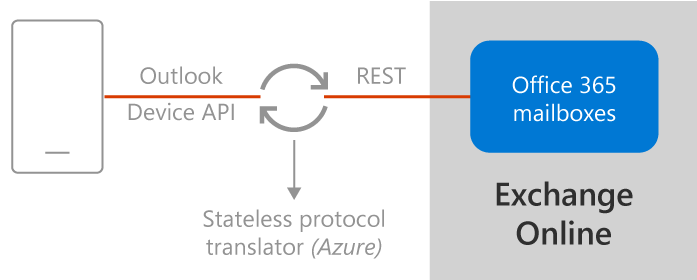

# Outlook for iOS and Android in Exchange Online

The Outlook app for iOS and Android is designed to bring together email, calendar, contacts, and other files, enabling users in your organization to do more from their mobile devices. This article provides an overview of the architecture, so that Office 365 administrators can deploy and maintain Outlook for iOS and Android in their organizations.

> [!NOTE]
> The [Outlook for iOS and Android Help Center](https://support.office.com/article/cd84214e-a5ac-4e95-9ea3-e07f78d0cde6) is available for users, including help for using the app on specific devices and troubleshooting information.

## Outlook for iOS and Android architecture

The Outlook for iOS and Android app is fully powered by the Microsoft Cloud. All Office 365 Enterprise, Business, and Education accounts are supported natively, which means there is no mailbox data cached outside of Office 365. Data simply stays in its current Exchange Online mailbox, and it's protected by TLS-secured connections end-to-end, between Office 365 and the app. Outlook for iOS and Android is  fully delivered through Microsoft services that provide a strong commitment to security, privacy, and compliance.

The Office 365-based architecture provides the following benefits:
1. **Data locality**: User mailbox data stays in place, and therefore continues to respect the data locality and regionality promises of Office 365 for data at rest. In other words, the user’s mailbox data is stored within the region in which the tenant is located.

2. **Device ID**: Each Outlook for iOS and Android connection registers in the Office 365 Admin console and is able to be managed as a unique connection.

3. **Modern Authentication (OAuth)**: Outlook for iOS and Android leverages Modern Authentication (OAuth) to protect user’s credentials. Modern authentication provides Outlook for iOS and Android with a secure mechanism to access Office 365 data without ever touching a user’s credentials. At sign in, the user authenticates directly against an identity platform (either Azure AD or an on-premises identity provider like ADFS) and receives an access token in return, which grants Outlook for iOS and Android access to the user’s mailbox or files. At no time does the service have access to the user’s password in any form.

4. **Enterprise Mobility + Security support**: Customers can take advantage of Microsoft Enterprise Mobility + Security (EMS) including Microsoft Intune and Azure Active Directory Premium, to enable conditional access and Intune app protection policies, which control and secure corporate messaging data on the mobile device.

### Data synchronization protocol

Within the Office 365-based architecture, Outlook for iOS and Android is utilizing one of two different data synchronization protocols:
- a proprietary device API + REST API
- a native Microsoft sync technology

Today, the vast majority of accounts using Outlook for iOS and Android connect via a Stateless Protocol Translator component that is built and run in Azure. This component routes data and translates commands, but it doesn't cache user data. The app is coded with the Outlook device API, a proprietary API that syncs commands and data to and from the app. Exchange Online data is accessed via the publicly available REST APIs. The protocol translator enables communication between Outlook and Exchange Online.

Beginning in December 2018, Microsoft will migrate customers to a native Microsoft sync technology that removes the Stateless Protocol Translator component from the Office 365-based architecture. With the native Microsoft sync technology, Outlook for iOS and Android connects directly to Office 365 for data connections ensuring the data is protected by an HTTP TLS-secured connection end-to-end.

The native Microsoft sync technology offers several benefits:

1. **Eliminates middle tier services**: Data synchronization with the native Microsoft sync technology occurs between the app and Office 365, eliminating the need for any middle tier services.

2. **Latency reduction**: By replacing the propietary Outlook device API and Stateless Protocol Translator, there is a reduction in end-to-end latency between the app and Office 365.

3. **Additional Office 365 instance support**: Removing the intermediary Stateless Protocol Translator for data connections enables Microsoft to support other unique Office 365 instances, like Office 365 Government Community Cloud High and Office 365 Department of Defense, that were previously blocked from using Outlook for iOS and Android.

4. **Protocol consolidation**: Today, each Outlook client platform utilizes a different data sync protocol, which hinders the ability to innovate and deploy new features quickly across all Outlook clients. The native Microsoft sync technology that Outlook for iOS and Android is adopting has been in use by the native Windows 10 mail client for a number of years, and in the future, will be used by Outlook for Mac.

5. **Unlocking new features**: The native Microsoft sync technology will enable Outlook for iOS and Android to take advantage of native Office 365 features it does not support today, such as S/MIME, Microsoft Information Protection labeling, and shared mailboxes. These and more Office 365 features will roll out soon after the architecture update.

