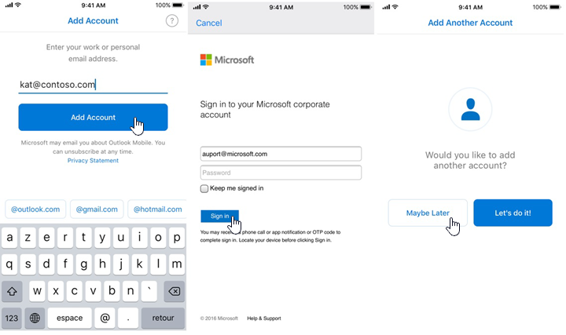
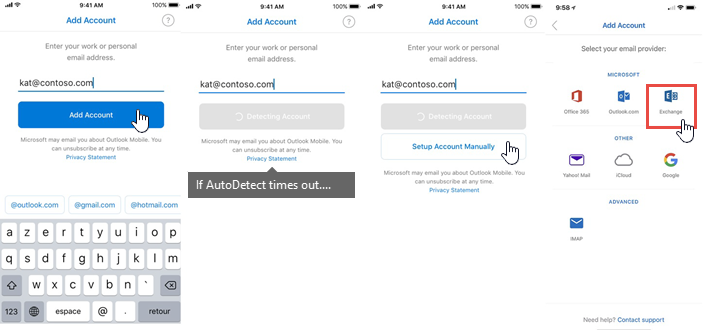
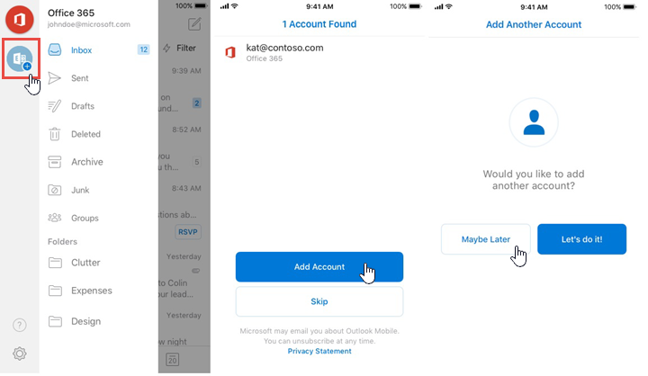

# Account setup with modern authentication in Exchange Online

 **Summary**: How users with modern authentication-enabled accounts can quickly set up their Outlook for iOS and Android accounts in Exchange Online.

Users with modern authentication-enabled accounts (Microsoft 365 accounts or [on-premises accounts leveraging hybrid modern authentication](https://docs.microsoft.com/Exchange/clients/outlook-for-ios-and-android/use-hybrid-modern-auth)) have two ways to set up their own Outlook for iOS and Android accounts: AutoDetect and single sign-on. In addition, Outlook for iOS and Android also offers IT administrators the ability to "push" account configurations to their Microsoft 365 users, and to control whether Outlook for iOS and Android supports personal accounts.

## Modern Authentication

Modern authentication is an umbrella term for a combination of authentication and authorization methods. These include:
  
- **Authentication methods**: Multi-factor Authentication; Client Certificate-based authentication.
    
- **Authorization methods**: Microsoft's implementation of Open Authorization (OAuth). 

Modern authentication is enabled through the use of the Active Directory Authentication Library (ADAL). ADAL-based authentication is what Outlook for iOS and Android uses to access Exchange Online mailboxes in Office 365. ADAL authentication, used by Office apps on both desktop and mobile devices, involves users signing in directly to Azure Active Directory, which is Office 365's identity provider, instead of providing credentials to Outlook.

ADAL-based authentication leverages OAuth for modern authentication-enabled accounts (Office 365 accounts or [on-premises accounts leveraging hybrid modern authentication](https://docs.microsoft.com/Exchange/clients/outlook-for-ios-and-android/use-hybrid-modern-auth)), and provides Outlook for iOS and Android a secure mechanism to access email without requiring access to user credentials. At sign in, the user authenticates directly with Azure Active Directory and receives an access/refresh token pair in return. The access token grants Outlook for iOS and Android access to the appropriate resources in Office 365 (e.g., the user's mailbox), while a refresh token is used to obtain a new access or refresh token pair when the current access token expires. OAuth provides Outlook with a secure mechanism to access Office 365 without needing or storing a user's credentials. For more information, see the Office Blog post [New access and security controls for Outlook for iOS and Android](https://go.microsoft.com/fwlink/p/?LinkId=623595).

By default, the access token lifetime is one hour and the refresh token lifetime is 90 days. These values can be adjusted; for more information see [Configure authentication session management with conditional access](https://docs.microsoft.com/azure/active-directory/conditional-access/howto-conditional-access-session-lifetime). Note that if you choose to reduce these lifetimes, you can also reduce the performance of Outlook for iOS and Android, because a smaller lifetime increases the number of times the application must acquire a fresh access token.

A previously granted access token is valid until it expires. Upon expiration, the client will attempt to use the refresh token to obtain a new access token, but because the user's password has changed, the refresh token will be invalidated (assuming directory synchronization has occurred between on-premises and Azure Active Directory). The invalidated refresh token will force the user to re-authenticate in order to obtain a new access token and refresh token pair.

## AutoDetect

Outlook for iOS and Android offers a solution called AutoDetect that helps end-users quickly setup their accounts. AutoDetect will first determine which type of account a user has, based on the SMTP domain. Account types that are covered by this service include Office 365, Outlook.com, Google, Yahoo, and iCloud. Next, AutoDetect will make the appropriate configurations to the app on the user's device based on that account type. This saves time for users and eliminates the need for manual input of configuration settings like hostname and port number.

For modern authentication, which is used by all Office 365 accounts and [on-premises accounts leveraging hybrid modern authentication](https://docs.microsoft.com/Exchange/clients/outlook-for-ios-and-android/use-hybrid-modern-auth), AutoDetect queries Exchange Online for a user's account information and then configures Outlook for iOS and Android on the user's device so that the app can connect to Exchange Online. During this process, the only information required from the user is their SMTP address and credentials.

The following images show an example of account configuration via AutoDetect:

In the event that AutoDetect fails for a user, the following images show an alternative account configuration path using manual configuration:

## Single sign-on

All Microsoft apps that leverage the Azure Active Directory Authentication Library (ADAL) support single sign-on. In addition, single sign-on is also supported when the apps are used in conjunction with either the Microsoft Authenticator or Microsoft Company Portal apps.

Tokens can be shared and re-used by other Microsoft apps (such as Word mobile) under the following scenarios:

1. When the apps are signed by the same signing certificate, and use the same service endpoint or audience URL (such as the Office 365 URL). In this case, the token is stored in app shared storage.

2. When the apps leverage or support single sign-on with a broker app. The tokens are stored within the broker app. Microsoft Authenticator is an example of a broker app. In the broker app scenario, after you attempt to sign in to Outlook for iOS and Android, ADAL will launch the Microsoft Authenticator app, which will make a connection to Azure Active Directory to obtain the token. It will then hold on to the token and re-use it for authentication requests from other apps, for as long as the configured token lifetime allows.

For more information, see [How to enable cross-app SSO on iOS using ADAL](https://docs.microsoft.com/azure/active-directory/develop/active-directory-sso-ios).

If a user is already signed in to another Microsoft app on their device, like Word or Company Portal, Outlook for iOS for Android will detect that token and use it for its own authentication. When such a token is detected, users adding an account in Outlook for iOS and Android will see the discovered account available as "Found" under **Accounts** on the **Settings** menu. New users will see their account in the initial account setup screen. 

The following images show an example of account configuration via single sign-on for a first-time user:

If a user already has Outlook for iOS and Android, such as for a personal account, but an Office 365 account is detected because they recently enrolled, the single-sign on path will look as follows:

## Account setup configuration via enterprise mobility management

Outlook for iOS and Android offers IT administrators the ability to "push" account configurations to Office 365 accounts or on-premises accounts leveraging hybrid modern authentication. This capability works with any Mobile Device Management (MDM) provider who uses the [Managed App Configuration](https://developer.apple.com/library/content/samplecode/sc2279/Introduction/Intro.html) channel for iOS or the [Android in the Enterprise](https://developer.android.com/work/managed-configurations) channel for Android.

For users enrolled in Microsoft Intune, you can deploy the account configuration settings using Intune in the Azure Portal.

Once account setup configuration has been setup in the MDM provider and the user enrolls their device, Outlook for iOS and Android will detect that an account is "Found" and will then prompt the user to add the account. The only information the user needs to enter to complete the setup process is their password. Then, the user's mailbox content will load and the user can begin using the app.

For more information on the account setup configuration keys needed to enable this functionality, please see the Account setup configuration section in [Deploying Outlook for iOS and Android App Configuration Settings](https://docs.microsoft.com/exchange/clients-and-mobile-in-exchange-online/outlook-for-ios-and-android/outlook-for-ios-and-android-configuration-with-microsoft-intune).

## Organization allowed accounts mode

Respecting the data security and compliance policies of our largest and highly regulated customers is a key pillar to the Office 365 value. Some companies have a requirement to capture all communications information within their corporate environment, as well as, ensure the devices are only used for corporate communications. To support these requirements, Outlook for iOS and Android on corporate-managed devices can be configured to only allow a single, corporate account to be provisioned within Outlook for iOS and Android. Like with account setup configuration, this capability works with any Mobile Device Management (MDM) provider who uses the [Managed App Configuration](https://developer.apple.com/library/content/samplecode/sc2279/Introduction/Intro.html) channel for iOS or the [Android in the Enterprise](https://developer.android.com/work/managed-configurations) channel for Android. This is supported with Office 365 accounts or on-premises accounts leveraging hybrid modern authentication, however, only a single corporate account can be added to Outlook for iOS and Android.

For more information on the settings that need to be configured to deploy Organization Allowed Accounts mode, please see the Organization allowed accounts mode section in [Deploying Outlook for iOS and Android App Configuration Settings](https://docs.microsoft.com/exchange/clients-and-mobile-in-exchange-online/outlook-for-ios-and-android/outlook-for-ios-and-android-configuration-with-microsoft-intune).

> [!NOTE]
> Account setup configuration and Organization allowed accounts mode can be configured together to simplify account setup.

In order to ensure these users can only access corporate email on enrolled devices (whether it be iOS or Android Enterprise) with Intune, you will need to leverage an Azure Active Directory conditional access policy with the grant controls [Require devices to be marked as compliant](https://docs.microsoft.com/azure/active-directory/conditional-access/require-managed-devices#require-device-to-be-marked-as-compliant) and [Require approved client app](https://docs.microsoft.com/azure/active-directory/active-directory-conditional-access-technical-reference). Details on creating this type of policy can be found in [Azure Active Directory app-based conditional access](https://docs.microsoft.com/azure/active-directory/active-directory-conditional-access-mam#exchange-online-policy).

> [!IMPORTANT]
> [Require devices to be marked as compliant](https://docs.microsoft.com/azure/active-directory/conditional-access/require-managed-devices#require-device-to-be-marked-as-compliant) grant control requires the device to be managed by Intune.

1. The first policy allows Outlook for iOS and Android, and it blocks OAuth capable Exchange ActiveSync clients from connecting to Exchange Online. See "Step 1 - Configure an Azure AD conditional access policy for Exchange Online", but for the fifth step select  "Require device to be marked as compliant", "Require approved client app", and "Require all the selected controls".

2. The second policy prevents Exchange ActiveSync clients leveraging basic authentication from connecting to Exchange Online. See "Step 2 - Configure an Azure AD conditional access policy for Exchange Online with Active Sync (EAS)."

