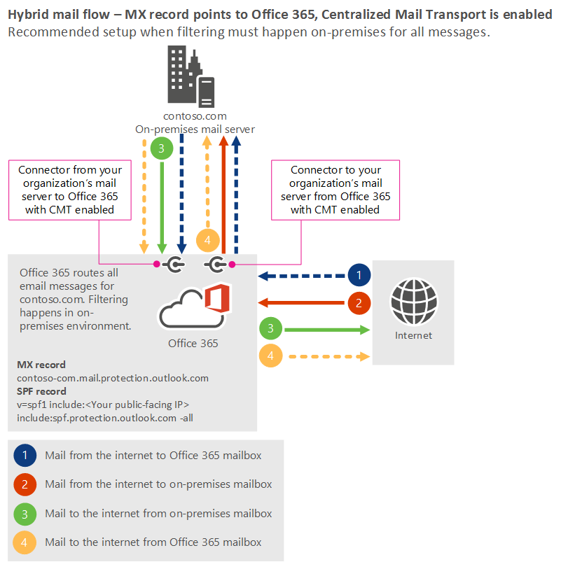
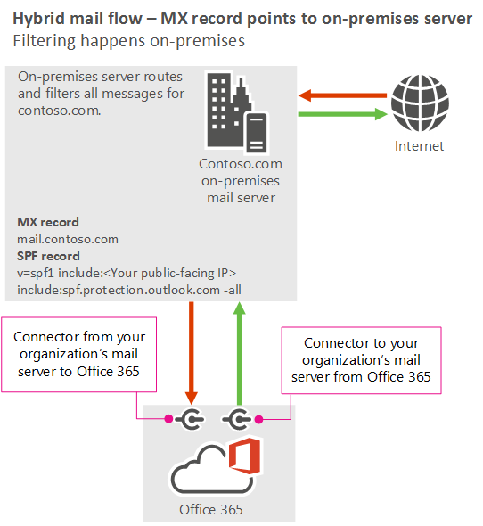
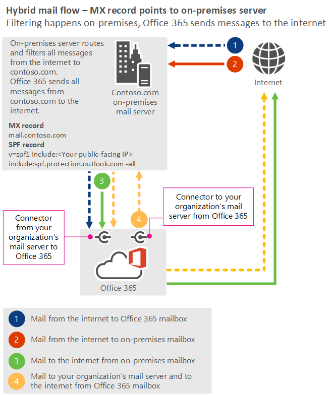

# Manage mail flow with mailboxes in multiple locations (Exchange Online and on-premises)

 **Summary**: How to manage mail flow in an Exchange hybrid environment, which is when some mailboxes are on-premises and some are in Office 365.

This topic covers the following complex mail flow scenarios using Office 365:

- [Scenario 1: MX record points to Office 365 and Office 365 filters all messages](#scenario-1-mx-record-points-to-office-365-and-office-365-filters-all-messages)

- [Scenario 2: MX record points to Office 365 and mail is filtered on-premises](#scenario-2-mx-record-points-to-office-365-and-mail-is-filtered-on-premises)

- [Scenario 3: MX record points to my on-premises servers](#scenario-3-mx-record-points-to-my-on-premises-servers)

- [Scenario 4: MX record points to my on-premises server, which filters and provides compliance solutions for your messages. Your on-premises server needs to relay messages to the internet through Office 365.](#scenario-4-mx-record-points-to-my-on-premises-server-which-filters-and-provides-compliance-solutions-for-your-messages-your-on-premises-server-needs-to-relay-messages-to-the-internet-through-office-365)

> [!NOTE]
> Examples in this topic use the fictitious organization, Contoso, which owns the domain contoso.com. The IP address of the Contoso email server is 131.107.21.231, and its third-party provider uses 10.10.10.1 for their IP address. These are just examples. You can adapt these examples to fit your organization's domain name and public-facing IP address where necessary.

## Manage mail flow where some mailboxes are in Office 365 and some mailboxes are on your organization's email servers

### Scenario 1: MX record points to Office 365 and Office 365 filters all messages

- I'm migrating my mailboxes to Exchange Online, and I want to keep some mailboxes on my organization's email server (on-premises server). I want to use Office 365 as my spam filtering solution and want to send my messages from my on-premises server to the internet by using Office 365. Office 365 sends and receives all messages.

Most customers who need a hybrid mail flow setup should allow Office 365 to perform all their filtering and routing. We recommend that you point your MX record to Office 365 because this provides for the most accurate spam filtering. For this scenario, your organization's mail flow setup looks like the following diagram.


#### Best practices

1. Add your custom domains in Office 365. To prove that you own the domains, follow the instructions in [Add a domain to Microsoft 365](https://docs.microsoft.com/microsoft-365/admin/setup/add-domain).

2. [Create user mailboxes in Exchange Online](../recipients-in-exchange-online/create-user-mailboxes.md) or [move all users' mailboxes to Office 365](../mailbox-migration/mailbox-migration.md).

3. Update the DNS records for the domains that you added in step 1. (Not sure how to do this? Follow the instructions on [this page](https://docs.microsoft.com/microsoft-365/admin/get-help-with-domains/create-dns-records-at-any-dns-hosting-provider).) The following DNS records control mail flow:

   - **MX record**: Point your MX record to Office 365 in the following format: \<domainKey\>-com.mail.protection.outlook.com

     For example, if your domain is contoso.com, the MX record should be: contoso-com.mail.protection.outlook.com.

   - **SPF record**: This should list Office 365 as a valid sender, plus any IP addresses from your on-premises servers that connect to EOP, and any third parties that send email on behalf of your organization. For example, if your organization's email server's internet-facing IP address is131.107.21.231, the SPF record for contoso.com should be:

     ```text
     v=spf1 ip4:131.107.21.231 include:spf.protection.outlook.com -all
     ```

     Alternatively, depending on the third-party's requirements, you might need to include the domain from the third-party, as shown in the following example:

     ```text
     v=spf1 include:spf.protection.outlook.com include:third_party_cloud_service.com -all
     ```

4. In the Exchange admin center, use the connector wizard to [Configure mail flow using connectors in Office 365](use-connectors-to-configure-mail-flow/use-connectors-to-configure-mail-flow.md) for the following scenarios:

   - Sending messages from Office 365 to your organization's email servers

   - Sending messages from your on-premises servers to Office 365

     If either of the following scenarios apply to your organization, you must create a connector to support sending mail from your on-premises servers to Office 365.

   - Your organization is authorized to send messages on behalf of your client, but your organization doesn't own the domain. For example, contoso.com is authorized to send email through fabrikam.com, which doesn't belong to contoso.com.

   - Your organization relays non-delivery reports (also known as NDRs or bounce messages) to the internet through Office 365.

     To create the connector, choose the first option in the connector creation wizard on the **How should Office 365 identify email for your email server** screen.

     

     This enables Office 365 to identify your email server by using the certificate. In this scenario, the certificate CN or Subject Alternative Name (SAN) contains the domain that belongs to your organization. For more details, see [Identifying email from your email server](https://docs.microsoft.com/previous-versions/exchange-server/exchange-150/dn910993(v=exchg.150)). For connector configuration details see, [Part 2: Configure mail to flow from your email server to Office 365](use-connectors-to-configure-mail-flow/set-up-connectors-to-route-mail.md#part-2-configure-mail-to-flow-from-your-email-server-to-microsoft-365-or-office-365).

5. You don't need connectors in the following scenarios unless one of your partners has a special requirement, such as enforcing TLS with a bank.

   - Sending mail from Office 365 to a partner organization

   - Sending mail from a partner organization to Office 365

> [!NOTE]
> If your organization's uses Exchange 2010 or later, we recommend that you use the [Hybrid Configuration Wizard](https://docs.microsoft.com/exchange/hybrid-configuration-wizard) to configure connectors in Office 365 as well as on your on-premises Exchange servers. For this scenario, your domain's MX record can't point to your organization's email server.

### Scenario 2: MX record points to Office 365 and mail is filtered on-premises

- I'm migrating my mailboxes to Exchange Online and I want to keep some mailboxes on my organization's email server (on-premises server). I want to use the filtering and compliance solutions that are already in my on-premises environment. All messages that come from the internet to my cloud mailboxes, or messages sent to the internet from my cloud mailboxes, must route through my on-premises servers.

If you have business or regulatory reasons for filtering mail in your on-premises environment, we recommend pointing your domain's MX record to Office 365 and enabling centralized mail transport. This setup provides optimal spam filtering and protects your organization's IP addresses. For this scenario, your organization's mail flow setup looks like the following diagram.



#### Best practices

1. Add your custom domains in Office 365. To prove that you own the domains, follow the instructions in [Add a domain to Microsoft 365](https://docs.microsoft.com/microsoft-365/admin/setup/add-domain).

2. [Create user mailboxes in Exchange Online](../recipients-in-exchange-online/create-user-mailboxes.md) or [move all users' mailboxes to Office 365](../mailbox-migration/mailbox-migration.md).

3. Update the DNS records for the domains that you added in step 1. (Not sure how to do this? Follow the instructions on [this page](https://docs.microsoft.com/microsoft-365/admin/get-help-with-domains/create-dns-records-at-any-dns-hosting-provider).) The following DNS records control mail flow:

   - **MX record**: Point your MX record to Office 365 in the following format: \<domainKey\>-com.mail.protection.outlook.com

    For example, if your domain is contoso.com, the MX record should be: contoso-com.mail.protection.outlook.com.

   - **SPF record**: This should list Office 365 as a valid sender, plus any IP addresses from your on-premises servers that connect to EOP, and any third parties that send email on behalf of your organization. For example, if your organization's email server's internet-facing IP address is131.107.21.231, the SPF record for contoso.com should be:

     ```text
     v=spf1 ip4:131.107.21.231 include:spf.protection.outlook.com -all
     ```

4. Use Centralized Mail Transport (CMT) for on-premises compliance solutions.

   - Mail that comes from the internet to a mailbox in Exchange Online first gets sent to your on-premises server and then comes back to Exchange Online to be delivered to the mailbox. Line 1 represents this path in the scenario 2 diagram.

   - Mail that comes from Exchange Online and is destined for the internet is first sent to your on-premises servers, then comes back to Exchange Online, and is then delivered to the internet. Line 4 represents this path in the scenario 2 diagram.

   - To achieve this configuration, create connectors via the [Hybrid Configuration Wizard](https://docs.microsoft.com/exchange/hybrid-configuration-wizard) or via cmdlets, and enable CMT. For details about CMT, see [Transport Options in Exchange Hybrid Deployments](https://docs.microsoft.com/exchange/transport-options).

You don't need connectors in the following scenarios unless one of your partners has special requirements, such as enforcing TLS with a bank.

- Sending mail from Office 365 to a partner organization

- Sending mail from a partner organization to Office 365

### Scenario 3: MX record points to my on-premises servers

- I'm migrating my mailboxes to Exchange Online, and I want to keep some mailboxes on my organization's email server (on-premises server). I want to use the filtering and compliance solutions that are already in my on-premises email environment. All messages that come from the internet to my cloud mailboxes, or messages sent to the internet from cloud mailboxes, must route through my on-premises servers. I need to point my domain's MX record to my on-premises server.

As an alternative to Scenario 2, you can point your domain's MX record to your organization's email server instead of to Office 365. Some organizations have a business or regulatory need for this setup, but filtering typically works better if you use Scenario 2.

For this scenario, your organization's mail flow setup looks like the following diagram.



#### Best practices

If the MX record for your domain needs to point to your on-premises IP address, use the following best practices:

1. Add your custom domains in Office 365. To prove that you own the domains, follow the instructions in [Add a domain to Microsoft 365s](https://docs.microsoft.com/microsoft-365/admin/setup/add-domain).

2. [Create user mailboxes in Exchange Online](../recipients-in-exchange-online/create-user-mailboxes.md) or [move all users' mailboxes to Office 365](../mailbox-migration/mailbox-migration.md).

3. Update the DNS records for the domains that you added in step 1. (Not sure how to do this? Follow the instructions on [this page](https://docs.microsoft.com/microsoft-365/admin/get-help-with-domains/create-dns-records-at-any-dns-hosting-provider).) The following DNS records control mail flow:

   - **SPF record**: This should list Office 365 as a valid sender. It should also include any IP addresses from your on-premises servers that connect to EOP and any third parties that send email on behalf of your organization. For example, if your organization's email server's internet-facing IP address is131.107.21.231, the SPF record for contoso.com should be:

     ```text
     v=spf1 ip4:131.107.21.231 include:spf.protection.outlook.com -all
     ```

4. Because you're not relaying messages from your on-premises servers to the internet through Office 365, you don't technically need to create connectors for the following scenarios. But if at some point you change your MX record to point to Office 365, you'll need to create connectors; therefore, it's best to do it up front. In the Exchange admin center, use the connector wizard to [Part 2: Configure mail to flow from your email server to Office 365](use-connectors-to-configure-mail-flow/set-up-connectors-to-route-mail.md#part-2-configure-mail-to-flow-from-your-email-server-to-microsoft-365-or-office-365) for the following scenarios, or use the [Hybrid Configuration Wizard](https://docs.microsoft.com/exchange/hybrid-configuration-wizard) to create connectors:

   - Sending mail from Office 365 to your organization's email servers

   - Sending mail from your on-premises servers to Office 365

5. To make sure that messages are sent to your organization's on-premises servers through MX, go to [Example security restrictions you can apply to email sent from a partner organization](use-connectors-to-configure-mail-flow/set-up-connectors-for-secure-mail-flow-with-a-partner.md#examplesecurityrestrict), and follow "Example 3: Require that all email from your partner organization domain ContosoBank.com is sent from a specific IP address range."

### Scenario 4: MX record points to my on-premises server, which filters and provides compliance solutions for your messages. Your on-premises server needs to relay messages to the internet through Office 365.

- I'm migrating my mailboxes to Exchange Online, and I want to keep some mailboxes on my organization's email server (on-premises server). I want to use the filtering and compliance solutions that are already in my on-premises email environment. All messages sent from my on-premises servers must relay through Office 365 to the internet. I need to point my domain's MX record to my on-premises server.

For this scenario, your organization's mail flow setup looks like the following diagram.



#### Best practices

If the MX record for your domain needs to point to your on-premises IP address, use the following best practices:

1. Add your custom domains in Office 365. To prove that you own the domains, follow the instructions in [Add a domain to Microsoft 365](https://docs.microsoft.com/microsoft-365/admin/setup/add-domain).

2. [Create user mailboxes in Exchange Online](../recipients-in-exchange-online/create-user-mailboxes.md) or [move all users' mailboxes to Office 365](../mailbox-migration/mailbox-migration.md).

3. Update the DNS records for the domains that you added in step 1. (Not sure how to do this? Follow the instructions on [this page](https://docs.microsoft.com/microsoft-365/admin/get-help-with-domains/create-dns-records-at-any-dns-hosting-provider).) The following DNS records control mail flow:

   - **MX record**: Point your MX record to your on-premises server in the following format: mail.\<domainKey\>.com

     For example, if your domain is contoso.com, the MX record should be: .mail.contoso.com.

   - **SPF record**: This should list Office 365 as a valid sender. It should also include any IP addresses from your on-premises servers that connect to EOP and any third parties that send email on behalf of your organization. For example, if your organization's email server's internet-facing IP address is 131.107.21.231, the SPF record for contoso.com should be:

     ```text
     v=spf1 ip4:131.107.21.231 include:spf.protection.outlook.com -all
     ```

4. In the Exchange admin center, use the connector wizard to [Configure mail flow using connectors in Office 365](use-connectors-to-configure-mail-flow/use-connectors-to-configure-mail-flow.md) for the following scenarios:

   - Sending mail from Office 365 to your organization's email servers

   - Sending mail from your on-premises servers to Office 365

     You need to create a connector to support the scenario "Sending mail from your on-premises servers to Office 365" if any of the following scenarios apply to your organization:

   - Your organization is authorized to send mail on behalf of your client, but your organization doesn't own the domain. For example, contoso.com is authorized to send email through fabrikam.com, which doesn't belong to contoso.com.

   - Your organization relays non-delivery reports (NDRs) to the internet through Office 365.

   - The MX record for your domain, contoso.com, points to your on-premises server, and users in your organization automatically forward messages to email addresses outside your organization. For example, kate@contoso.com has forwarding enabled, and all messages go to kate@tailspintoys.com. If john@fabrikam.com sends a message to kate@contoso.com, by the time the message arrives at Office 365 the sender domain is fabrikam.com and the recipient domain is tailspin.com. Neither the sender domain nor recipient domain belongs to your organization.

     To create the connector, choose the first option in the connector creation wizard on the **How should Office 365 identify email for your email server** screen.

     

     This allows Office 365 to identify your email server by using the certificate. In this scenario, the certificate CN or Subject Alternative Name (SAN) contains the domain that belongs to your organization. For more details, see [Identifying email from your email server](https://docs.microsoft.com/previous-versions/exchange-server/exchange-150/dn910993(v=exchg.150)). For connector configuration details see, [Part 2: Configure mail to flow from your email server to Office 365](use-connectors-to-configure-mail-flow/set-up-connectors-to-route-mail.md#part-2-configure-mail-to-flow-from-your-email-server-to-microsoft-365-or-office-365).

5. [Set up connectors for secure mail flow with a partner organization](use-connectors-to-configure-mail-flow/set-up-connectors-for-secure-mail-flow-with-a-partner.md) to make sure that messages are sent to your organization's on-premises servers via MX.

## See also

[Mail flow best practices for Exchange Online and Office 365 (overview)](mail-flow-best-practices.md)

[Manage all mailboxes and mail flow using Office 365](manage-mailboxes-with-office-365.md)

[Manage mail flow using a third-party cloud service with Office 365](manage-mail-flow-using-third-party-cloud.md)

[Manage mail flow using a third-party cloud service with mailboxes on Office 365 and on-prem](manage-mail-flow-on-office-365-and-on-prem.md)

[Troubleshoot Office 365 mail flow](troubleshoot-mail-flow.md)

[Test mail flow by validating your Office 365 connectors](test-mail-flow.md)
