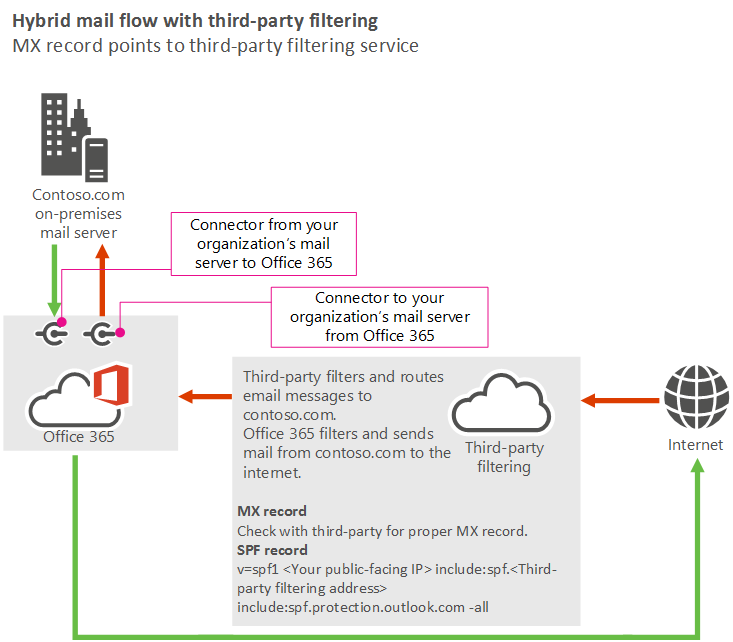

# Manage mail flow using a third-party cloud service with Exchange Online and on-premises mailboxes

This topic covers the most complex mail flow scenario using Office 365.

> [!NOTE]
> Examples in this guide use the fictitious organization, Contoso, which owns the domain contoso.com. The IP address of the Contoso mail server is 131.107.21.231, and its third-party provider uses 10.10.10.1 for their IP address. These are just examples. You can adapt these examples to fit your organization's domain name and public-facing IP address where necessary.

## Using a third-party cloud service with mailboxes in Exchange Online and on my organization's email servers

### Scenario

- I'm migrating my mailboxes to Exchange Online, and I want to keep some mailboxes on my organization's on-premises email server. I want to use a third-party cloud service to filter spam from the internet. My messages to the internet must route through Office 365 to prevent my on-premises servers' IP addresses from being added to external block lists.

In this scenario, your organization's mail flow setup looks like the following diagram.



#### Best practices

1. Add your custom domains in Office 365. To prove that you own the domains, follow the instructions in [Add users and domains](https://go.microsoft.com/fwlink/p/?LinkId=708999).

2. [Create user mailboxes in Exchange Online](../recipients-in-exchange-online/create-user-mailboxes.md) or [move all users' mailboxes to Office 365](https://go.microsoft.com/fwlink/p/?LinkId=524030).

3. Update the DNS records for the domains that you added in step 1. (Not sure how to do this? Follow the instructions on [this page](https://go.microsoft.com/fwlink/p/?LinkID=534835).) The following DNS records control mail flow:

   - **MX record**: Point your MX record to your third-party service. Follow their guidelines for configuring your MX record.

   - **SPF record**: Because your domain's MX record must point to a third-party service (in other words, you require complex routing), include the third-party service in your SPF record. Follow the third-party provider's guidelines for adding them to your SPF record. Also add Office 365 and the IP addresses of your on-premises servers as valid senders. For example, if contoso.com is your domain name, the third-party cloud service IP address is 10.10.10.1, and your on-premises server IP address is 131.107.21.231, the SPF record for contoso.com should be:

   ```
   v=spf1 ip4:10.10.10.1 ip4:131.107.21.231 include:spf.protection.outlook.com -all
   ```

   Alternatively, depending on the third-party's requirements, you might need to include the domain from the third-party, as shown in the following example:

   ```
   v=spf1 ip4:131.107.21.231 include:spf.protection.outlook.com include:third_party_cloud_service.com -all
   ```

### More information

There are additional considerations in hybrid deployments between on-premise Exchange and Office 365. For more information, see [Exchange Server hybrid deployments](https://docs.microsoft.com/exchange/exchange-hybrid).

## See also

[Mail flow best practices for Exchange Online and Office 365 (overview)](mail-flow-best-practices.md)

[Manage all mailboxes and mail flow using Office 365](manage-mailboxes-with-office-365.md)

[Manage mail flow using a third-party cloud service with Office 365](manage-mail-flow-using-third-party-cloud.md)

[Manage mail flow with mailboxes in multiple locations (Office 365 and on-prem)](manage-mail-flow-for-multiple-locations.md)

[Troubleshoot Office 365 mail flow](troubleshoot-mail-flow.md)

[Test mail flow by validating your Office 365 connectors](test-mail-flow.md)
