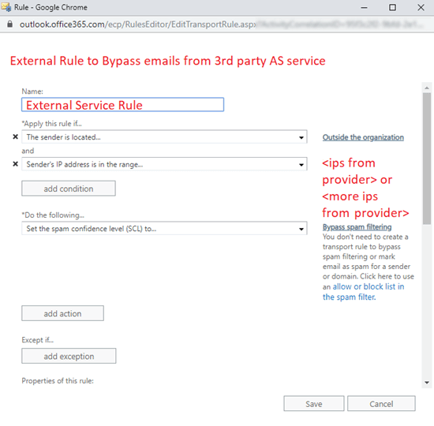
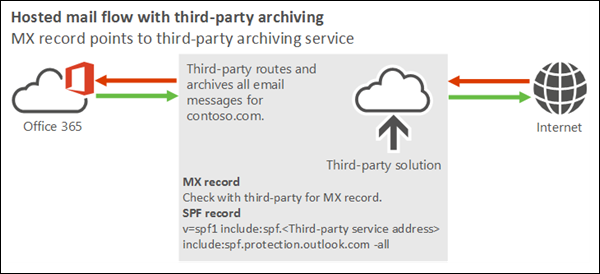

# Manage mail flow using a third-party cloud service with Exchange Online

This topic covers the following complex mail flow scenarios using Exchange Online:

[Scenario 1 - MX record points to third-party spam filtering](#scenario-1---mx-record-points-to-third-party-spam-filtering)

[Scenario 2 - MX record points to third-party solution without spam filtering](#scenario-2-unsupported---mx-record-points-to-third-party-solution-without-spam-filtering)

> [!NOTE]
> Examples in this topic use the fictitious organization, Contoso, which owns the domain contoso.com and is a tenant in Exchange Online. This is just an example. You can adapt this example to fit your organization's domain name and third-party service IP addresses where necessary.

## Using a third-party cloud service with Office 365

### Scenario 1 - MX record points to third-party spam filtering

I plan to use Exchange Online to host all my organization's mailboxes. My organization uses a third-party cloud service for spam, malware, and phish filtering. All email from the internet must first be filtered by this third-party cloud service before being routed to Office 365.

For this scenario, your organization's mail flow setup looks like the following diagram:


#### Best practices for using a third-party cloud filtering service with Office 365

1. Add your custom domains in Office 365. To prove that you own the domains, follow the instructions in [Add users and domains](https://go.microsoft.com/fwlink/p/?LinkId=708999).

2. [Create user mailboxes in Exchange Online](../recipients-in-exchange-online/create-user-mailboxes.md) or [move all users' mailboxes to Office 365](https://go.microsoft.com/fwlink/p/?LinkId=524030).

3. Update the DNS records for the domains that you added in step 1. (Not sure how to do this? Follow the instructions on [this page](https://go.microsoft.com/fwlink/p/?LinkID=534835).) The following DNS records control mail flow:

   - **MX record**: Your domain's MX record must point to your third-party service provider. Follow their guidelines for how to configure your MX record.

   - **SPF record**: All mail sent from your domain to the internet originates in Office 365, so your SPF record requires the standard value for Office 365:

     ```
     v=spf1 include:spf.protection.outlook.com -all
     ```

     You would only need to include the third-party service in your SPF record if your organization sends **outbound** internet email through the service (where the third-party service would be a source for email from your domain).

When you're configuring this scenario, the "host" that you need to configure to receive email from the third-party service is specified in the **MX Record**. For example:


In this example, the host name for the Office 365 host should be **hubstream-mx.mail.protection.outlook.com**. This value can vary from domain to domain, so check your value at **Configuration** \> **Domain** \> \<select domain\> to confirm your actual value.

Next, you need to lock down your Exchange Online organization to only accept mail from your third-party service.

Create and configure a **Partner** inbound connector using either *TlsSenderCertificateName* (preferred) or *SenderIpAddresses* parameters, then set the corresponding *RestrictDomainsToCertificate* or *RestrictDomainsToIPAddresses* parameters to $True. Any messages that are smart-host routed directly to Exchange Online will be rejected (because they didn't arrive over a connection using specified certificate or from the specified IP addresses). 

For example:

```powershell
New-InboundConnector –Name "Reject mail not routed through MX (third-party service name)" -ConnectorType Partner -SenderDomains * -RestrictDomainsToCertificate $true -TlsSenderCertificateName *.contoso.com -RequireTls $true
```

or

```powershell
New-InboundConnector –Name "Reject mail not routed through MX (third-party service name)" -ConnectorType Partner -SenderDomains * -RestrictDomainsToIPAddresses $true -SenderIpAddresses <#static list of on-premises IPs or IP ranges of the third-party service>
```

> [!NOTE]
> If you already have an **OnPremises** inbound connector for the same certificate or sender IP addresses, you still need to create the  **Partner** inbound connector (the *RestrictDomainsToCertificate* and *RestrictDomainsToIPAddresses* parameters are only applied to **Partner** connectors). The two connectors can coexist without problems. 

There are two options for the next step that you may choose from; if you want to prevent double anti-spam check, you may choose option A, which will prevent most of EOP and Office 365 ATP controls through a bypass transport rule. If you want to take advantage of EOP and Office 365 ATP controls you should opt for option B, which consists of enabling Enhanced Filtering.

> [!IMPORTANT]
> In alternative of bypass spam filtering through transport rule, we recommend you enable [Enhanced Filtering Connector (also known as Skip Listing)](https://docs.microsoft.com/en-us/exchange/mail-flow-best-practices/use-connectors-to-configure-mail-flow/enhanced-filtering-for-connectors). Most of times third-party cloud anti-spam shares IPs across many customers, bypassing IPs in this situation may result in spoofed and phishing messages being marked as legitimate from these IPs.


#### Option A:
Create a mail flow rule (also known as a transport rule) in the Exchange admin center (EAC) at **Exchange admin > Mail flow > Rules** to bypass anti-spam check:



#### Option B (recommended):
Enable [Enhanced Filtering](https://docs.microsoft.com/en-us/exchange/mail-flow-best-practices/use-connectors-to-configure-mail-flow/enhanced-filtering-for-connectors#procedures-for-enhanced-filtering-for-connectors) on the Inbound Connector of type *Partner*, which you created to receive messages from the third-party application.

> [!NOTE]
> For hybrid scenarios where third-party application relay on Exchange on-premises to send to EXO, you need to enable Enhanced Filtering on the Inbound Connector of type *OnPremises*. Even so, you can lockdown inbound flow using Inbound Connector of type *Partner*.

### Scenario 2 - MX record points to third-party solution without spam filtering

I plan to use Exchange Online to host all my organization's mailboxes. All email that's sent to my domain from the internet must first flow through a third-party archiving or auditing service before arriving in Exchange Online. All outbound email that's sent from my Exchange Online organization to the internet must also flow through the service. However, the service doesn't provide a spam filtering solution.

We can support this scenario only if you enabled Enhanced Filtering. If you choose to bypass inbound flow through transport rule, we cannot support this scenario because the inbound mail flow through the service causes Office 365 spam and phish filtering to not work properly (mail from all internet senders appears to originate from the third-party service, not the true email source on the internet). 
If you choose to enable Enhanced Filtering, your organization's mail flow setup looks like the following diagram:



#### Best practices for using a third-party cloud service with Office 365

This scenario is currently supported but we strongly recommend that you use the archiving and auditing solutions that are provided by Office 365.

## See also

[Mail flow best practices for Exchange Online and Office 365 (overview)](mail-flow-best-practices.md)

[Set up connectors for secure mail flow with a partner organization](use-connectors-to-configure-mail-flow/set-up-connectors-for-secure-mail-flow-with-a-partner.md)

[Manage all mailboxes and mail flow using Office 365](manage-mailboxes-with-office-365.md)

[Manage mail flow with mailboxes in multiple locations (Office 365 and on-premises Exchange)](manage-mail-flow-for-multiple-locations.md)

[Manage mail flow using a third-party cloud service with Exchange Online and on-premises mailboxes](manage-mail-flow-on-office-365-and-on-prem.md)

[Troubleshoot Office 365 mail flow](troubleshoot-mail-flow.md)

[Test mail flow by validating your Office 365 connectors](test-mail-flow.md)
