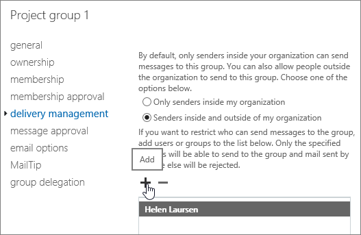

# Fix email delivery issues for error code 5.7.124 in Exchange Online

It's frustrating when you get an error after sending an email message. This topic describes what you can do if you see status code 550 5.7.124 or 5.7.124 in a non-delivery report (also known as an NDR, bounce message, delivery status notification, or DSN). You'll see this automated notification when the sender sender isn't specified in the group's allowed senders list (directly or as a member of a group). Depending how the group is configured, even the group's owner might need to be in the group's allowed senders list in order to send messages to the group.

|||||
|---|---|---|---|
||[I got this bounce message. How do fix I it?](#i-got-this-bounce-message-how-do-fix-i-it)||[I'm the group owner or email admin. How do I fix this?](#im-the-group-owner-or-email-admin-how-do-i-fix-this)|
|

## I got this bounce message. How do fix I it?

Typically, members of a group can send messages to the group. If the group is in your Exchange Online organization, you can try to join the group in Outlook or Outlook on the web (formerly known as Outlook Web App). For instructions, see [Join a group in Outlook](https://support.microsoft.com/office/2e59e19c-b872-44c8-ae84-0acc4b79c45d).

You might have to wait for the group's owner to approve your request to join the group before you can successfully send messages to it. If the group isn't in your organization, or if the group doesn't allow requests to join, then you'll need to ask the group owner to add you to the allowed senders list. You'll find instructions for finding the group owner in the NDR.

## I'm the group owner or email admin. How do I fix this?

The two methods that will allow the sender to send messages to the group are described in the following sections.

To open the Exchange admin center (EAC), see [Exchange admin center in Exchange Online](https://docs.microsoft.com/Exchange/exchange-admin-center).

### Method 1: Add the sender to the group's existing allowed senders list

1. In the EAC, go to **Recipients** \> **Groups** \> select the group from the list, and then click **Edit** .

2. In the group properties dialog box that opens, go to **Delivery management** and then click **Add** .

   

3. In the **Select Allowed Senders** dialog box that opens, select and add the sender or a group that the sender is a member of. When you're finished, click **OK**.

4. Click **Save**.

> [!NOTE]
> To add an external sender to a group's allowed senders list, you must first create a [mail contact](https://docs.microsoft.com/exchange/recipients-in-exchange-online/manage-mail-contacts) or a [mail user](https://docs.microsoft.com/exchange/recipients-in-exchange-online/manage-mail-users) to represent the external sender in your organization.

### Method 2: Allow all internal and external senders to send messages to this group

If you decide that you don't need to restrict the message senders to this group, you can remove the restrictions so anyone can send messages to this group:

1. In the EAC, go to **Recipients** \> **Groups** \> select the group from the list, and then click **Edit** .

2. In the group properties dialog box that opens, go to **Delivery management**.

3. In the **Distribution Group** box select **Delivery management** and configure the following settings:

   - Remove any entries in the allowed senders list by selecting one entry, pressing CTRL + A to select all entries, and then clicking **Remove** .

     

   - Select **Senders inside and outside of my organization**.

4. When you're finished, click **Save**.

## More information about groups

Groups with more than 5,000 members have the following restrictions automatically applied to them:

- Senders to the group must be members of the group.

- Messages sent to the group require the approval of a moderator. To configure moderation for a group, see [Configure a moderated recipient in Exchange Online](../../recipients-in-exchange-online/configure-a-moderated-recipient.md).

- Large messages can't be sent to the group. However, senders of large messages will receive a different NDR. For more information about large messages, see [Distribution group limits](https://docs.microsoft.com/office365/servicedescriptions/exchange-online-service-description/exchange-online-limits#distribution-group-limits).

## Still need help with error code 550 5.7.124?

## See also

[Email non-delivery reports in Exchange Online](non-delivery-reports-in-exchange-online.md)

[Create and manage distribution groups in Exchange Online](../../recipients-in-exchange-online/manage-distribution-groups/manage-distribution-groups.md).
