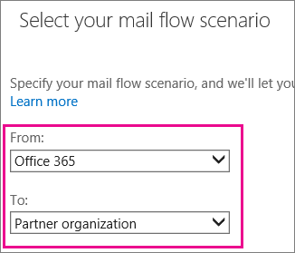
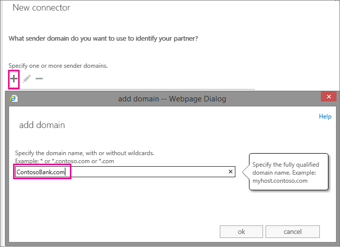
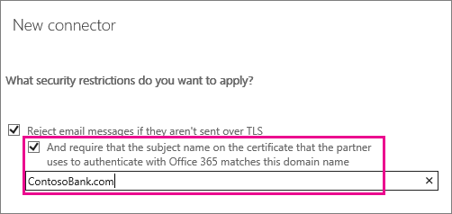
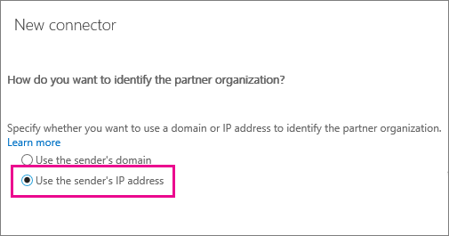
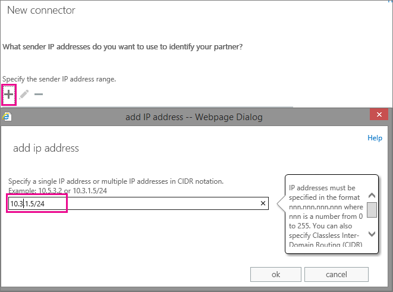

# Set up connectors for secure mail flow with a partner organization

You can create connectors to apply security restrictions to mail exchanges with a partner organization or service provider. A partner can be an organization you do business with, such as a bank. It can also be a third-party cloud service that provides services such as archiving, anti-spam, and filtering.

You can create a connector to enforce encryption via transport layer security (TLS). You can also apply other security restrictions such as specifying domain names or IP address ranges that your partner organization sends mail from.

> [!NOTE]
> Setting up a connector to exchange mail with a partner organization is optional; mail flows to and from your partner organization without connectors.

If you use a third-party cloud service for email filtering and need instructions for making this work with Office 365, see [Mail flow best practices for Exchange Online and Office 365 (overview)](../../mail-flow-best-practices/mail-flow-best-practices.md).

## Using connectors to exchange email with a partner organization

By default, Office 365 sends mail using TLS encryption, provided that the destination server also supports TLS. If your partner organization supports TLS, you only need to create a connector if you want to enforce certain security restrictions - for example, you always want TLS applied, or you require certificate verification whenever mail is sent from your partner to your organization.

> [!NOTE]
> For information about TLS, see [How Exchange Online uses TLS to secure email connections in Office 365](https://go.microsoft.com/fwlink/p/?LinkId=620842) and for detailed technical information about how Exchange Online uses TLS with cipher suite ordering, see [Enhancing mail flow security for Exchange Online](https://go.microsoft.com/fwlink/p/?LinkId=620841).

When you set up a connector, email messages are checked to make sure they meet the security restrictions that you specify. If email messages don't meet the security restrictions that you specify, the connector will reject them, and those messages will not be delivered. This makes it possible to set up a secure communication channel with a partner organization.

You can set up one or both of the following depending on your requirements:

- [Set up a connector to apply security restrictions to mail sent from Office 365 to your partner organization](#set-up-a-connector-to-apply-security-restrictions-to-mail-sent-from-office-365-to-your-partner-organization)

- [Set up a connector to apply security restrictions to mail sent from your partner organization to Office 365](#set-up-a-connector-to-apply-security-restrictions-to-mail-sent-from-your-partner-organization-to-office-365)

Also in this article:

- [Change a connector that Office 365 is using for mail flow](#change-a-connector-that-office-365-is-using-for-mail-flow)

- [Example security restrictions you can apply to email sent from a partner organization](#example-security-restrictions-you-can-apply-to-email-sent-from-a-partner-organization)

Review this section to help you determine the specific settings you need for your business.

## Set up a connector to apply security restrictions to mail sent from Office 365 to your partner organization

To create a connector in Office 365, click **Admin**, then click **Exchange** to go to the **Exchange admin center**. Next, click **mail flow**, and click **connectors**. If any connectors already exist for your organization, you can see them listed here.

Before you set up a new connector, check any connectors that are already listed here for your organization. For example, if you already have a connector set up for a partner organization, you'll see it listed. Make sure you don't create duplicate connectors for a single organizational partner; when this happens, it can cause errors, and your mail might not be delivered.

To start the wizard, click the plus symbol **+**. On the first screen, choose the options that are depicted in the following screenshot:

Click **Next**, and follow the instructions in the wizard. Click the **Help** or **Learn More** links if you need more information. The wizard will guide you through setup. At the end, make sure your connector validates. If the connector does not validate, see [About fixing connector validation errors](https://technet.microsoft.com/library/abbae1e7-2cbe-434c-bd9f-ede00cebc170.aspx) for help resolving issues.

If you want to create a secure channel with your partner organization in both directions, set up a connector that restricts mail flow from your partner organization to Office 365.

## Set up a connector to apply security restrictions to mail sent from your partner organization to Office 365

You can set up a connector to apply security restrictions to email that your partner organization sends to you. To start the wizard, click the plus symbol **+**. On the first screen, choose the following options:

Click **Next**, and follow the instructions in the wizard. Click the **Help** or **Learn More** links if you need more information. The wizard will guide you through setup. At the end, save your connector.

Ask your partner organization to send a test email. Make sure the email your partner organization sends will cause the connector to be applied. For example, if you specified security restrictions for mail sent from a specific partner domain, make sure they send test mail from that domain. Check that the test email is delivered to confirm that the connector works correctly.

## Change a connector that Office 365 is using for mail flow

To change settings for a connector, select the connector you want to edit and then select the edit icon as shown in the following screen shot.

The connector wizard opens, and you can make changes to the existing connector settings. While you change the connector settings, Office 365 continues to use the existing connector settings for mail flow. When you save changes to the connector, Office 365 starts using the new settings.

## Example security restrictions you can apply to email sent from a partner organization

Review these connector examples to help you decide whether you want to apply security restrictions to email sent by a partner organization, and understand what settings will meet your business needs:

### Create a partner organization connector

To create a connector in Office 365, click **Admin**, and then click **Exchange** to go to the **Exchange admin center**. Next, click **mail flow**, and click **connectors**. If any connectors already exist for your organization, you can see them listed here.

To start the wizard, click the plus symbol **+**. To create a connector for email you receive from a partner organization, use the options depicted in the following screenshot:

Once you choose this mail flow scenario, you can set up a connector that will apply security restrictions to email that your partner organization sends to you. For some security restrictions, you might need to talk to your partner organization to obtain information to complete some settings. Look for the examples that best meet your needs to help you set up your partner connector.

> [!NOTE]
> Any email sent from your partner organization that does not meet security restrictions that you specify will not be delivered.

### Example 1: Require that email sent from your partner organization domain contosobank.com is encrypted using transport layer security (TLS)

To do this, specify your partner organization domain name to identify mail from that partner, and then choose transport layer security (TLS) encryption when you create your Partner to Office 365 connector. Use these options during setup:

Use this screen to enter your partner organization's domain name(s) so the connector can identify mail sent by your partner:

Choose this setting to require encryption for all email from ContosoBank.com using TLS:

When you choose these settings, all email from your partner organization's domain, ContosoBank.com, must be encrypted using TLS. Any mail that is not encrypted will be rejected.

### Example 2: Require that email sent from your partner organization domain ContosoBank.com is encrypted and uses their domain certificate

To do this, use all the settings shown in Example 1. Also, add the certificate domain name that your partner organization uses to connect with Office 365. Use this option during setup:

When you set these restrictions, all mail from your partner organization domain must be encrypted using TLS, and sent from a server with the certificate name you specify. Any email that does not meet these conditions will be rejected.

### Example 3: Require that all email is sent from a specific IP address range

This email could be from a partner organization, such as ContosoBank.com, or from your on-premises environment. For instance, the MX record for your domain, contoso.com, points to on-premises, and you want all email sent to contoso.com to come from your on-premises IP addresses only. This helps prevent spoofing and makes sure your compliance policies can be enforced for all messages.

To do this, specify your partner organization domain name to identify mail from that partner, and then restrict the IP addresses that you accept mail from. Using an IP address makes the connector more specific because it identifies a single address or an address range that your partner organization sends mail from. Enter your partner domain as described in Example 1, then use this option during setup:

When you set these restrictions, all email sent from your partner organization domain, ContosoBank.com, or from your on-premises environment must be sent from the IP address or an address range you specify. Any mail that does not meet these conditions will be rejected.

### Example 4: Require that all email sent to your organization from the internet is sent from a specific IP address (third-party email service scenario)

Mail flow from a third-party email service to Office 365 works without a connector. However, in this scenario you can optionally use a connector to restrict all mail delivery to your organization. If you use the settings described in this example, they will apply to *all email sent to your organization*. When all email sent to your organization comes from a single third-party email service, you can optionally use a connector to restrict all mail delivery; only mail sent from a single IP address or address range will be delivered.

> [!NOTE]
> Make sure you identify the full range of IP addresses that your third-party email service sends mail from. If you miss an IP address, or if one gets added without your knowledge, some mail will not be delivered to your organization.

To restrict all mail sent to your organization from a specific IP address or address range, use these options during setup:

When you set these restrictions, all mail sent to your organization must be sent from a specific IP address range. Any internet email that does not originate from this IP address range will be rejected.

### Example 5: Require that all mail sent from your partner organization IP address or address range is encrypted using TLS

To identify your partner organization by IP address, use these options during setup:

Add the requirement for TLS encryption by using this setting:

When you set these restrictions, all mail from your partner organization sent from the IP address or address range you specify must be sent using TLS. Any mail that does not meet this restriction will be rejected.

## See also

[Configure mail flow using connectors in Office 365](use-connectors-to-configure-mail-flow.md)

[Mail flow best practices for Exchange Online and Office 365 (overview)](../mail-flow-best-practices.md)

[About fixing connector validation errors](https://technet.microsoft.com/library/abbae1e7-2cbe-434c-bd9f-ede00cebc170.aspx)

[What happens when I have multiple connectors for the same scenario?](set-up-connectors-to-route-mail.md#what-happens-when-i-have-multiple-connectors-for-the-same-scenario)
