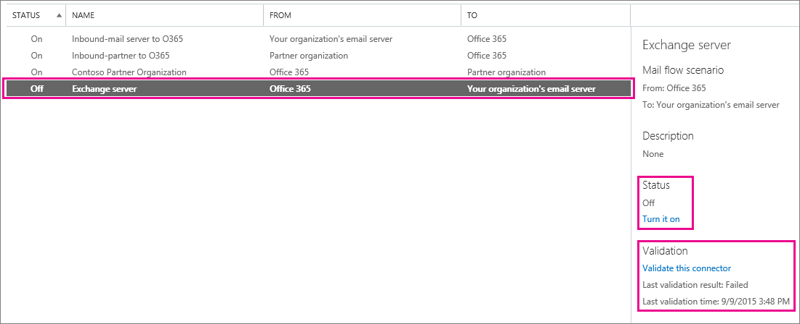
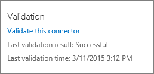

# Validate connectors in Office 365

If your organization has its own email server (also called on-premises server), you must set up connectors to enable mail flow between Office 365 and your email server. For mail flow to work correctly, your connectors must be validated and turned on. Connector validation runs as part of the connector setup process. This article helps if you want to validate your connectors at a different time, or if you want to understand more about the process. Use built-in connector validation to test whether a connector is set up correctly and fix any mail flow issues before you turn the connector on.
  
> [!NOTE]
> If you want to change connector settings, Office 365 uses the existing connector settings for mail flow until you save your changes. For more information, see [Change a connector that Office 365 is using for mail flow](set-up-connectors-to-route-mail.md#change-a-connector-that-office-365-is-using-for-mail-flow)
  
## Validate and turn on connectors

1. Sign in to Office 365, choose **Admin**, and then click **Exchange** to go to the Exchange admin center. Click **Mail flow**, and click **Connectors**. 
    
    Any Office 365 connectors that exist for your organization are listed on the **Connectors** page. This includes connectors that were created by using the Hybrid Configuration Wizard or PowerShell. You can validate any connector configured for mail flow from Office 365 to your organization's email server, or to a partner organization. 
    
2. Choose the connector you want to validate or turn on. You can see information about the connector in the details pane as shown in the following screen shot. 
  

  
3. When you select a connector for mail flow that originates in Office 365, you can choose the **Validate this connector** link. You can also see whether the connector was validated previously as shown in the following screen shot. 
    
    
  
4. With the connector selected, choose **Validate this connector**. The **Validate this connector** dialog box opens. Enter one or more email addresses to start the validation. Office 365 uses these addresses to make sure your mail flow is set up correctly. For example, if you want to validate a connector for mail flow from Office 365 to your organization's email server, enter an email address for a mailbox located on that email server. 
    
5. Choose **Validate** to continue. To find out what issues validation examines, and for details about fixing any validation errors, see [Fixing connector validation errors](https://technet.microsoft.com/library/abbae1e7-2cbe-434c-bd9f-ede00cebc170.aspx).
    
6. For each connector, check whether the connector is turned on. If a connector that you need for mail flow isn't turned on, under **Status** choose **Turn it on**. 
    
> [!NOTE]
> If you continue to have mail flow issues after validating a connector, check whether you have set up multiple connectors that might apply in a single scenario. For example, problems can occur if you have more than one connector set up for mail flow from Office 365 to your email server. If you need multiple connectors for mail flow from Office 365 to your email server (or to a partner), make sure you validate and turn on each connector. > If you want to change a connector, Office 365 uses the existing connector settings for mail flow until you save your changes. For more information, see [Change a connector that Office 365 is using for mail flow](set-up-connectors-to-route-mail.md#change-a-connector-that-office-365-is-using-for-mail-flow)
  
## See also

[Set up connectors to route mail between Office 365 and your own email servers](set-up-connectors-to-route-mail.md)
  
[Configure mail flow using connectors in Office 365](use-connectors-to-configure-mail-flow.md)

[Fixing connector validation errors](https://technet.microsoft.com/library/abbae1e7-2cbe-434c-bd9f-ede00cebc170.aspx)
  
[When do I need a connector?](use-connectors-to-configure-mail-flow.md#when-do-i-need-a-connector)

