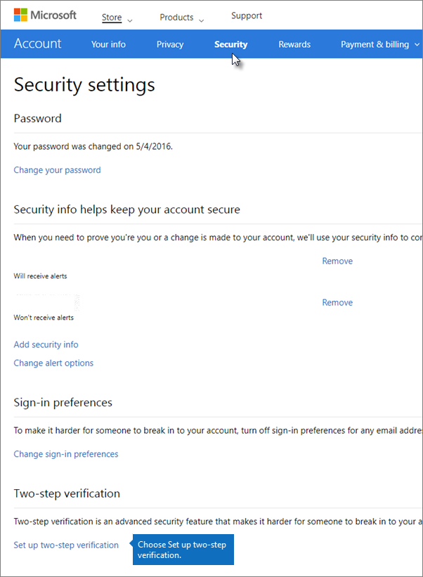
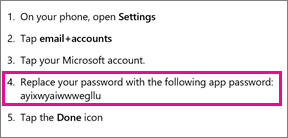

# Migrating your Outlook.com account to Office 365

If you are migrating your Outlook.com or Hotmail.com account to Office 365, you'll need to enable two-step verification (also known as two-factor authentication).

Two-step verification helps protect you by making it more difficult for someone else to sign in to your email account. It uses two different forms of identity: your password, and a contact method. Even if someone else finds your password, they'll be stopped if they don't have access to your other devices or accounts.

You set up two-step verification with an email address, phone number, or authenticator app. When you sign in on a new device or from a new location, we'll send you a security code that you enter on the sign-in page as a second form of authentication in addition to your password.

After you have setup two-step verification, you can also obtain an app password that you will have to use in order to use Internet Message Access Protocol (IMAP) migration to copy email from your Outlook.com or Hotmail.com account to your Office 365 for business account. If your Office 365 admin is moving email messages from your Outlook.com or Hotmail.com account to Office 365 on your behalf, you'll need to give him your app password.

## Turn on two-step verification and create an app password in Outlook.com or Hotmail.com

1. Sign in to [Outlook.com](https://go.microsoft.com/fwlink/p/?LinkId=255207) or [Hotmail.com](https://go.microsoft.com/fwlink/p/?LinkId=229224).

2. Go to the [Security settings](https://go.microsoft.com/fwlink/p/?LinkId=239676) page. Enter your password if prompted.

    If you want to navigate to the Security settings page, in Outlook.com click or tap your profile picture on the upper right \> **View account** and on the Account page, On your **Account** page, choose **Security** on the blue bar and then, **more security options**.

3. Scroll down the page and choose **Set up two-step verification** under **Two-step verification**.

    

4. Choose **Next** to start the setup wizard.

5. On the **Set up your smart phone with an app password** page, under the **Update your Windows Phone 8 (or earlier) with an app password** list, note the 16-digit app password in the list:

    

    If you use a Windows Phone 8 (or earlier) you need to replace the password you use to sign in to your email with the app password.

    > [!IMPORTANT]
    > Even though the page indicates this is for Windows Phone 8 (or earlier), **this list contains the app password your admin needs** to migrate you hotmail.com or outlook.com email to Office 365 for business. You will need this app password even if you set up two-step verification by using an Android or iPhone.

    This is also the app password you or your admin will use to [migrate your hotmail.com or outlook.com](imap-migration-in-the-admin-center.md) email to Office 365 for business.

6. On your mobile device, download the Microsoft Authenticator from your app store.

    Choose on of the links take you to the Microsoft Authenticator for [Windows Phone](https://go.microsoft.com/fwlink/p/?LinkId=722777), [Android](https://go.microsoft.com/fwlink/p/?LinkId=722778) or [iOS](https://go.microsoft.com/fwlink/p/?LinkId=722779).

7. Open the Microsoft Authenticator app on your mobile device, and choose **+**. Scan the code on the **Set up an authenticator app** page.

8. In step **4** on the **Set up an authenticator app** page, type the 6-digit code that's displayed on your mobile device (for example, 555111; you don't need to include any spaces).

    You don't need to memorize this password; it changes constantly and a new ones are sent to you via the Microsoft Authenticator app. This is why it's so secure. Whenever you sign in to your email account from a new device or location, look at your Microsoft Authenticator app and sign in using latest app password that's been sent to you instead of using your old static password.

9. You'll get a message that two-step verification is turned on. Print your new *recovery code* (this isn't your app password). If you ever need to recover access to this account, this recovery code will help. It's a good idea to keep it tucked away in a safe place.

10. Choose **Next**.
