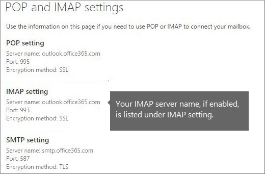

# Learn more about setting up your IMAP server connection

To migrate your email by using Internet Message Access Protocol (IMAP) migration, Office 365 needs to know the name and connection settings of your IMAP server.

## Find your IMAP server name

Office 365 needs the name of the source email server from which you want to migrate mailboxes. In this task, we describe how to get the name of the system by using Outlook Web App. If you don't have access to Outlook Web App, or if your IMAP server name isn't listed there, either contact support or consult the help documentation for your source email system.

 **To get the name of your source email system by using TE102821288**

- In Outlook Web App, on the toolbar, choose **Settings**  \> **Options** \> **Mail** \> **Accounts** \> **POP and IMAP**. Below your account information, you'll see a link to **Settings for POP and IMAP access**. Your IMAP server name, if enabled, is listed under IMAP setting.

    

    The IMAP server for Gmail is: **imap.gmail.com**.

    See [POP and IMAP email settings for Outlook](https://support.office.com/article/8361e398-8af4-4e97-b147-6c6c4ac95353.aspx) for more information about IMAP connections in Office 365.

## Values for security and port

Office 365 also needs the values for the encryption method and the Transmission Control Protocol (TCP) port number used by the source email IMAP server.

- **Security**: This is the encryption method used by the IMAP server. The default value for secure sockets layer (SSL) is appropriate for most IMAP servers.

- **Port**: This is the TCP port number used to connect to the IMAP server. Use port 143 for unencrypted connections, port 143 for Transport Layer Security (TLS) connections, or port 993 (the default), for SSL connections. Port 993 is appropriate for most IMAP servers.

