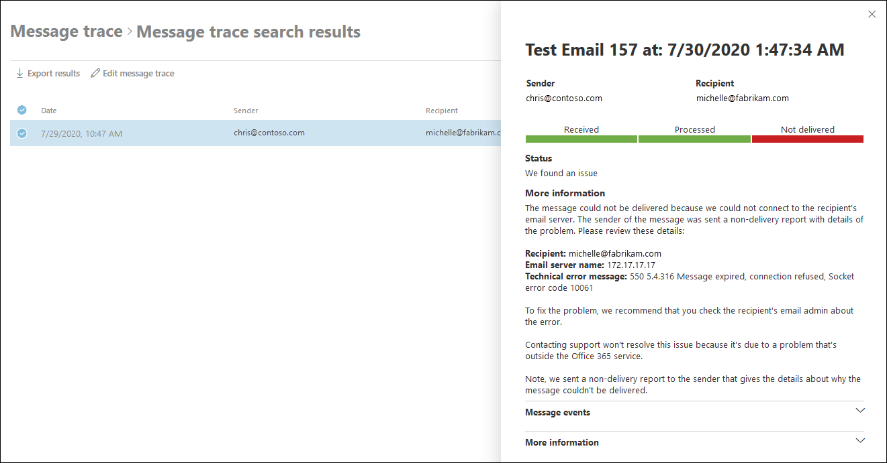

# Email issues for priority accounts report in the modern EAC

> [!NOTE]
> The priority accounts feature that's described in this topic is available only to organizations that meet both of the following requirements:
> 
> - Office 365 E3 or Microsoft 365 E3, or Office 365 E5 or Microsoft 365 E5.
> 
> - At least 10,000 licenses and at least 50 monthly active Exchange Online users.

The **Email issues for priority accounts** report in the modern Exchange admin center (modern EAC) allows Excahnge Admins and Global admins to view failed events from the last 15 minutes and delayed email messages from last 6 hours that were sent to or sent from priority accounts. If no issues are found, the report will be empty. Users can configure to receive email notifications for failed and delayed messages which will provide information at the time alert is fired. 

Priority users are people in your Microsoft 365 organization who have a high business impact, like your CEO, executives, or other users who have access to sensitive or high priority information. For more information about priority accounts, see [Manage and monitor priority account](https://docs.microsoft.com/microsoft-365/admin/setup/priority-accounts).

The **Unhealthy email status** section shows the following information about messages where a priority user is a sender or a recipient:

- **Date**
- **Sender**
- **Recipient**
- **Subject**
- **Status**: The value is **Failed** or **Delayed**.

To quickly filter the results by recipient, click **Search**  and start typing the recipient's email address.

For more advanced filters that you can also save and use later, click **Filter**  and select **New filter**. In the **Custom filter** flyout that appears, enter the following information:

- **Name your filter**: Enter a unique name.

- Click **Add new clause**. A clause contains the following elements that you need to enter:

  - **Field**: Select **Date**, **Sender**, **Recipient**, **Subject** or **Status**.

  - **Operator**: Select **starts with** or **is**.

  - **Value**: Enter the value you want to search for.

  You can click **Add new clause** as many times as you need. Multiple clauses use AND logic (\<Clause1\> AND \<Clause2\>...).

  To remove a clause, click **Remove** 

  When you're finished, click **Save**. The new filter is automatically loaded, and the results are changed based on the filter. This is the same result as clicking **Filter** and selecting the customer filter from the list.

  To unload a existing filter (return to the default list), click **Filter**  and select **Clear all filters**.

Select an entry in the list to be taken to the [message trace](../../monitoring/trace-an-email-message/message-trace-modern-eac.md) search results for the message. Select the message trace entry to view details about the message and what happened to it.

Click **Export** to export the displayed results to a .csv file.

Click **Manage priority accounts** to add or remove users from the priority accounts list.

Click **Edit policy** to configure email notifications related to priority accounts:

- **Send email notification**: Select or clear this checkbox.

- **Send email notifications ot these users or groups**: Click in the box to find or enter a user or group to receive email notifications.

- **Daily notification limit**: Select from the following values: **No limit**, 1 (default), 5, 10, 25, 50, 150, or 200.
  
- **Threshold**: An email notification is sent when the number of failed or delayed email messages for priority accounts exceeds the specified value. The default value is 100.

You can see alerts for delayed and failed messages under **View Alerts**. Selecting the alert will provide details about the messages that were delayed or failed at the time alert is fired. 

When you're finished, click **Save**.
