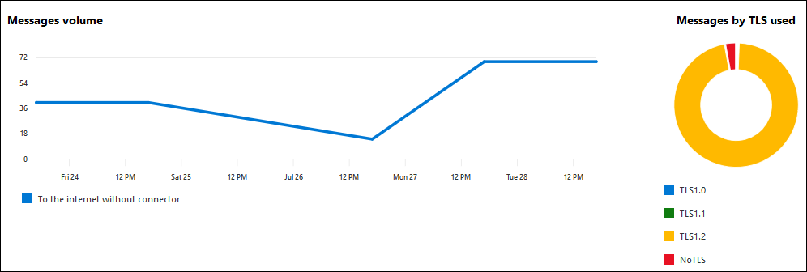

# Outbound messages report in the modern Exchange admin center

The **Outbound messages report** report in the modern Exchange admin center (modern EAC) displays information about email leaving your organization to the internet and over connectors. The report also shows the TLS encryption level that's being used.

> [!NOTE]
> By default, the report shows data for the last 7 days. If the report is empty, try changing the date range.

The overview section contains the following charts:

- **Message volume**: Shows the number of outbound messages to the internet and over connectors.

- **Messages by TLS used**: Shows the TLS encryption level. If you hover over a specific color in the chart, you'll see the number of messages for that specific version of TLS.

The **Connector report details** section shows the following information about each specific connector or email from the internet:

- **Date**
- **Connector direction and name**
- **Connector type**
- **Forced TLS?**
- **No TLS**
- **TLS 1.0**
- **TLS 1.1**
- **TLS 1.2**
- **Volume**

To quickly filter the results, click **Search**  and start typing a value.

To filter the results by date range or connector name, use the boxes. You can specify a date range up to 90 days.

For more advanced filters that you can also save and use later, click **Filter**  and select **New filter**. In the **Custom filter** flyout that appears, enter the following information:

- **Name your filter**: Enter a unique name.

- Click **Add new clause**. A clause contains the following elements that you need to enter:

  - **Field**: Select **Date**, **Connector direction**, **Connector type**, **Forced TLS**, **No TLS**, **TLS 1.0**, **TLS 1.1**, **TLS 1.2**, or **Volume**.

  - **Operator**: Select **starts with** or **is**.

  - **Value**: Enter the value you want to search for.

  You can click **Add new clause** as many times as you need. Multiple clauses use AND logic (\<Clause1\> AND \<Clause2\>...).

  To remove a clause, click **Remove** 

  When you're finished, click **Save**. The new filter is automatically loaded, and the results are changed based on the filter. This is the same result as clicking **Filter** and selecting the customer filter from the list.

  To unload a existing filter (return to the default list), click **Filter**  and select **Clear all filters**.

Click **Export** to export the displayed results to a .csv file.

## See also

For more information about other mail flow reports, see [Mail flow reports in the modern EAC](mail-flow-reports.md).
