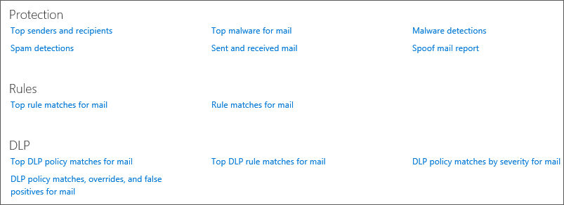
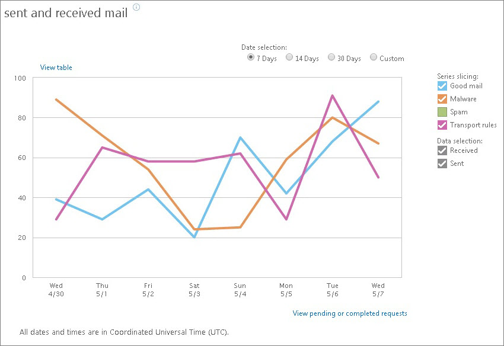
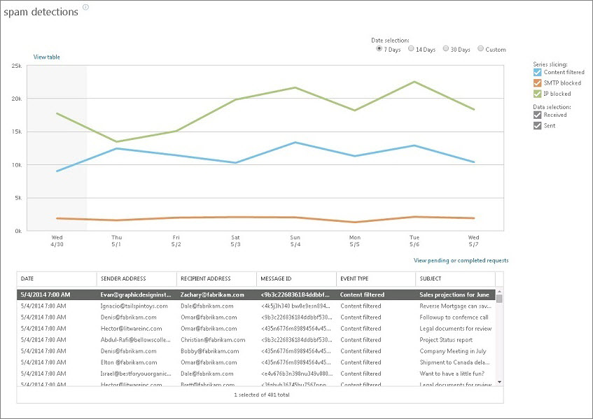
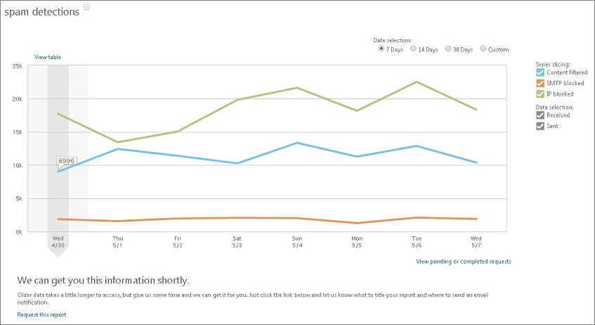
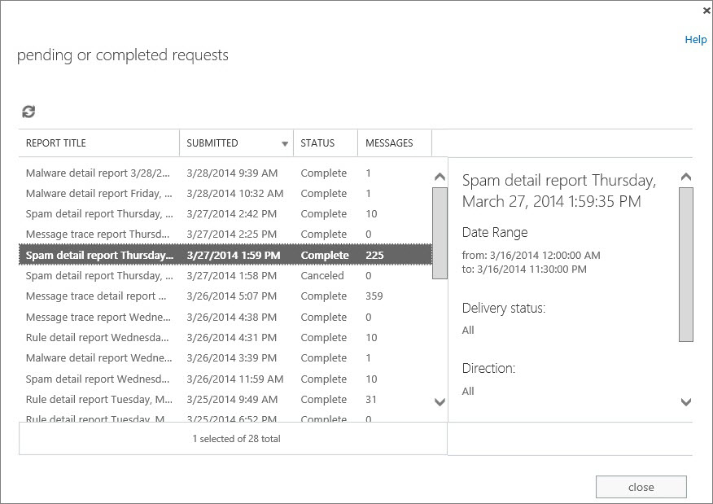

# Use mail protection reports in Office 365 to view data about malware, spam, and rule detections

If you're an Exchange Online or Exchange Online Protection (EOP) admin, there's a good chance you'd like to monitor how much spam and malware is being detected, or how often your mail flow rules, also called transport rules, are being matched. With the interactive mail protection reports in the Office 365 admin center, you can quickly get a visual report of summary data, and drill-down into details about individual messages, for as far back as 90 days. 
  

  
This topic covers the following areas:
  
- [Reporting overview](use-mail-protection-reports.md#BKMK_Reportingoverview) Describes the mail protection reports that are available in the Office 365 admin center. 
    
- [View mail protection reports in the Office 365 admin center](use-mail-protection-reports.md#BKMK_Viewmailprotectionreportsintheoffice365admincenter) Describes how to view summary and detail data reports. 
    
- [View detail data for messages that are older than 7 days](use-mail-protection-reports.md#BKMK_Viewdetaildataformessagesthatareolderthan7days) Describes how to run a downloadable detail data report for messages that are greater than 7 days old and how to view the report results. 
    
You can customize certain mail protection reports to filter on sender and/or recipient or on a specific domain. You can also schedule mail reports to be sent automatically to your inbox. To learn how to do this, see [Customize and schedule mail protection reports in Office 365 to be automatically sent to your inbox](customize-and-schedule-mail-protection-reports.md).
  
## Reporting overview

You can access the following mail protection reports from the **REPORTS** page in Office 365 admin center. 
  
### Protection reports

|**Report**|**Description**|
|:-----|:-----|
|Top senders and recipients    | Shows the following, depending on the type of report you select:     Top mail recipients - the top 10 recipients for overall mail.     Top mail senders - the top 10 senders for overall mail.     Top spam recipients - the top 10 recipients for spam detections.     Top malware recipients - the top 10 recipients for malware detections.    |
|Top malware for mail    |Shows the top 10 malware in received and sent mail.    |
|Malware detections    |Shows the number of malware detections in sent or received mail before the malware action was applied. Details about individual malware-filtered messages are available by selecting a point on the graph.    |
|Spam detections    | Shows what spam was detected in sent or received mail, grouped by spam filtering type:     Content filtered - mail identified as spam due to message characteristics consistent with spam.     SMTP blocked - mail blocked before entering the service, based on sender/recipient filtering.     IP blocked - mail blocked before entering the service, based on IP reputation.     By default, all messages are included. You can modify the details of this report to filter to a specific sender and/or a recipient or you can use \*@domain to get a report on a single domain. To learn how to do this, see [Customize and schedule mail protection reports in Office 365 to be automatically sent to your inbox](customize-and-schedule-mail-protection-reports.md).     Details about individual content-filtered messages are available by selecting a point on the graph.    |
|Sent and received mail    | Shows the sent and received mail grouped by traffic type:     Good mail - messages that were received and not identified as spam or malware.     Spam - messages identified as spam.     Malware - messages that contained malware.     Mail flow rules (also called transport rules) - messages that matched at least one rule.     By default, all messages are included. You can modify the details of this report to filter to a specific sender and/or a recipient or you can use \*@domain to get a report on a single domain. To learn how to do this, see [Customize and schedule mail protection reports in Office 365 to be automatically sent to your inbox](customize-and-schedule-mail-protection-reports.md).     Details about individual messages are not available.    |
|Spoof mail report    | For customers who have Office 365 Enterprise E5 or have purchased Advanced Threat Protection (ATP) licenses, this chart shows inbound emails sent to your organization where the sender appears to represent your organization, but the actual sender identity is different. This is known as "insider spoofing".     Organizations might use spoofing intentionally for good reason, and some types of spoofing are malicious. This report includes both types of spoofing emails received by your organization, and helps you take action to allow or block further emails from that sender. For example, you might contract a third party to send an invite to all employees for a company event - an email like this would appear in this report as non-spam or **Good mail**. Office 365 also detects mail sent as your company in a malicious way and labels this **Caught as spam**.     You can see a detailed view by clicking on a data point in the chart for a given day. The counts are aggregated based on the following attributes:    **Spoofed Sender** - The visible sender name which appears to be from your organization.    **True Sender** - The actual sender associated with the registered IP address. If this field is blank, the sender's domain was not detected when the DNS record was examined by Office 365.    **Sender IP** - The IP address or address range associated with the sender of the spoof message.    **Event Type** - Whether the spoof message was marked as spam ( **Caught as spam**) or non-spam ( **Good mail**).     You can block or allow email sent from this IP address in future by selecting **Add to IP Block or IP Allow list**. Only add IP addresses to the **Allow list** if you know they belong to safe domains.    |
   
### Rules reports

|||
|:-----|:-----|
|**Report**   |**Description**   |
|Top rule matches for mail    |Shows the top 10 most-matched mail flow rules for received and sent mail.    |
|Rule matches for mail    |Shows the number of mail flow rule matches, grouped by rule severity. Details about individual messages are available by selecting a point on the graph.    By default, all messages are included. You can modify the details of this report to filter to a specific sender and/or a recipient or you can use \*@domain to get a report on a single domain. To learn how to do this, see [Customize and schedule mail protection reports in Office 365 to be automatically sent to your inbox](customize-and-schedule-mail-protection-reports.md).    |
   
### DLP reports

|||
|:-----|:-----|
|**Report**   |**Description**   |
|Top DLP policy matches for mail    |Shows the top 10 most-matched data loss prevention (DLP) policies for received and sent mail.    |
|Top DLP rule matches for mail    |Shows the top 10 most-matched DLP rules for received and sent mail.    |
|DLP policy matches by severity for mail    |Shows the number of DLP policy rule matches for mail, grouped by severity. Details about individual messages are available by selecting a point on the graph.    |
|DLP policy matches, overrides, and false positives for mail    |Shows the number of DLP policy matches, overrides (the user has sent the mail despite a DLP match), and false positives (the user reports that a DLP match was incorrect). Details about individual messages are available by selecting a point on the graph.    |
   
> [!NOTE]
> The DLP feature is available only with certain Exchange Online and EOP subscription plans. For information about DLP feature availability with each plan, see the Data Loss Prevention table entries in the [Exchange Online Service Description](https://go.microsoft.com/fwlink/?LinkId=275416) and the [Exchange Online Protection Service Description](https://go.microsoft.com/fwlink/?LinkId=320619). 
  
### What do you need to know before you begin?

- You need to be assigned permissions before you can perform this procedure or procedures:
    
  - For Exchange Online admins, in order to view Office 365 admin center reports, you need the "global admin" Office 365 admin role, and the Exchange admin roles listed for the "View reports" entry in the [Feature permissions in Exchange Online](../permissions/feature-permissions.md) topic. 
    
  - For EOP admins, in order to view Office 365 admin center reports, you need the "global admin" Office 365 admin role, and the Exchange admin roles listed for the "View reports" entry in the [Feature Permissions in EOP](http://technet.microsoft.com/library/34674847-a6b7-4a7e-9eaa-b64f22bc150d.aspx) topic. 
    
- For information about when data is available and for how long, see the "Reporting and message trace data availability and latency" section in [Reporting and Message Trace in Exchange Online Protection](http://technet.microsoft.com/library/f40253f2-50a1-426e-9979-be74ba74cb61.aspx).
    
- If a detail report is run for messages that are older than 7 days, the report is available as a downloadable .csv file, which can be opened in an application such as Excel.
    
-  Exchange mail protection reports are also accessible through remote Windows PowerShell. For a complete list of Exchange Online reporting cmdlets, see [Reporting cmdlets in Exchange Online](http://technet.microsoft.com/library/9f883787-d711-41a5-95b3-f7aaa1b3cdf0.aspx).
    
> [!TIP]
> Having problems? Ask for help in the Exchange forums. Visit the forums at [Exchange Server](https://go.microsoft.com/fwlink/p/?linkId=60612),[Exchange Online](https://go.microsoft.com/fwlink/p/?linkId=267542), or [Exchange Online Protection](https://go.microsoft.com/fwlink/p/?linkId=285351). 
  
## View mail protection reports in the Office 365 admin center

When you click a mail protection report link, such as the **sent and received mail** report, a new window opens up and displays an interactive chart with summary-level information. 
  

  
 **Summary data:** You can select the appropriate date range to see up to 90 days of summary data. You can change the view to see only messages that match specific criteria by altering the series slicers located on the right side of the graph. For example, if you want to view all messages except spam messages, clear the **Spam** slicer option. Some reports might also have parameters above the graph that let you further narrow down your criteria. For information about the report and its parameters, you can hover over the information link next to the report title. 
  
 **Detail data:** Detailed message data is available for some reports by clicking on a specific data point within the graph. When a point is selected, the message details are displayed below the graph in a table. You can page through the detail messages if there are more records than can be displayed on one page. Each detail lists the following: 
  
- The date the message was sent.
    
- The sender and recipient of the message (only one recipient is listed per line). 
    
- The message ID (found in the header of the message and usually similar to the following format: \<08f1e0f6806a47b4ac103961109ae6ef@server.domain\>).
    
- The subject line text of the message.
    
Depending on the type of report, you may see additional fields that include information such as the spam event type, the mail flow rule matched, and the action associated with a rule. 
  
The following image shows the **spam detections** report with detail data. 
  

  
> [!NOTE]
> The number of details may differ from the summary count. Each report will have an explanation about how the number of detail records is computed. 
  
> [!TIP]
> You can click the **View table** link to display the data in a table rather than a graph. You can't drill down into message details within the table view, however. 
  
## View detail data for messages that are older than 7 days

Detail data for messages that are older than 7 days is available as a download. This will be shown as the area in the graph with a gray background. When you select a data point in the summary graph for data older than 7 days, a **Request this report** link will be displayed on the bottom of the page. 
  

  
### Run a detail report for messages that are older than 7 days

When you click the **Request this report** link, you'll be presented with a new page that lets you provide notification information and further filter the request. 
  

  
You can specify the following parameters:
  
- **Start date and time** and **End date and time** Specify the date range from which you want reporting data. The end date and time must be at least 24 hours old. 
    
- **Delivery status** Using the list, select the status of the message you want to view information about. Leave the default value of **All** to cover all statuses. Other possible values are: 
    
  - **Delivered** The message was successfully delivered to the intended destination. 
    
  - **Failed** The message was not delivered. Either the delivery was attempted and failed, or the message was not delivered as a result of actions taken by the filtering service. For example, if the message was determined to contain malware. 
    
  - **Expanded** The message was sent to a distribution list and was expanded so the members of the list can be viewed individually. 
    
- **Message ID** This is the Internet message ID (also known as the Client ID) found in the header of the message with the "Message-ID:" token. Users can provide you with this information in order to investigate specific messages. 
    
    The form of this ID varies depending on the sending mail system. The following is an example: \<08f1e0f6806a47b4ac103961109ae6ef@server.domain\>.
    
    > [!NOTE]
    > Be sure to include the full Message ID string. This may include angle brackets (\<\>). 
  
    This ID should be unique; however, it is dependent on the sending mail system for generation, and not all sending mail systems behave the same way. As a result, there's a possibility that you may get results for multiple messages when querying on a single Message ID.
    
- **Original client IP address** Specify the IP address of the sender's client. 
    
- **Report title** Specify the unique identifier for this report. This will also be used as the subject line text for the email notification. The default is "\<  *Report type*  \> detail report \<  *day of the week*  \>, \<  *current date*  \> \<  *current time*  \>". Here's an example: "Spam detail report Thursday, February 27, 2014 7:21:09 AM". 
    
- **Notification email address** Specify the email address that you want to receive the notification when the report request completes. This address must reside within your list of accepted domains. 
    
Click **Submit** to submit the report request. Although the amount of reports you can run over a 24-hour period should be sufficient for your reporting needs, you'll be warned if you're nearing the threshold of the amount of reports you're allowed to run over a 24-hour period. 
  
After you click the **Submit** button, a message should appear letting you know that the report request was successfully submitted and that an email notification will be sent to the email address (if supplied) when it has completed. It may take up to a few hours for the report request to complete. (If the request is processed, and data that matches your search criteria is successfully retrieved, this notification message will include information about the report and a link to the downloadable .csv file. If no data was found that matched the search criteria you specified, you'll be asked to submit a new request with changed criteria in order to obtain valid results.) 
  
### View pending or completed report requests

To view the status of report requests, you can click the **View pending or completed requests** link from the main page, which will open the **pending or completed requests** page. 
  

  
The **Pending or completed requests** page lets you see the status of any of your submitted requests (in addition to your report requests, it also lists your submitted message trace requests). From here, you can cancel pending requests or download a completed report. 
  
The list of requests can be sorted by clicking any of the column headers. In addition to the report title, the date and time the request was submitted, and the number of messages in the report, the following status values are listed: 
  
- **Not started** The request was submitted but is not yet running. At this point, you have the option to cancel the request. 
    
- **Cancelled** The request was submitted but was cancelled. 
    
- **In progress** The request is running, and you can't cancel the request or download the report. 
    
- **Completed** The request has completed, and you can click **Download this report** to retrieve the results in a .csv file. Note that if your results exceed 5,000 messages for a report, they will be truncated to 5,000 messages. If you don't see all the results that you need, we recommend that you break your search out into multiple queries. 
    
When you select a specific report, additional information appears in the right pane, which shows the search criteria you specified for that report.
  
> [!NOTE]
> Reports are automatically deleted after 10 days. They can't be manually deleted. 
  
### View a downloaded detail report

> [!IMPORTANT]
> To view downloaded mail protection and mail flow rules reports, you must have the "View-Only Recipients" role assigned to your role group. By default, the following role groups have this role assigned: Compliance Management, Help Desk, Hygiene Management, Organization Management, and View-Only Organization Management. To view downloaded DLP reports, the required role is "Data Loss Prevention," and by default, it's only available to the Compliance Management role group. 
  
When you download a report either from the **View pending or completed requests** page or from a notification email, you can open and view it in an application such as Microsoft Excel. 
  
The following information about each message is included for every type of report: 
  
- **origin_timestamp** The date and time at which the message was received by the service, using the configured UTC time zone. 
    
- **sender_address** The email address of the sender in the form  *alias*  @  *domain*  . 
    
- **recipient_address** The recipient of the message. 
    
- **message_subject** The subject line text of the message. If necessary, this is truncated to the first 256 characters. 
    
- **total_bytes** The size of the message, including attachments, in bytes. 
    
- **message_id** This is the Internet message ID (also known as the Client ID) found in the header of the message with the "Message-ID:" token. The form of this varies depending on the sending mail system. The following is an example: \<  *08f1e0f6806a47b4ac103961109ae6ef*  @  *server*  .  *domain*  \>. 
    
    This ID should be unique; however, it is dependent on the sending mail system for generation, and not all sending mail systems behave the same way. As a result, there is a possibility that you may get results for multiple messages when querying on a single message ID.
    
- **network_message_id** This is a unique message ID value that persists across copies of the message that may be created due to bifurcation or distribution group expansion. An example value is 1341ac7b13fb42ab4d4408cf7f55890f. 
    
- **original_client_ip** The IP address of the sender's client. 
    
- **directionality** This field denotes whether the message was sent inbound (1) to your organization or whether it was sent outbound (2) from your organization. 
    
The following fields are also included in reports about spam-detected messages:
  
- **event_type** Denotes whether the spam filtering type is: 
    
  - **Content filtered** The message was identified as spam due to its content. 
    
  - **SMTP blocked** The message was blocked before entering the service based on sender/recipient filtering. 
    
  - **IP blocked** The message was blocked before entering the service based on IP reputation. 
    
- **scl** For more information about the different SCL values and what they mean, see [Spam Confidence Levels](http://technet.microsoft.com/library/34681000-0022-4b92-b38a-e32b3ed96bf6.aspx).
    
- **country** The country or region from which the message originated, if available. 
    
- **language** The language code in which the message was written (for example, en denotes the message was written in English). 
    
- **helo string** The HELO or EHLO string of the connecting mail server. 
    
- **reverse_dns** The PTR record of the sending IP address, also known as the reverse DNS address. 
    
The following fields are also included in reports about malware-detected messages:
  
- **event_type** This will always be **Malware**.
    
- **filename** The name of the file that contained the malware. 
    
- **malware_name** The name of the malware that was detected. 
    
The following fields are also included in reports about messages that matched a mail flow rule:
  
- **ruleid** The rule ID that was matched, for example 368067fd-c36c-4b56-9f38-08d0ffcf8b23. Each rule has a unique ID. You can get this value via remote Windows PowerShell 
    
- **action** The action that was applied. For a list of available actions, see [Mail flow rule actions in Exchange Online](../security-and-compliance/mail-flow-rules/mail-flow-rule-actions.md).
    
- **severity** The audit severity of the rule that was matched. 
    
- **set_time** The date and time (in UTC) when the rule match occurred. 
    
- **mode** The mode of the rule. Possible values are: 
    
  - **Enforce** All actions on the rule will be enforced. 
    
  - **Test with Policy Tips** Any Policy Tip actions will be sent, but other enforcement actions will not be acted on. 
    
  - **Test without Policy Tips** Actions will be listed in a log file, but senders will not be notified in any way, and enforcement actions will not be acted on. 
    
The following fields are also included in reports about messages that matched a DLP policy:
  
- **dlpid** The DLP policy ID that was matched. Each policy has a unique ID. You can get this value via remote Windows PowerShell. 
    
- **sender_override** An end user reported either an override or false positive for a rule. 
    
- **Sender_just** The justification text provided by the end user as the reason the data classification should be overridden. 
    
- **dcid** The ID of the data classification that was matched. 
    
- **dc_count** The count of the data classification that was matched. 
    
- **dc_conf** The confidence level of the data classification that was matched. For a detailed explanation of the confidence level, see the "Entity rules" section in [Developing Sensitive Information Rule Packages](http://technet.microsoft.com/library/c4ab8707-0839-4855-9390-3dbcb43475a7.aspx).
    
> [!NOTE]
> The **ruleid**, **action**, **severity**, **set_time**, and **mode** fields defined previously for mail flow rule reports also appear in DLP reports. 
  

