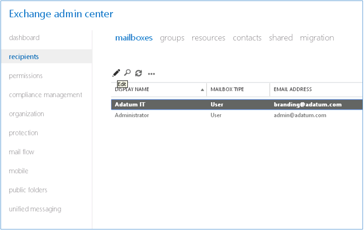
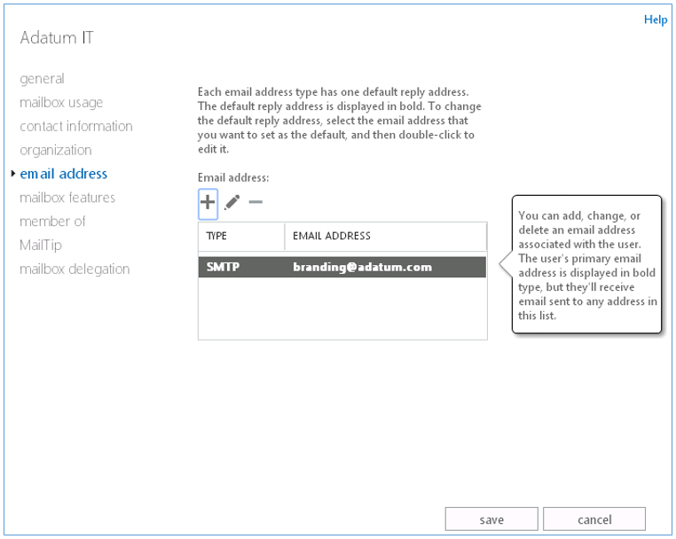
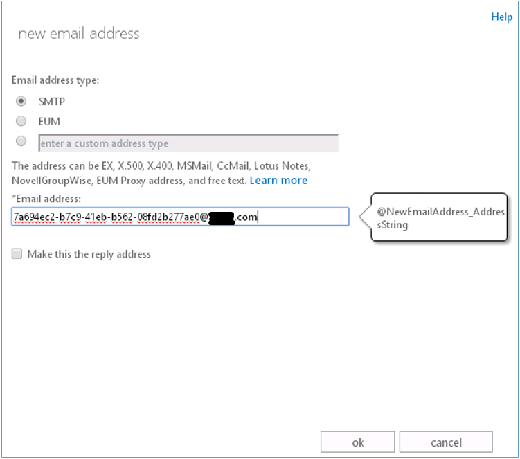

# Change the branding of Clutter notifications

The Clutter feature uses Inbox notifications to invite users and to send status messages. The default branding used for these notifications is Outlook, but you can modify the branding for your organization.

## Change the branding of Clutter notifications (new EAC)

This article describes how to change the branding of Clutter notifications to match that of your school, business, or organization.

> [!NOTE]
> For more information about the types of Clutter notifications that end users in your organization receive, see [Clutter notifications in Outlook](clutter-notifications-in-outlook.md).

To begin, you will need to sign in to Microsoft 365 or Office 365 with your work or school account.

1. Once signed in to Microsoft 365 or Office 365, go to the Microsoft 365 admin center.

2. Click to expand **Users**, then select **Active Users**.

3. Select **Add**  to add a user. The **Create a new user account** dialog will open.

4. In the **Create a new user account** dialog, enter a **Display name** and a **username**. The display name will appear in the Sender field for all Clutter notifications sent to your users. A new temporary password is generated for the new user account. Click **Create** to create the account.

5. Go to the new Exchange admin center (EAC).

6. Click **Recipients**, and then click **Mailboxes**.

7. Select the user you just created. A details pane will open.

8. Under **Mailbox** settings, click **Manage email address types** under **Email addresses**. 

9. In the **Manage email address types** dialog, click  **Add email address type**  to add an email address to the new user account.

10. In the **new email address** dialog, select SMTP as the email address type, and then, in the **Email address:\*** box, type the following: **7a694ec2-b7c9-41eb-b562-08fd2b277ae0@[your default domain]**, where [your default domain] is the domain that your organization uses. For most organizations, this would be **[your domain name].onmicrosoft.com**. When finished, click **OK**.

11. Back in the **Manage email address types** dialog, click **Save** to associate the new email address with the user account. All Clutter notifications sent to end users in your organization will now originate from this account.


## Change the branding of Clutter notifications (classic EAC)

This article describes how to change the branding of Clutter notifications to match that of your school, business, or organization.

> [!NOTE]
> For more information about the types of Clutter notifications that end users in your organization receive, see [Clutter notifications in Outlook](clutter-notifications-in-outlook.md).

To begin, you will need to sign in to Microsoft 365 or Office 365 with your work or school account.

1. Once signed in to Microsoft 365 or Office 365, go to the Microsoft 365 admin center.

2. Click to expand **Users**, then select **Active Users**.

3. Select **Add**  to add a user. The **Create a new user account** dialog will open.

4. In the **Create a new user account** dialog, enter a **Display name** and a **username**. The display name will appear in the Sender field for all Clutter notifications sent to your users. A new temporary password is generated for the new user account. Click **Create** to create the account.

5. Go the Exchange admin center.

6. Click **recipients**, and then click **mailboxes**.

7. Select the user you just created, and then click the pencil icon to edit the account, as shown in the following example.

   

8. In the user account dialog, click **Email address**, and then click **Add**  to add an email address to the new user account.

   

9. In the **new email address** dialog, select SMTP as the email address type, and then, in the **Email address** box, type the following: **7a694ec2-b7c9-41eb-b562-08fd2b277ae0@[your default domain]**, where [your default domain] is the domain that your organization uses. For most organizations, this would be **[your domain name].onmicrosoft.com**.

   When finished, click **OK**.

   

10. Back in the user account dialog, click **save** to associate the new email address with the user account. All Clutter notifications sent to end users in your organization will now originate from this account.

## Change the branding of Clutter notifications using PowerShell

You can also create a new shared mailbox as the branding mailbox using PowerShell. Follow these steps.

1. [Connect to Exchange Online Using Remote PowerShell](https://docs.microsoft.com/powershell/exchange/connect-to-exchange-online-powershell).

2. Type the following commands:

   ```PowerShell
   New-Mailbox -Shared -Name branding@contoso.com -DisplayName "Branding Clutter Mailbox" -Alias branding
   Set-Mailbox "IT Admin" -EmailAddresses SMTP: branding@contoso
   ```
