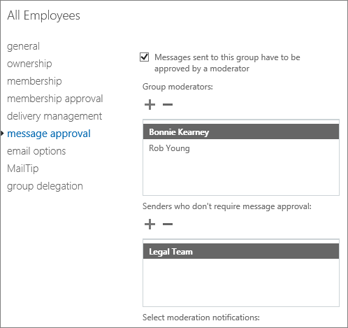
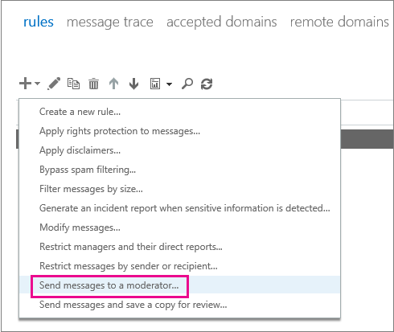
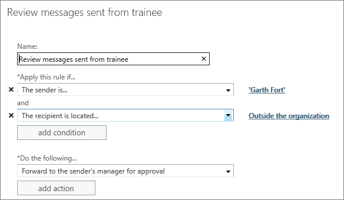
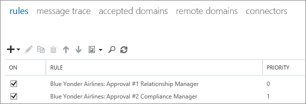
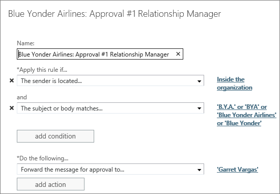
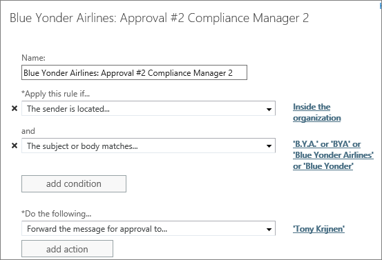
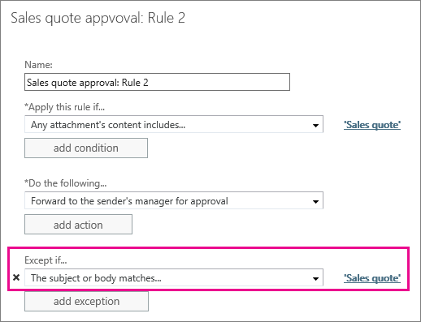
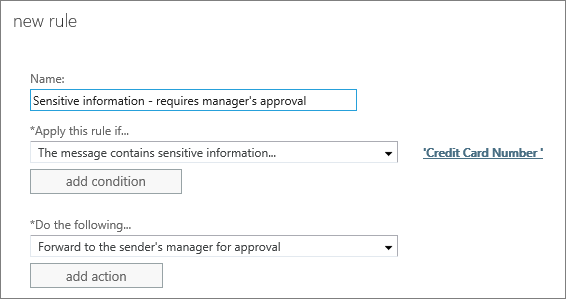

# Common message approval scenarios in Exchange Online

Your organization may require certain types of messages be approved in order to meet legal or compliance requirements, or to implement a specific business workflow. This article discusses examples of common scenarios that you can set up by using Exchange.

## Example 1: Avoid mail storms to a large distribution group

To control messages to a large distribution group, you can require that a moderator approve messages that are sent to that group. If there are no criteria for which messages require approval, the simplest way to set this up is to configure the group to require message approval. 

In this example, all messages to the All Employees group must be approved, except if the senders are members of the distribution group named Legal Team.

To require that messages to a specific distribution group be approved, in the Exchange admin center (EAC), go to **Recipients** \> **Groups**, edit the distribution group, and then select **Message approval**. To open the EAC, see [Exchange admin center in Exchange Online](../../exchange-admin-center.md).

## Example 2: Forward messages to a sender's manager for approval

Here are some common types of messages for which you might want to require manager approval: 

- Messages sent from a user to certain distribution groups or recipients 

- Messages sent to external users or partners 

- Message sent between two groups 

- Messages sent with specific content, such as the name of a specific customer 

- Messages sent by a trainee 

To require that a message be sent for approval, first, create a mail flow rule (also known as a transport rule) using the **Send messages to a moderator** template, and select that the messages should go to the sender's manager, as shown in the following screenshots.

Then, define which messages need approval.

Here's an example where all messages sent out by a trainee, Garth Fort, to recipients outside the organization requires a manager's approval.

To get started, go to EAC \> **Mail flow** \> **Rules**, and create a new rule using the **Send messages to a moderator** template. To open the EAC, see [Exchange admin center in Exchange Online](../../exchange-admin-center.md).

> [!IMPORTANT]
> Some conditions and actions, including forwarding to the sender's manager, are hidden by default in the **New rule** page. To see all the conditions and actions, select **More options**.

## Example 3: Set up a message approval chain

You can require multiple levels of approval for messages. For example, you can require that messages to a specific customer be approved first by a customer relationship manager and then by a compliance officer, or you can require that expense reports be approved by two levels of managers.

To create this type of multiple-level approval, create one mail flow rule for each level of approval. Each rule detects the same patterns in the messages, as follows:

- The first rule forwards the message to the first approver. When the first approver accepts the message, the message automatically goes to the approver in the second rule.

- If all approvers in the chain select **Approve** when they receive the approval request, when the last approval in the chain is complete, the original message is sent to the intended recipients.

- If anyone in the approval chain selects **Reject** when they receive the approval request, the sender receives a rejection message. 

- If any of the approval requests aren't approved within the expiration time (2 days for Exchange Online, 5 days for Exchange Server), the sender receives an expiration message.

The following example assumes that you have a customer called Blue Yonder Airlines, and you want both the customer relationship manager and the compliance officer to approve all messages that go to this customer. You create two rules, one for each approver. The first rule goes to the first-level approver. The second rule goes to the second-level approver.

The first rule identifies all messages with the company name Blue Yonder Airlines in the subject or message, and it sends these messages to the internal customer relationship manager for Blue Yonder Airlines, Garret Vargas.

The second rule sends these messages to the compliance officer, Tony Krijnen.

## Example 4: Forward messages that match one of several criteria

Within a mail flow rule, all conditions configured within the rule must be true for the rule to match. If you want the same actions applied for either condition, you should create a separate rule for each one.

To do this, on the **Rules** page in EAC, create a rule for the first condition. Then select the rule, select **Copy**, and change the conditions in the new rule to match the second condition.

Be careful when you create multiple rules with "OR" conditions so you don't end up with a message being sent multiple times to the approver. To avoid this, add an exception to the second rule so it ignores messages that matched the first rule.

For example, a single rule can't check whether a message has "sales quote" in either the subject or in the attachment title. To avoid the message being sent multiple times to the approver, if the first rule checks for "sales quote" in the subject or body of the message, the second rule that checks for "sales quote" in attachment content needs an exception that contains the first rule's criteria.

> [!NOTE]
> Exceptions are hidden by default in the **New rule** page. To see all the conditions and actions, select **More options**.

## Example 5: Forward a message that contains sensitive information

If you have the [Data loss prevention](../../security-and-compliance/data-loss-prevention/data-loss-prevention.md)(DLP) feature, many types of sensitive information are predefined. With DLP, you see that the message contains a sensitive information condition. Whether or not you have DLP, you can create conditions that identify specific sensitive information patterns that are unique to your organization. 

Here's an example where messages with sensitive information require approval. In this example, messages that contain a credit card number require approval.

## See also

[Manage message approval](manage-message-approval.md)
