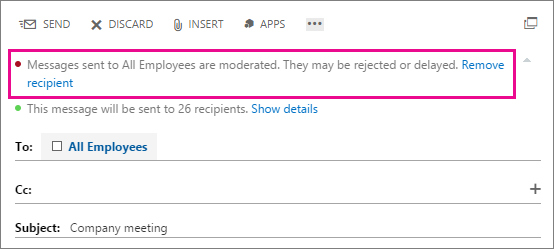
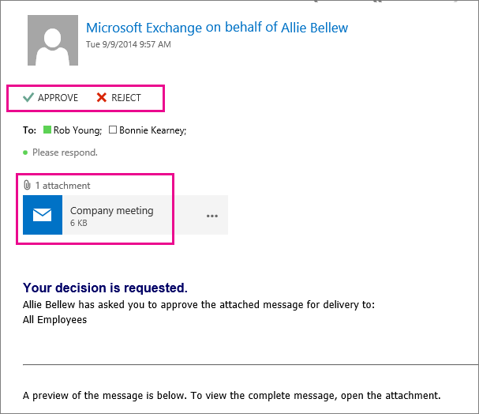
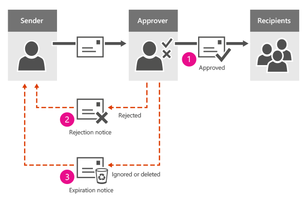
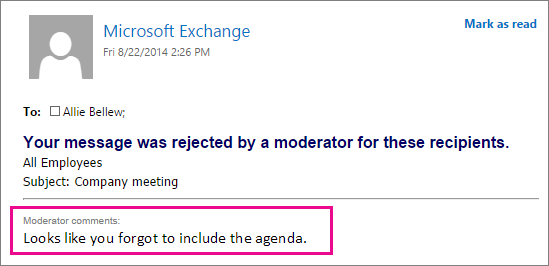

# Manage message approval in Exchange Online

Sometimes it makes sense to have a second set of eyes on a message before the message is delivered. As an Exchange administrator, you can set this up. This process is called moderation, and the approver is called the moderator. Depending on which messages need approval, you can use one of two approaches:

- Change the distribution group properties

- Create a mail flow rule

This article explains:

- [How to decide which approval approach to use](#how-to-decide-which-approval-approach-to-use)

- [How the approval process works](#how-the-approval-process-works)

To learn how to implement common scenarios, see [Common message approval scenarios](common-message-approval-scenarios.md).

## How to decide which approval approach to use

Here's a comparison of the two approaches to message approval.

|**What do you want to do?**|**Approach**|**First step**|
|:-----|:-----|:-----|
|Create a moderated distribution group where all messages to the group must be approved.|Set up message approval for the distribution group.|Go to the Exchange admin center (EAC) \> **Recipients** \>  **Groups**, edit the distribution group, and then select **Message approval**.|
|Require approval for messages that match specific criteria or that are sent to a specific person.|Create a mail flow rule (also known as a transport rule) using the **Forward the message for approval** action.   You can specify message criteria, including text patterns, senders, and recipients. Your criteria can also contain exceptions.|Go to the EAC \> **Mail flow** \> **Rules**.|

## How the approval process works

When someone sends a message to a person or group that requires approval, if they're using Outlook on the web (formerly known as Outlook Web App), they're notified that their message might be delayed.

The moderator receives an email with a request to approve or reject the message. The text of the message includes buttons to approve or reject the message, and the attachment includes the original message to review.

 The moderator can take one of three actions:

1. If approved, the message goes to the original intended recipients. The original sender isn't notified.

2. If rejected, a rejection message is sent to the sender. The moderator can add an explanation:

    

3. If the approver either deletes or ignores the approval message, an expiration message is sent to the sender. This happens after two days in Exchange Online, and after five days in Exchange Server. (In Exchange Server, you can change this time period).

The message that's waiting for approval gets temporarily stored in a system mailbox called the arbitration mailbox. Until the moderator decides to approve or reject the message, deletes the approval message, or lets the approval message expire, the original message is kept in the arbitration mailbox.

## Questions and answers

 **What's the difference between the approver and owner of a distribution group?**

The owner of a distribution group is responsible for managing the distribution group membership. For example, a person in IT might be the owner of a distribution group called All Employees, but only the Human Resources manager might be set up as the moderator. Also, messages that the owner sends to the distribution group do not need to be approved by a moderator.

 **What happens when the moderator or approver sends a message to the distribution group?**

The message goes directly to the group, bypassing the approval process.

 **What happens when only a subset of recipients needs approval?**

You can send a message to a group of recipients where only a subset of the recipients requires approval. Consider a message that's sent to 12 recipients, one of which is a moderated distribution group. The message is automatically split into two copies. One message is delivered immediately to the 11 recipients that don't require approval, and the second message is submitted to the approval process for the moderated distribution group. If a message is intended for more than one moderated recipient, a separate copy of the message is automatically created for each moderated recipient and each copy goes through the appropriate approval process.

 **What if my distribution group contains moderated recipients that require approval?**

A distribution group can include moderated recipients that also require approval. In this case, after the message to the distribution group is approved, a separate approval process occurs for each moderated recipient that's a member of the distribution group. However, you can also enable the automatic approval of the distribution group members after the message to the moderated distribution group is approved. To do this, you use the _BypassNestedModerationEnabled_ parameter on the [Set-DistributionGroup](https://docs.microsoft.com/powershell/module/exchange/users-and-groups/set-distributiongroup) cmdlet.

 **Is this process different if we have our own Exchange servers?**

By default, one arbitration mailbox is used for each Exchange organization. If you have your own Exchange servers and need more arbitration mailboxes for load balancing, follow the instructions for adding arbitration mailboxes in [Manage and troubleshoot message approval](ttroubleshoot-message-approval.md). Arbitration mailboxes are system mailboxes and don't require an Exchange license.

## Need more info?

[Manage mail flow rules](manage-mail-flow-rules.md)

[Exchange Online PowerShell](https://docs.microsoft.com/powershell/exchange/exchange-online/exchange-online-powershell)
