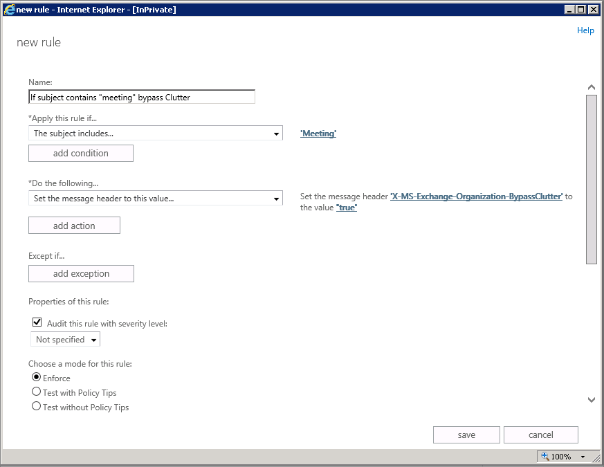

# Use mail flow rules so messages can bypass Clutter

If you want to be sure that you receive particular messages, you can create an Exchange transport rule that makes sure that these messages bypass your clutter folder. Check out [Use Clutter to sort low-priority messages in Outlook](https://go.microsoft.com/fwlink/p/?LinkId=528411) for more info on Clutter. 
  
For additional management tasks related to transport rules, check out [Mail flow rules (transport rules) in Exchange Online](mail-flow-rules.md) and the [New-TransportRule](http://technet.microsoft.com/library/eb3546bf-ca37-474e-9c22-962fe95af276.aspx) PowerShell topic. If you're new to PowerShell, check out the following topics for help on using Powershell: 
  
- [Connect to Exchange Online using remote PowerShell](http://technet.microsoft.com/library/c8bea338-6c1a-4bdf-8de0-7895d427ee5b.aspx)
    
- [Connect to Exchange using remote Shell](http://technet.microsoft.com/library/0b5987c3-8836-456d-99f7-abc2ffb57300.aspx)
    
## What do you need to know before you begin?

- Estimated time to complete: 5 minutes
    
- You need to be assigned permissions before you can perform this procedure or procedures. To see what permissions you need, see the "Transport rules" entry in the [Messaging policy and compliance permissions](http://technet.microsoft.com/library/ec4d3b9f-b85a-4cb9-95f5-6fc149c3899b.aspx) topic. 
    
- For information about keyboard shortcuts that may apply to the procedures in this topic, see **Keyboard shortcuts in the Exchange admin center**.
    
## Use the UI to create a transport rule to bypass the clutter folder

This example allows all messages with title "Meeting" to bypass clutter.
  
1. In the Exchange admin center, navigate to **mail flow** \> **Rules**. Click  and then choose **Create a new rule...**.
    
2. After you're done creating the new rule, click **save** to start the rule. 
    

  
## Use the Shell to create a transport rule to bypass the clutter folder

This example allows all messages with title "Meeting" to bypass clutter.
  
```
New-TransportRule -Name <name_of_the_rule> -SubjectContainsWords "Meeting" -SetHeaderName "X-MS-Exchange-Organization-BypassClutter" -SetHeaderValue "true"
```

> [!IMPORTANT]
> In this example, both "X-MS-Exchange-Organization-BypassClutter" and "true" is case sensitive. 
  
For detailed syntax and parameter information, see [New-TransportRule](http://technet.microsoft.com/library/eb3546bf-ca37-474e-9c22-962fe95af276.aspx).
  
## How do you know this worked?

You can check email message headers to see if the email messages are landing in the Inbox due to the clutter transport rule bypass. Pick an email message from a mailbox in your organization that has the clutter bypass transport rule applied. Look at the headers stamped on the message, and you should see the **X-MS-Exchange-Organization-BypassClutter: true** header. This means the bypass is working. Check out the [View the Internet header information for an email message](https://go.microsoft.com/fwlink/p/?LinkId=822530) topic for info on how to find the header information. 
  
> [!NOTE]
> Calendar items, like meetings accepted, sent or declined won't have these headers on them. We're working on extending clutter capabilities to these calendar items soon. 
  

