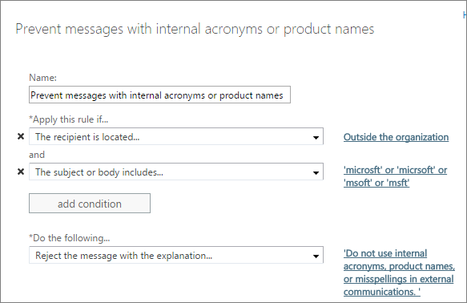

# Use mail flow rules to route email based on a list of words, phrases, or patterns

To help your users comply with your organization's email policies, you can use Exchange mail flow rules (also known as transport rules) to determine how email containing specific words or patterns is routed. For a short list of words or phrases, you can use the Exchange admin center (EAC). For a longer list, you might want to use Exchange Online PowerShell to read the list from a text file.

If your organization uses Data Loss Prevention (DLP), see [Data loss prevention](../../security-and-compliance/data-loss-prevention/data-loss-prevention.md) for additional options for identifying and routing email that contains sensitive information.

## Example 1: Use a short list of unacceptable words

If your list of words or phrases is short, you can create a rule using the Exchange admin center. For example, if you want to make sure no one sends email with bad words or with misspellings of your company name, internal acronyms or product names, you could create a rule to block the message and tell the sender. Note that words, phrases, and patterns are not case sensitive.

This example blocks messages with common typos.



## Example 2: Use a long list of unacceptable words

If your list of words, phrases, or patterns is long, you can put them in a text file with each word, phrase, or pattern on its own line. Use Exchange Online PowerShell to read in the list of keywords into a variable, create a mail flow rule, and assign the variable with the keywords to the mail flow rule condition. For example, the following script takes a list of misspellings from a file called C:\My Documents\misspelled_companyname.txt.

```
$Keywords=Import-Content "C:\My Documents\misspelled_companyname.txt"
New-TransportRule -Name "Block messages with unacceptable words" -SubjectOrBodyContainsWords $Keywords -SentToScope "NotInOrganization" -RejectMessageReasonText "Do not use internal acronyms, product names, or misspellings in external communications."
```

### Using phrases and patterns in the text file

The text file can contain regular expressions for patterns. These expressions are not case-sensitive. Common regular expressions include:

|:-----|:-----|
|**Expression**|**Matches**|
|**.**|Any single character|
|**\***|Any additional characters|
|**\d**|Any decimal digit|
|[*character_group*]|Any single character in *character_group*.|

For example, this text file contains common misspellings of Microsoft.

```
[mn]sft
[mn]icrosft
[mn]icro soft
[mn].crosoft
```

To learn how to specify patterns using regular expressions, see [Regular Expression Reference](https://go.microsoft.com/fwlink/p/?LinkId=532394).

