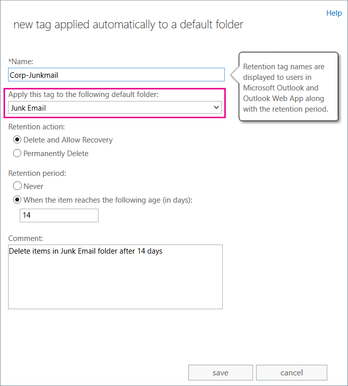

# Default folders that support Retention Policy Tags

You can use [Retention tags and retention policies](retention-tags-and-policies.md) to manage email lifecycle. Retention Policies contain Retention Tags, which are settings you can use to specify when a message should be automatically moved to the archive or when it should be deleted.

A Retention Policy Tag (RPT) is a type of retention tag that you can apply to default folders in a mailbox, such as **Inbox** and **Deleted Items**.

## Supported default folders

You can create RPTs for the default folders shown in the following table.

|**Folder name**|**Details**|
|:-----|:-----|
|Archive|This folder is the default destination for messages archived with the Archive button in Outlook. The Archive feature provides a fast way for users to remove messages from their Inbox without deleting them.   This RPT is available only in Exchange Online.|
|Calendar|This default folder is used to store meetings and appointments.|
|Clutter|This folder contains email messages that are low priority. Clutter looks at what you've done in the past to determine the messages you're most likely to ignore. It then moves those messages to the **Clutter** folder.|
|Conversation History|This folder is created by Microsoft Lync (previously Microsoft Office Communicator). Although not treated as a default folder by Outlook, it's treated as a special folder by Exchange and can have RPTs applied.|
|Deleted Items|This default folder is used to store items deleted from other folders in the mailbox. Outlook and Outlook on the web (formerly known as Outlook Web App) users can manually empty this folder. Users can also configure Outlook to empty the folder upon closing Outlook.|
|Drafts|This default folder is used to store draft messages that haven't been sent by the user. Outlook on the web also uses this folder to save messages that were sent by the user but not submitted to the Hub Transport server.|
|Inbox|This default folder is used to store messages delivered to a mailbox.|
|Journal|This default folder contains actions selected by the user. These actions are automatically recorded by Outlook and placed in a timeline view.|
|Junk E-mail|This default folder is used to save messages marked as junk e-mail by the content filter on an Exchange server or by the anti-spam filter in Outlook.|
|Notes|This folder contains notes created by users in Outlook. These notes are also visible in Outlook on the web.|
|Outbox|This default folder is used to temporarily store messages sent by the user until they're submitted to a Hub Transport server. A copy of sent messages is saved in the Sent Items default folder. Because messages usually remain in this folder for a brief period, it isn't necessary to create an RPT for this folder.|
|RSS Feeds|This default folder contains RSS feeds.|
|Recoverable Items|This is a hidden folder in the Non-IPM sub-tree. It contains the Deletions, Versions, Purges, DiscoveryHolds, and Audits sub-folders. Retention tags for this folder move items from the Recoverable Items folder in the user's primary mailbox to the Recoverable Items folder in the user's archive mailbox. You can assign only the **Move To Archive** retention action to tags for this folder. To learn more, see [Recoverable Items folder in Exchange Online](../recoverable-items-folder/recoverable-items-folder.md).|
|Sent Items|This default folder is used to store messages that have been submitted to a Hub Transport server.|
|Sync Issues|This folder contains synchronization logs.|
|Tasks|This default folder is used to store tasks. To create an RPT for the Tasks folder, you have to use Exchange Online PowerShell. For more information, see [New-RetentionPolicyTag](https://docs.microsoft.com/powershell/module/exchange/new-retentionpolicytag). After the RPT for the Tasks folder is created, you can manage it by using the Exchange admin center.|

## More Info

- RPTs are retention tags for default folders. You can only select a delete action for RPTs - either **delete and allow recovery** or **permanently delete**.

- You can't create an RPT to move messages to the archive. To move old items to archive, you can create a Default Policy Tag (DPT), which applies to the entire mailbox, or Personal Tags, which are displayed in Outlook and Outlook on the web as Archive Policies. Your users can apply them to folders or individual messages.

- You can't apply RPTs to the Contacts folder.

- You can only add one RPT for a particular default folder to a Retention Policy. For example, if a retention policy has an Inbox tag, you can't add another RPT of type Inbox to that retention policy.

- To learn how to create RPTs or other types of retention tags and add them to a retention policy, see [Create a Retention Policy](create-a-retention-policy.md).

- In Exchange Server and Exchange Online, a DPT also applies to the **Calendar** and **Tasks** default folders. This may result in items being deleted or moved to the archive based on the DPT settings. To prevent the DPT settings from deleting items in these folders , create RPTs with retention disabled. To prevent the DPT settings from moving items in a default folder, you can create a disabled Personal Tag with the move to archive action, add it to the retention policy, and then have users apply it to the default folder. For details, see [Prevent archiving of items in a default folder in Exchange 2010](https://techcommunity.microsoft.com/t5/exchange-team-blog/prevent-archiving-of-items-in-a-default-folder-in-exchange-2010/ba-p/603444).
