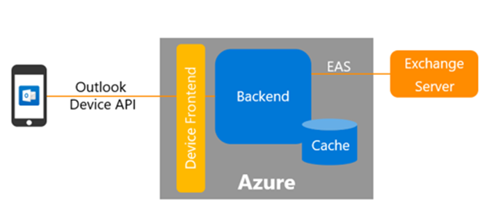

# Using Basic authentication with Outlook for iOS and Android

The Outlook app for iOS and Android is designed to bring together email, calendar, contacts, and other files, enabling users in your organization to do more from their mobile devices. This article provides an overview of the architecture and the storage design of the app, so that Exchange administrators can deploy and maintain Outlook for iOS and Android in their Exchange organizations.

Note that this article is about using the app in an Exchange 2016 or Exchange 2019 environment. For more information about using hybrid Modern Authentication for on-premises mailboxes with the app, see [Using hybrid Modern Authentication with Outlook for iOS and Android](use-hybrid-modern-auth.md). For information about using the app with Exchange Online, see [Outlook for iOS and Android in Exchange Online](https://go.microsoft.com/fwlink/p/?linkid=845477).

## Outlook for iOS and Android architecture

Outlook for iOS and Android consists of a front-end app that is installed on mobile devices and a secure and scalable cloud service on the back end, known as the *Outlook service*. Processing information in the Outlook service enables advanced features and capabilities that enhance the Outlook experience, as well as improved performance and stability. This architecture relies on the Outlook service for intensive processing, minimizing the resources required from users' devices.

Examples of what the Outlook service provides for users include:

- Categorization for the Focused Inbox.

- One-click unsubscribe feature from mailing lists.

- Improve search speed and effectiveness.

- The ability to forward and send large files without first downloading them to a mobile device.

This architecture does not support Enterprise Mobility + Security features such as Azure Active Directory conditional access and Intune app protection policies.

## Data caching

For improved performance, a subset of email, calendar, and file data from each user's mailbox is synchronized into the Outlook service. For on-premises mailboxes that are authenticating with Basic authentication, this service currently runs on Microsoft Azure.

The information in the Outlook service is currently cached either in the United States or in Europe, depending on the IP address of the connecting client. As we move the Outlook service into Office 365, we will align to the principles of the Microsot Trust Center with a regionalized data center strategy. In Office 365 a customer's country or region, which the customer's administrator inputs during the initial setup of the services, determines the primary storage location for that customer's data. For more information, see [the Microsoft Trust Center](https://microsoft.com/trustcenter).

### Data caching FAQ

The following are frequently asked questions about data storage in Outlook for iOS and Android when used with Basic authentication.

### How much of a user's mailbox data is synchronized into the Outlook service?

Approximately one month of email, calendar, and contact data. The caching process is determined by an algorithm that accounts for, among other factors, the size of a mailbox, the relative importance of a given folder within the mailbox (for example, the default Inbox folder compared to a folder that was created by the user), and how often a user accesses a given folder.

The Outlook service stores attachment data as follows: When a user requests to open an email attachment in Outlook, the service retrieves the attachment from the Exchange server and temporarily stores it. At that point the attachment is delivered to the app on the user's mobile device. Data older than one month is routinely flushed out of the service, at which point the attachment will only be available on the Exchange server.

### How do I remove my information from the Outlook service?

You have three options for removing your information from the Outlook service.

- Option 1: Initiate a Remote Wipe for each user who has used the Outlook app for iOS and Android to connect to Office 365 or Exchange.

- Option 2: Have all users delete the Outlook app. All data will be removed in approximately 3-7 days.

- Option 3: Have each user remove their account from the Outlook app, and then delete the app from their mobile devices. To remove an account, have users follow these steps:

1. In the Outlook app, in **Settings**, tap **Account Settings**.

2. Tap **Select an Account**, and then, with the account selected, tap **Remove Account**.

3. Tap **Device & Remote Data**.

### How is the temporarily cached mailbox data secured while stored in the Outlook service?

You can read about how our data is currently protected at the [Azure Trust Center](https://azure.microsoft.com/support/trust-center/). As noted previously, we're moving from Azure to Office 365. The security of these services is covered at [the Microsoft Trust Center](https://microsoft.com/trustcenter).

