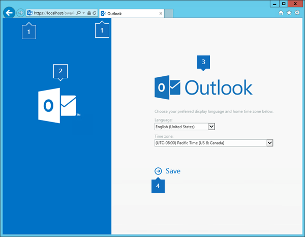

# Customize the Outlook on the web sign-in, language selection, and error pages in Exchange 2016

 **Summary**: Learn how to customize the color and images of the sign-in, language selection, and error pages for Outlook on the web in Exchange 2016.
  
The Outlook on the web (formerly known as Outlook Web App) sign-in, language selection, and error pages are based on image and content style sheet (CSS) files in the themes resources folder in the Client Access (front end) services on an Exchange Server 2016 server. Outlook on the web uses only one set of sign-in, language selection, and error pages for all themes. Any modifications to those pages will be seen by all users who connect to the Exchange server for Outlook on the web.
  
 **Notes**:
  
- Backup the default Outlook on the web files before you make any changes.
    
- Create a back-up copy of your customized files so you can reapply them after a reinstallation or upgrade of the Exchange server.
    
- If you use multiple Exchange servers for Outlook on the web connections, you need to copy the modified files to each server.
    
For more information about Outlook on the web, see [Outlook on the web in Exchange 2016](outlook-on-the-web.md). For information about creating a custom theme, see [Create a theme for Outlook on the web in Exchange 2016](themes.md).
  
## What do you need to know before you begin?

- Estimated time to complete this task: 30 minutes.
    
- You need to be assigned permissions before you can perform this procedure or procedures. To see what permissions you need, see the "Graphics editor" entry under "Outlook on the web Permissions" in the [Clients and mobile devices permissions](../../permissions/feature-permissions/client-and-mobile-device-permissions.md) topic.
    
- To replace the existing color with a new color, you need the HTML RGB value of the new color. You can find HTML RGB values in the topic [Color Table](https://go.microsoft.com/fwlink/p/?LinkId=280679). If you can't find the color there, you can use an image editing tool to sample a color and determine its HTML RGB value.
    
- For information about keyboard shortcuts that may apply to the procedures in this topic, see [Keyboard shortcuts in the Exchange admin center](../../about-documentation/exchange-admin-center-keyboard-shortcuts.md).
    
> [!TIP]
> Having problems? Ask for help in the Exchange forums. Visit the forums at: [Exchange Server](https://go.microsoft.com/fwlink/p/?linkId=60612), [Exchange Online](https://go.microsoft.com/fwlink/p/?linkId=267542), or [Exchange Online Protection](https://go.microsoft.com/fwlink/p/?linkId=285351).
  
## Customize the color of the Outlook on the web sign-in page

1. Use Notepad to open the file `%ExchangeInstallPath%FrontEnd\HttpProxy\owa\auth\<ExchangeVersion>\themes\resources\logon.css`.
    
    **Note**: The _\<ExchangeVersion\>_ subfolder uses the syntax 15.1. _nnn_. _nn_, and changes every time you install an Exchange Cumulative Update (CU).
    
2. In the `logon.css` file, replace the default blue color value #0072c6 with the HTML RGB value that you want to use.
    
3. When you're finished, save and close the file.
    
    
  
## Customize the color of the Outlook on the web error page

1. Use Notepad to open the file `%ExchangeInstallPath%FrontEnd\HttpProxy\owa\auth\<ExchangeVersion>\themes\resources\errorFE.css`.
    
2. In the `errorFE.css` file, replace the default blue color value #0072c6 with the HTML RGB value that you want to use.
    
3. When you're finished, save and close the file.
    
    
  
## Customize the color of the Outlook on the web language selection page

1. Use Notepad to open the file `%ExchangeInstallPath%ClientAccess\Owa\Current2\version\resources\styles\languageselection.css`. An easy way to do this is to press the Windows key + R, and run the following command:
    
  ```
  Notepad.exe %ExchangeInstallPath%ClientAccess\Owa\Current2\version\resources\styles\languageselection.css
  ```

2. In the `languageselection.css` file, replace the default blue color value #0072c6 with the HTML RGB value that you want to use.
    
3. When you're finished, save and close the file.
    
    
  
## Customize the images on the Outlook on the web sign-in, language selection, and error pages

You can edit the existing image files, or replace the files with new files that have the same names and dimensions. The images are described in the following table:
  
|**Image**|**File name**|**Location**|**Dimensions (width x height in pixels)**|**Bit depth**|
|:-----|:-----|:-----|:-----|:-----|
|1  <br/> |favicon.ico  <br/> | `%ExchangeInstallPath%FrontEnd\HttpProxy\owa\auth\<ExchangeVersion>\themes\resources` <br/> |16 x 16  <br/> |32  <br/> |
|2  <br/> |olk_logo_white.png  <br/> | `%ExchangeInstallPath%FrontEnd\HttpProxy\owa\auth\<ExchangeVersion>\themes\resources` <br/> |128 x 108  <br/> |32  <br/> |
|3  <br/> |owa_text_blue.png  <br/> | `%ExchangeInstallPath%FrontEnd\HttpProxy\owa\auth\<ExchangeVersion>\themes\resources` <br/> |300 x 76  <br/> |32  <br/> |
|4  <br/> |Sign_in_arrow.png (for left-to-right languages)  <br/> Sign_in_arrow_rtl.png (for right-to-left languages)  <br/> | `%ExchangeInstallPath%FrontEnd\HttpProxy\owa\auth\<ExchangeVersion>\themes\resources` <br/> |22 x 22  <br/> |32  <br/> |
|5  <br/> |olk_logo_white_cropped.png  <br/> | `%ExchangeInstallPath%FrontEnd\HttpProxy\owa\auth\<ExchangeVersion>\themes\resources` <br/> |265 x 310  <br/> |32  <br/> |
|6  <br/> |office_logo_white_small.png  <br/> | `%ExchangeInstallPath%ClientAccess\Owa\prem\<ExchangeVersion>\resources\images\0` (for left-to-right languages)  <br/> `%ExchangeInstallPath%ClientAccess\Owa\prem\<ExchangeVersion>\resources\images\rtl` (for right-to-left languages)  <br/> |81 x 26  <br/> |8  <br/> |
   
## How do you know this worked?

To verify that you've successfully customized the Outlook on the web sign-in, language selection, and error pages, perform the following steps:
  
1. Open the Outlook on the web sign-in page in a web browser. On the Exchange server that hosts the Outlook on the web virtual directory, you can test your changes by opening the URL https://localhost/owa or https://127.0.0.1/owa.
    
2. If you don't see your changes, clear your browsing history (delete temporary Internet files), and refresh the browser window.
    
 **Note**: To see the effects of your changes, you can keep the .css file open and refresh the browser window after you save each change.
  

