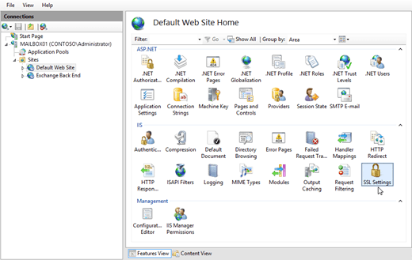
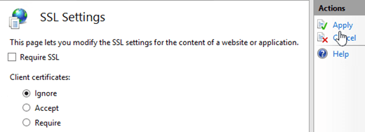
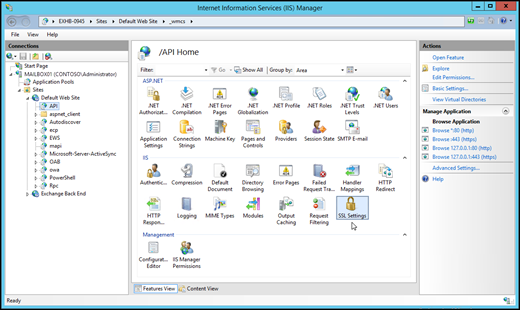
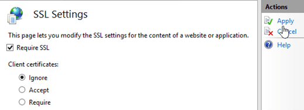
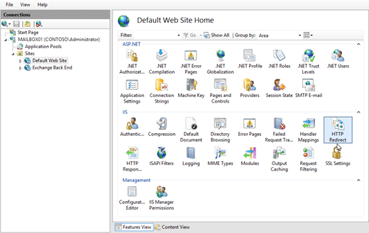
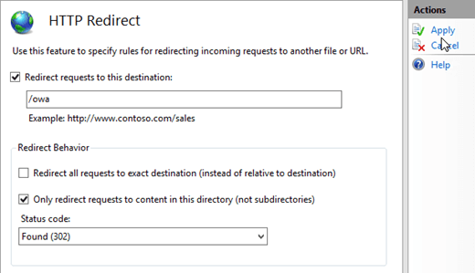
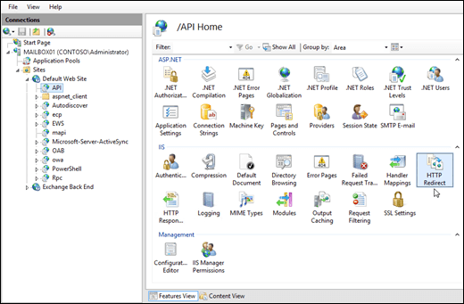
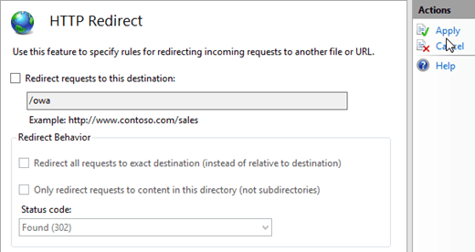

# Configure http to https redirection for Outlook on the web in Exchange 2016

 **Summary**: Learn how to configure redirection for Outlook on the web in Exchange 2016 so http requests are automatically redirected to https.
  
By default in Exchange Server 2016, the URL https:// _\<ServerName\>_ redirects users to https://  _\<ServerName\>_/owa. But, if anyone tries to access Outlook on the web (formerly known as Outlook Web App) by using http:// _\<ServerName\>_ or http://  _\<ServerName\>_/owa, they'll get an error.
  
You can configure http redirection for Outlook on the web so that requests for http:// _\<ServerName\>_ or http://  _\<ServerName\>_/owa are automatically redirected to https:// _\<ServerName\>_/owa. This requires the following configuration steps in Internet Information Services (IIS):
  
1. Remove the **Require SSL** setting from the default website. 
    
2. Restore the **Require SSL** setting on other virtual directories in the default website that had it enabled by default (except for /owa). 
    
3. Configure the default website to redirect http requests to the /owa virtual directory.
    
4. Remove http redirection from all virtual directories in the default website (including /owa).
    
5. Reset IIS for the changes to take effect.
    
For the default SSL and http redirect settings on all virtual directories in the default website, see the [Default Require SSL and HTTP Redirect settings in the default website on an Exchange 2016 server](http-to-https-redirection.md#DefaultValues) section at the end of this topic. 
  
## What do you need to know before you begin?

- Estimated time to complete this procedure: 15 minutes.
    
- You need to be assigned permissions before you can perform this procedure or procedures. To see what permissions you need, see the "IIS Manager" entry in the Outlook on the web permissions section of the [Clients and mobile devices permissions](../../permissions/feature-permissions/client-and-mobile-device-permissions.md) topic. 
    
- The procedures in this topic might cause a web.config file to be created in the folder  `%ExchangeInstallPath%ClientAccess\OAB`. If you later remove http redirection for Outlook on the web, Outlook might freeze when users click **Send and Receive**. To prevent Outlook from freezing after you remove http redirection, delete the web.config file in  `%ExchangeInstallPath%ClientAccess\OAB`.
    
- Secure Sockets Layer (SSL) is being replaced by Transport Layer Security (TLS) as the protocol that's used to encrypt data sent between computer systems. They're so closely related that the terms "SSL" and "TLS" (without versions) are often used interchangeably. Because of this similarity, references to "SSL" in Exchange topics, the Exchange admin center, and the Exchange Management Shell have often been used to encompass both the SSL and TLS protocols. Typically, "SSL" refers to the actual SSL protocol only when a version is also provided (for example, SSL 3.0). To find out why you should disable the SSL protocol and switch to TLS, check out [Protecting you against the SSL 3.0 vulnerability](https://blogs.office.com/2014/10/29/protecting-ssl-3-0-vulnerability/).
    
- For information about keyboard shortcuts that may apply to the procedures in this topic, see [Keyboard shortcuts in the Exchange admin center](../../about-documentation/exchange-admin-center-keyboard-shortcuts.md).
    
> [!TIP]
> Having problems? Ask for help in the Exchange forums. Visit the forums at: [Exchange Server](https://go.microsoft.com/fwlink/p/?linkId=60612), [Exchange Online](https://go.microsoft.com/fwlink/p/?linkId=267542), or [Exchange Online Protection](https://go.microsoft.com/fwlink/p/?linkId=285351). 
  
## Step 1: Use IIS Manager to remove the Require SSL setting from the default website

1. Open IIS Manager on the Exchange server. An easy way to do this in Windows Server 2012 or later is to press Windows key + Q, type inetmgr, and select **Internet Information Services (IIS) Manager** in the results. 
    
2. Expand the server, and expand **Sites**.
    
3. Select **Default Web Site**. and verify **Features View** is selected at the bottom of the page. 
    
4. In the **IIS** section, double-click **SSL Settings**.
    
  
5. On the **SSL Settings** page, clear the **Require SSL** check box, and in the **Actions** pane, click **Apply**.
    
  
 **Note**: To perform this procedure on the command line, open an elevated command prompt on the Exchange server (a Command Prompt window you open by selecting **Run as administrator**) and run the following command:
  
```
%windir%\system32\inetsrv\appcmd.exe set config "Default Web Site" -section:access -sslFlags:None -commit:APPHOST
```

## Step 2: Use IIS Manager to restore the Require SSL setting on other virtual directories in the default website

When you change the **Require SSL** setting on a website in IIS, the setting is automatically inherited by all virtual directories in the website. Because we're only interested in configuring Outlook on the web, you need to restore the **Require SSL** setting for other virtual directories that had it enabled by default. 
  
Based on the information in the [Default Require SSL and HTTP Redirect settings in the default website on an Exchange 2016 server](http-to-https-redirection.md#DefaultValues) section, use the following procedure to restore the setting on the other virtual directories where **Require SSL** was enabled by default: 
  
1. In IIS Manager, expand the server, expand **Sites**, and expand **Default Web Site**.
    
2. Select the virtual directory, and verify **Features View** is selected at the bottom of the page. 
    
3. In the **IIS** section, double-click **SSL Settings**.
    
  
4. On the **SSL Settings** page, select the **Require SSL** check box, and in the **Actions** pane, click **Apply**.
    
  
5. Repeat the previous steps on each virtual directory in the default website that had **Require SSL** enabled by default (except for /owa). The only virtual directories that don't have **Require SSL** enabled by default are /IES, /PowerShell, and /Rpc. 
    
 **Note**: To perform these procedures on the command line, replace  _\<VirtualDirectory\>_ with the name of the virtual directory, and run the following command in an elevated command prompt: 
  
```
%windir%\system32\inetsrv\appcmd.exe set config "Default Web Site/<VirtualDirectory>" -section:Access -sslFlags:Ssl,Ssl128 -commit:APPHOST
```

## Step 3: Use IIS Manager to configure the default website to redirect to the /owa virtual directory.

1. In IIS Manager, expand the server, and expand **Sites**.
    
2. Select **Default Web Site**. and verify **Features View** is selected at the bottom of the page. 
    
3. In the **IIS** section, double-click **HTTP Redirect**.
    
  
4. On the **HTTP Redirect** page, configure the following settings: 
    
1. Select the **Redirect requests to this destination** check box, and enter the value /owa.
    
2. In the **Redirect Behavior** section, select the **Only redirect requests to content in this directory (not subdirectories)** check box. 
    
3. In the **Status code** list, verify **Found (302)** is selected. 
    
    When you're finished, click **Apply** in the **Actions** pane. 
    
  
 **Note**: To perform this procedure on the command line, open an elevated command prompt and run the following command:
  
```
%windir%\system32\inetsrv\appcmd.exe set config "Default Web Site" -section:httpredirect -enabled:true -destination:"/owa" -childOnly:true
```

## Step 4: Use IIS Manager to remove http redirection from all virtual directories in the default website

When you enable redirection on a website in IIS, the setting is automatically inherited by all virtual directories in the website. Because we're only interested in configuring redirection for the default website, you need to remove the redirect setting from all virtual directories. By default, no directories or virtual directories in the default website are enabled for redirection. For more information, see the [Default Require SSL and HTTP Redirect settings in the default website on an Exchange 2016 server](http-to-https-redirection.md#DefaultValues) section 
  
Use the following procedure to remove the redirect setting from all virtual directories in the default website (including /owa):
  
1. In IIS Manager, expand the server, expand **Sites**, and expand **Default Web Site**.
    
2. Select the virtual directory, and verify **Features View** is selected at the bottom of the page. 
    
3. In the **IIS** section, double-click **HTTP Redirect**.
    
  
4. On the **HTTP Redirect** page, change the following settings: 
    
1. Clear the **Only redirect requests to content in this directory (not subdirectories)** check box. 
    
2. Clear the **Redirect requests to this destination** check box. 
    
5. In the **Actions** pane, click **Apply**.
    
  
6. Repeat the previous steps on each virtual directory in the default website.
    
 **Note**: To perform these procedures on the command line, replace  _\<VirtualDirectory\>_ with the name of the virtual directory, and run the following command in an elevated command prompt: 
  
```
%windir%\system32\inetsrv\appcmd.exe set config "Default Web Site/<VirtualDirectory>" -section:httpredirect -enabled:false -destination:"" -childOnly:false
```

## Step 5: Use IIS Manager to restart IIS

1. In IIS Manager, select the server.
    
2. In the **Actions** pane, click **Restart**.
    
  
 **Note**: To perform this procedure on the command line, open an elevated command prompt on the Exchange server and run the following command:
  
```
iisreset /noforce
```

## How do you know this worked?

To verify that you have successfully configured http to https redirection for Outlook on the web, perform the following steps:
  
1. On a client computer, open a web browser and enter the URL http:// _\<ServerName\>_. On the local server, you can use the value http://127.0.0.1 or http://localhost.
    
2. Verify that you are redirected to Outlook on the web in https, and verify that you can log in successfully.
    
3. Open the URL http:// _\<ServerName\>_/owa (or http://127.0.0.1/owa or http://localhost/owa).
    
4.  Verify that you are redirected to Outlook on the web in https, and verify that you can log in successfully. 
    
## Default Require SSL and HTTP Redirect settings in the default website on an Exchange 2016 server
<a name="DefaultValues"> </a>

The default **Require SSL** and **HTTP Redirect** settings for the default website and all virtual directories in the default website on an Exchange 2016 server are described in the following table. 
  
|**Website**|**Virtual directory**|**Require SSL**|**HTTP Redirect**|
|:-----|:-----|:-----|:-----|
|Default Web Site  <br/> |n/a  <br/> |yes  <br/> |none  <br/> |
|Default Web Site  <br/> |_wmcs  <br/> |yes  <br/> |none  <br/> |
|Default Web Site  <br/> |API  <br/> |yes  <br/> |none  <br/> |
|Default Web Site  <br/> |aspnet_client (directory)  <br/> |yes  <br/> |none  <br/> |
|Default Web Site  <br/> |Autodiscover  <br/> |yes  <br/> |none  <br/> |
|Default Web Site  <br/> |ecp  <br/> |yes  <br/> |none  <br/> |
|Default Web Site  <br/> |EWS  <br/> |yes  <br/> |none  <br/> |
|Default Web Site  <br/> |IES  <br/> |no  <br/> |none  <br/> |
|Default Web Site  <br/> |mapi  <br/> |yes  <br/> |none  <br/> |
|Default Web Site  <br/> |Microsoft-Server-ActiveSync  <br/> |yes  <br/> |none  <br/> |
|Default Web Site  <br/> |OAB  <br/> |yes  <br/> |none  <br/> |
|Default Web Site  <br/> |owa  <br/> |yes  <br/> Subdirectories:  <br/> • auth: yes  <br/> • Calendar: no  <br/> • Integrated: yes  <br/> • oma: yes  <br/> |none  <br/> |
|Default Web Site  <br/> |PowerShell  <br/> |no  <br/> |none  <br/> |
|Default Web Site  <br/> |Rpc  <br/> |no  <br/> |none  <br/> |
   

