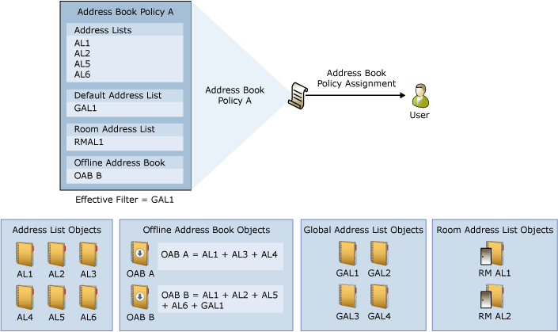
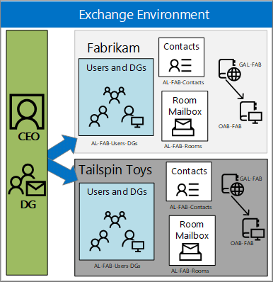

# Address book policies in Exchange 2016

Learn how to use address book policies (ABP) to create separate virtual organizations with a segmented global address list in Exchange 2016.
  
Address book policies (ABPs) lets administrators segment users into specific groups to provide customized views of the organization's global address list (GAL). The goal of an ABP is to provide a simpler mechanism for GAL segmentation (also known as GAL segregation) in on-premises organizations that require multiple GALs.
  
 An ABP contains these elements: 
  
- One GAL. For more information about GALs, see [Global address lists](../../email-addresses-and-address-books/address-lists/address-lists.md#GALs).
    
- One offline address book (OAB). For more information about OABs, see [Offline address books in Exchange 2016](../../email-addresses-and-address-books/oabs/oabs.md).
    
- One room list. Note that this room list is a custom address list that specifies rooms (contains the filter  `RecipientDisplayType -eq 'ConferenceRoomMailbox'`). It's not a room finder that you create with the  _RoomList_ switch on the **New-DistributionGroup** or **Set-DistributionGroup** cmdlet. For more information, see [Create and manage room mailboxes](../../recipients/room-mailboxes.md).
    
- One or more address lists. For more information about address lists, see [Custom address lists](../../email-addresses-and-address-books/address-lists/address-lists.md#CALists).
    
For procedures involving ABPs, see [Procedures for address book policies in Exchange 2016](address-book-policy-procedures.md).
  
 **Notes**:
  
- ABPs create only a virtual separation of users from a directory perspective, not a legal separation.
    
- Implementing an ABP is a multi-step process that requires planning. For more information, see [Scenario: Deploying address book policies in Exchange 2016](address-book-policy-scenarios.md).
    
## How ABPs work

The following diagram shows how ABPs work. The user is assigned Address Book Policy A that contains a subset of address lists that are available in the organization. When the ABP is created and assigned to the user, the ABP becomes the scope of the address lists that the user is able to view.
  

  
APBs take effect when a user connects to the Client Access (frontend) services on a Mailbox server. If you change an ABP, the updated APB takes effect when a user restarts or reconnects their client app, or you restart the Mailbox server (specifically, the Microsoft Exchange RPC Client Access service in the backend services).
  
### Address Book Policy Routing agent

In an Exchange organization that doesn't use ABPs, the following things occur when a user creates an email message in Outlook or Outlook on the web and sends the message to another recipient in the organization:
  
1. The email address resolves to the user's display name. For example, if you type sardor@contoso.com in the **To** field, the SMTP email address resolves to **Sarah Dorsey**.
    
2. After the name resolves, you can view the recipient's contact card by double-clicking on the user's name. The contact card shows the recipient's contact information, such as office and phone number.
    
If you're using ABPs, and you don't want the users in the ABPs to view each other's potentially private information, you can turn on the Address Book Policy Routing agent. The ABP Routing agent is a Transport agent that controls how recipients are resolved in your organization. When the ABP Routing agent is installed and configured, users that are assigned to different GALs by different ABPs can't view each other's contact cards (they appear as external recipients to each other).
  
For details about how to turn on the ABP Routing agent, see [Use the Exchange Management Shell to install and configure the Address Book Policy Routing Agent](address-book-policy-procedures.md#InstallABPRouting).
  
## ABP example

In the following diagram, Fabrikam and Tailspin Toys share the same Exchange organization and the same CEO. The CEO is the only employee common to both companies.
  

  
The suggested configuration includes three ABPs:
  
- One ABP is assigned to Fabrikam employees and the CEO.
    
- One ABP is assigned to Tailspin Toys employees and the CEO.
    
- One ABP is assigned to only the CEO.
    
Based on this configuration, the ABPs help to enforce these requirements:
  
- The users in Tailspin Toys can only see Tailspin Toys employees and the CEO when they browse the GAL.
    
- The users in Fabrikam can only see Fabrikam employees and the CEO when they browse the GAL.
    
- The CEO can see all Fabrikam and Tailspin Toys employees when she browses the GAL.
    
- Users who view the CEO's group membership can see only groups that belong to their company. They can't see groups that belong to the other company.
    
## ABPs for Entourage and Outlook for Mac users

ABPs won't function for Entourage and Outlook for Mac users who connect to their mailboxes from inside the corporate network, because Entourage and Outlook for Mac connect directly to global catalog server to query Active Directory (which bypasses the ABPs). However, Entourage and Outlook for Mac clients that connect to their mailboxes from outside the corporate networks can use an OAB or Exchange Web Services (EWS), which allows them to search the GAL based on the assigned ABP. To learn more about administering Outlook for Mac 2011, see [Planning for Outlook for Mac 2011](https://go.microsoft.com/fwlink/p/?LinkId=231878).
  

