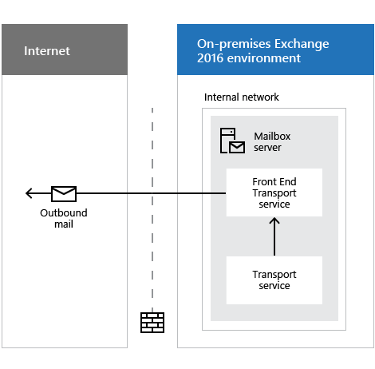

# Configure Send connectors to proxy outbound mail

When you create Send connectors, outbound mail flows through the Send connector in the Transport service on the Mailbox server or servers you specify, as shown in the following diagram.


However, you can configure a Send connector to relay or *proxy* outbound mail through the Front End Transport service on the Mailbox server, as shown in the following diagram.



By default, all inbound mail enters your Exchange organization through the Front End Transport service, and the Front End Transport service proxies inbound mail to the Transport service. For more information, see [Mail flow and the transport pipeline](../../mail-flow/mail-flow.md).

When you configure a Send connector to proxy outbound mail through the Front End Transport service, the Receive connector named "Outbound Proxy Frontend _\<Mailbox server name\>_" in the Front End Transport service listens for these outbound messages from the Transport service, and then the Front End Transport service sends the messages to the Internet. This configuration can consolidate and simplify mail flow by having inbound and outbound mail enter and leave your organization from the same place.

## What do you need to know before you begin?

- Estimated time to complete: less than 5 minutes

- You need to be assigned permissions before you can perform this procedure or procedures. To see what permissions you need, see the "Send connectors" entry in the [Mail flow permissions](../../permissions/feature-permissions/mail-flow-permissions.md) topic.

- For information about keyboard shortcuts that may apply to the procedures in this topic, see [Keyboard shortcuts in the Exchange admin center](../../about-documentation/exchange-admin-center-keyboard-shortcuts.md).

> [!TIP]
> Having problems? Ask for help in the Exchange forums. Visit the forums at: [Exchange Server](https://go.microsoft.com/fwlink/p/?linkId=60612), [Exchange Online](https://go.microsoft.com/fwlink/p/?linkId=267542), or [Exchange Online Protection](https://go.microsoft.com/fwlink/p/?linkId=285351).

## Configure Send connectors to proxy outbound mail through the Front End Transport service

### Use the EAC to configure Send connectors to proxy outbound mail

In the Exchange admin center (EAC), you can only configure existing Send connectors to proxy outbound mail.

1. In the EAC, navigate to **Mail flow** \> **Send connectors**, select the Send connector, and then click **Edit** .

2. On the **General** tab, in the **Connector status** section, select **Proxy through client access server**, and then click **Save**.

### Use PowerShell to configure Send Connectors to proxy outbound mail

In the Exchange Management Shell, you can configure new or existing Send connectors to proxy outbound mail.

For information about how to open the Exchange Management Shell, see [Open the Exchange Management Shell](http://technet.microsoft.com/library/63976059-25f8-4b4f-b597-633e78b803c0.aspx).

- To configure a new Send connector to proxy outbound mail, add `-FrontEndProxyEnabled $true` to the **New-SendConnector** command.

- To configure an existing Send connector to proxy outbound mail, run the following command:

  ```
  Set-SendConnector <Send connector identity>  -FrontEndProxyEnabled $true
  ```

    This example configures the existing Send connector named "Contoso.com Outbound" to proxy outbound mail.

  ```
  Set-SendConnector "Contoso.com Outbound" -FrontendProxyEnabled $true
  ```

### How do you know this worked?

To verify that a Send connector is configured for outbound proxy, perform either of the following procedures:

- In the EAC, navigate to **Mail flow** \> **Send connectors**, select the Send connector, and then click **Edit** . On the **General** tab, in the **Connector status** section, verify **Proxy through client access server** is selected.

- In the Exchange Management Shell, run the following command:

  ```
  Get-SendConnector | Format-Table -Auto Name,FrontEndProxyEnabled
  ```

    Verify the **FrontEndProxyEnabled** value is `True` for the Send connector.


