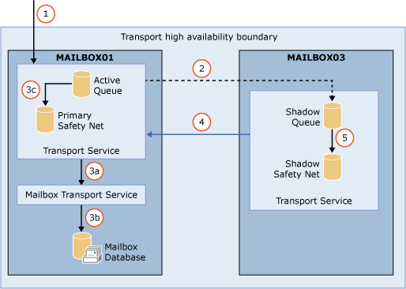

# Transport high availability

 **Summary**: Learn about transport high availability in Exchange 2016 and the features that improve the reliability of message delivery.
  
In Exchange 2016, transport high availability is responsible for keeping redundant copies of messages before and after the messages are successfully delivered. These features were introduced in Exchange 2013 as improvements to the transport high availability features in Exchange 2010 (for example, shadow redundancy and the transport dumpster) to help ensure messages aren't lost in transit.
  
Key features that improve transport high availability in Exchange 2013 and Exchange 2016 over Exchange 2010 include:
  
- Shadow redundancy creates a redundant copy of the message on another server before the message is accepted or acknowledged. The sending server's support or lack of support for shadow redundancy is irrelevant.
    
- Shadow redundancy recognizes both database availability groups (DAGs) and Active Directory sites as transport high availability boundaries. This reduces the number of servers that can hold redundant copies of messages, and eliminates unnecessary redundant message maintenance traffic across DAGs or Active Directory sites.
    
    For more information, see [Shadow redundancy in Exchange 2016](shadow-redundancy.md).
    
- The transport dumpster has been improved and is now named *Safety Net*. Safety Net stores messages that were successfully processed by the Transport service on Mailbox servers. Safety Net works best for Mailbox servers in a DAG, but Safety Net also works for multiple Mailbox servers in the same Active Directory site that don't belong to a DAG.
    
- Safety Net itself is now made redundant on another server. This is important to avoid a single point of failure, because the Transport service and the mailbox databases are both located on the Mailbox server.
    
    For more information, see [Safety Net in Exchange 2016](safety-net.md).
    
This diagram provides a high-level overview of how transport high availability works in Exchange 2016.
  

  
1. An Exchange 2016 Mailbox server named Mailbox01 receives a message from an SMTP server that's outside the transport high availability boundary. The *transport high availability boundary* is a DAG or an Active Directory site in non-DAG environments. The message could come from: 
    
  - An internal third-party messaging server.
    
  - An Internet messaging server that's proxied through the Front End Transport service on a Mailbox server.
    
  - Another Exchange 2016 server in your organization.
    
2. Before acknowledging receipt of the message, Mailbox01 initiates a new SMTP session to another Exchange 2016 Mailbox server named Mailbox03 that's within the Transport high availability boundary, and Mailbox03 makes a shadow copy of the message. In DAG environments, a shadow server in a remote Active Directory site is preferred. Mailbox01 is the primary server holding the primary message, and Mailbox03 is the shadow server holding the shadow message.
    
3. The Transport service on Mailbox01 processes the primary message.
    
1. In this example, the recipient's mailbox is located on Mailbox01, so the Transport service transmits the message to the local Mailbox Transport service.
    
2. The Mailbox Transport service delivers the message to the local mailbox database.
    
3. Mailbox01 queues a discard status for Mailbox03 that indicates the primary message was successfully processed, and Mailbox01 moves a copy of the primary message into the local Primary Safety Net. Note that the message moves between queues within the same queue database.
    
4. Mailbox03 periodically polls Mailbox01 for the discard status of the primary message.
    
5. When Mailbox03 determines Mailbox01 successfully processed the primary message, Mailbox03 moves the shadow message into the local Shadow Safety Net. Note that the message moves between queues within the same queue database.
    
The message is retained in Primary Safety Net and Shadow Safety Net until the message expires based on a configurable timeout value. If a mailbox database failover occurs before the message expires, the Primary Safety Net on Mailbox01 resubmits the message. If the Mailbox01 isn't available, the Shadow Safety Net on Mailbox03 takes over and resubmits the message.
  
## Message redundancy in the Front End Transport service on Mailbox servers

The Front End Transport service on a Mailbox server (part of the Client Access services) has no message queues. It's a stateless proxy that accepts incoming SMTP connections, and proxies them to the Transport service on a Mailbox server. The Front End Transport service keeps the SMTP session with the sending server open while:
  
- The primary message is transmitted to the Transport service on a Mailbox server.
    
    and
    
- A shadow copy of the message is made by the Transport service on a different Mailbox server within the transport high availability boundary (DAG or Active Directory site).
    
Only after both the primary message and shadow message are successfully created, the end of data SMTP command is sent back to the sending SMTP server through the Front End Transport service.
  

