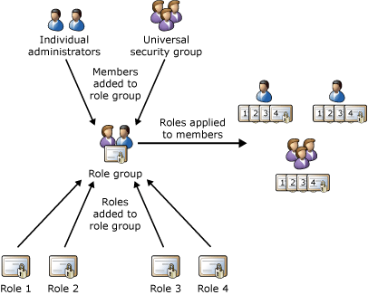
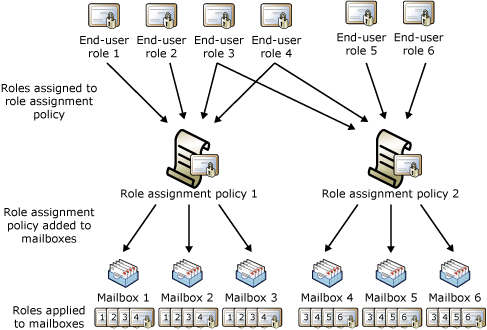
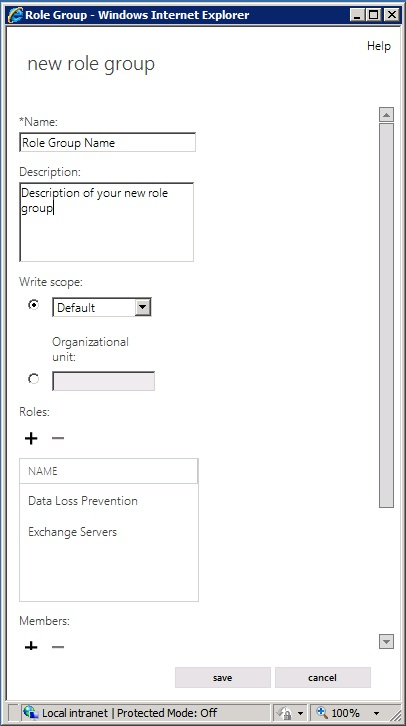
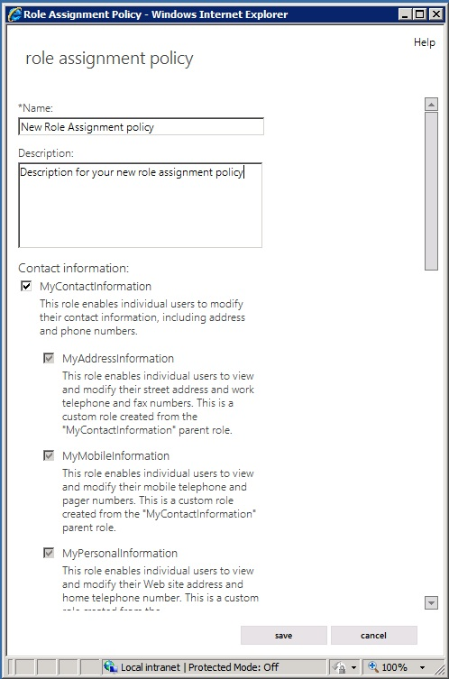

# Permissions

 **Summary**: Learn about Role Based Access Control in Exchange Server 2016.

Microsoft Exchange Server 2016 includes a large set of predefined permissions, based on the Role Based Access Control (RBAC) permissions model, which you can use right away to easily grant permissions to your administrators and users. You can use the permissions features in Exchange 2016 so that you can get your new organization up and running quickly.

## Role-based permissions

In Exchange 2016, the permissions that you grant to administrators and users are based on management roles. A role defines the set of tasks that an administrator or user can perform. For example, a management role called `Mail Recipients` defines the tasks that someone can perform on a set of mailboxes, contacts, and distribution groups. When a role is assigned to an administrator or user, that person is granted the permissions provided by the role.

There are two types of roles, administrative roles and end-user roles:

- **Administrative roles**: These roles contain permissions that can be assigned to administrators or specialist users using role groups that manage a part of the Exchange organization, such as recipients, servers, or databases.

- **End-user roles**: These roles, assigned using role assignment policies, enable users to manage aspects of their own mailbox and distribution groups that they own. End-user roles begin with the prefix `My`.

Roles give permissions to perform tasks to administrators and users by making cmdlets available to those who are assigned the roles. Because the Exchange Administration Center (EAC) and the Exchange Management Shell use cmdlets to manage Exchange, granting access to a cmdlet gives the administrator or user permission to perform the task in each of the Exchange management interfaces.

## Role groups and role assignment policies

Roles grant permissions to perform tasks in Exchange 2016, but you need an easy way to assign them to administrators and users. Exchange 2016 provides you with the following to help you do that:

- **Role groups**: Role groups enable you to grant permissions to administrators and specialist users.

- **Role assignment policies**: Role assignment policies enable you to grant permissions to end users to change settings on their own mailbox or distribution groups that they own.

For more information about role groups and role assignment policies, see the following sections.

### Role groups

Every administrator that manages Exchange 2016 needs to be assigned at least one or more roles. Administrators might have more than one role because they may perform job functions that span multiple areas in Exchange. For example, one administrator might manage both recipients and Exchange servers. In this case, that administrator might be assigned both the `Mail Recipients` and `Exchange Servers` roles.

To make it easier to assign multiple roles to an administrator, Exchange 2016 includes role groups. Role groups are special universal security groups (USGs) used by Exchange 2016 that can contain Active Directory users, USGs, and other role groups. When a role is assigned to a role group, the permissions granted by the role are granted to all the members of the role group. This enables you to assign many roles to many role group members at once. Role groups typically encompass broader management areas, such as recipient management. They're used only with administrative roles, and not end-user roles.

> [!NOTE]
> It's possible to assign a role directly to a user or USG without using a role group. However, that method of role assignment is an advanced procedure and isn't covered in this topic. We recommend that you use role groups to manage permissions.

The following figure shows the relationship between users, role groups, and roles.

 **Roles, role groups, and role group members**

Exchange 2016 includes several built-in role groups, each one providing permissions to manage specific areas in Exchange 2016. Some role groups may overlap with others. The following table lists each role group with a description of its use. If you want to see the roles assigned to each role group, click the name of the role group in the "Role group" column, and then open the "Management Roles Assigned to This Role Group" section.

> [!IMPORTANT]
> If an administrator is a member of more than one role group, Exchange 2016 grants the administrator all of the permissions provided by the role groups he or she is a member of.

**Built-in role groups**

|**Role group**|**Description**|
|:-----|:-----|
|[Organization Management](http://technet.microsoft.com/library/0bfd21c1-86ac-4369-86b7-aeba386741c8.aspx)   |Administrators who are members of the Organization Management role group have administrative access to the entire Exchange 2016 organization and can perform almost any task against any Exchange 2016 object, with some exceptions, such as the `Discovery Management` role.    **Important**: Because the Organization Management role group is a powerful role, only users or USGs that perform organizational-level administrative tasks that can potentially impact the entire Exchange organization should be members of this role group.    |
|[View-Only Organization Management](http://technet.microsoft.com/library/c514c6d0-0157-4c52-9ec6-441d9a30f3df.aspx)   |Administrators who are members of the View Only Organization Management role group can view the properties of any object in the Exchange organization.    |
|[Recipient Management](http://technet.microsoft.com/library/669d602e-68e3-41f9-a455-b942d212d130.aspx)   |Administrators who are members of the Recipient Management role group have administrative access to create or modify Exchange 2016 recipients within the Exchange 2016 organization.    |
|[UM Management](http://technet.microsoft.com/library/c91f0387-615c-4a1d-87d4-133ddac1e407.aspx)   |Administrators who are members of the UM Management role group can manage features in the Exchange organization such as Unified Messaging (UM) service configuration, UM properties on mailboxes, UM prompts, and UM auto attendant configuration.    |
|[Help Desk](http://technet.microsoft.com/library/e7958752-22e4-4155-a2fc-948099dec6f7.aspx)   |The Help Desk role group, by default, enables members to view and modify the Microsoft Office Outlook Web App options of any user in the organization. These options might include modifying the user's display name, address, and phone number. They don't include options that aren't available in Outlook Web App options, such as modifying the size of a mailbox or configuring the mailbox database on which a mailbox is located.    |
|[Hygiene Management](http://technet.microsoft.com/library/fc0a9ec2-9c3d-42f6-8442-8603fb29d464.aspx)   |Administrators who are members of the Hygiene Management role group can configure the antivirus and antispam features of Exchange 2016. Third-party programs that integrate with Exchange 2016 can add service accounts to this role group to grant those programs access to the cmdlets required to retrieve and configure the Exchange configuration.    |
|[Records Management](http://technet.microsoft.com/library/0e0c95ce-6109-4591-b86d-c6cfd44d21f5.aspx)   |Users who are members of the Records Management role group can configure compliance features, such as retention policy tags, message classifications, and transport rules.    |
|[Discovery Management](http://technet.microsoft.com/library/b8bc5922-a8c9-4707-906d-fa38bb87da8f.aspx)   |Administrators or users who are members of the Discovery Management role group can perform searches of mailboxes in the Exchange organization for data that meets specific criteria and can also configure legal holds on mailboxes.    |
|[Public Folder Management](http://technet.microsoft.com/library/e167d95e-bb39-43fd-b960-204ab0de27da.aspx)   |Administrators who are members of the Public Folder Management role group can manage public folders on servers running Exchange 2016.    |
|[Server Management](http://technet.microsoft.com/library/30cbc4de-adb3-42e8-922f-7661095bdb8c.aspx)   |Administrators who are members of the Server Management role group can configure server-specific configuration of transport, Unified Messaging, client access, and mailbox features such as database copies, certificates, transport queues and Send connectors, virtual directories, and client access protocols.    |
|[Delegated Setup](http://technet.microsoft.com/library/49362059-e53f-4135-ad2b-9edfbfff9a1e.aspx)   |Administrators who are members of the Delegated Setup role group can deploy servers running Exchange 2016 that have been previously provisioned by a member of the Organization Management role group.    |
|[Compliance Management](http://technet.microsoft.com/library/b91b23a4-e9c7-4bd0-9ee3-ec5cb498da15.aspx)   |Users who are members of the Compliance Management role group can configure and manage Exchange compliance settings in accordance with their organization's policy.    |
 
If you work in a small organization that has only a few administrators, you might only ever use the Organization Management role group, and none of the others. If you work in a larger organization, you might have administrators who perform specific tasks administering Exchange, such as recipient or server management. In those cases, you might add one administrator to the Recipient Management role group, and another administrator to the Server Management role group. Those administrators can then manage their specific areas of Exchange 2016 but won't have permissions to manage areas they're not responsible for.

If you can't find a built-in role group that fits the jobs your administrators need to do, you can create role groups and add roles to them. For more information, see [Work with role groups](#CustomRoleGroup.md) later in this topic.

### Role assignment policies

Exchange 2016 provides role assignment policies so that you can control what settings your users can configure on their own mailboxes and on distribution groups they own. These settings include their display name, contact information, voice mail settings, and distribution group membership.

Your Exchange 2016 organization can have multiple role assignment policies that provide different levels of permissions for the different types of users in your organizations. Some users can be allowed to change their address or create distribution groups, while others can't. It all depends on the role assignment policy associated with their mailbox. Role assignment policies are added directly to mailboxes, and each mailbox can only be associated with one role assignment policy at a time.

Of the role assignment policies in your organization, one is marked as default. The default role assignment policy is associated with new mailboxes that aren't explicitly assigned a specific role assignment policy when they're created. The default role assignment policy should contain the permissions that should be applied to the majority of your mailboxes.

Permissions are added to role assignment policies using end-user roles. End-user roles begin with `My` and grant permissions for users to manage only their mailbox or distribution groups they own. They can't be used to manage any other mailbox. Only end-user roles can be assigned to role assignment policies.

When an end-user role is assigned to a role assignment policy, all of the mailboxes associated with that role assignment policy receive the permissions granted by the role. This enables you to add or remove permissions to sets of users without having to configure individual mailboxes. The following figure shows:

- End-user roles are assigned to role assignment policies. Role assignment policies can share the same end-user roles.

- Role assignment policies are associated with mailboxes. Each mailbox can only be associated with one role assignment policy.

- After a mailbox is associated with a role assignment policy, the end-user roles are applied to that mailbox. The permissions granted by the roles are granted to the user of the mailbox.

 **Roles, role assignment policies, and mailboxes**

The Default Role Assignment Policy role assignment policy is included with Exchange 2016. As the name implies, it's the default role assignment policy. If you want to change the permissions provided by this role assignment policy, or if you want to create role assignment policies, see [Work with role assignment policies](#CustomRAP.md) later in this topic.

## Work with role groups

To manage your permissions using role groups in Exchange 2016, we recommend that you use the Exchange admin center (EAC). When you use the EAC to manage role groups, you can add and remove roles and members, create role groups, and copy role groups with a few clicks of your mouse. The EAC provides simple dialog boxes, such as the **new role group** dialog box, shown in the following figure, to perform these tasks.

 **New role group dialog box in the EAC**

If none of the role groups included with Exchange 2016 have the permissions you need, you can use the EAC to create a role group and add the roles that have the permissions you need. For your new role group, you'll need to:

1. Choose a name for your role group.

2. Select the roles you want to add to the role group.

3. Add members to the role group.

4. Save the role group.

After you create the role group, you manage it like any other role group.

If there's an existing role group that has some, but not all, of the permissions you need, you can copy it and then make changes to create a role group. Copying an existing role group lets you make changes to it without affecting the original role group. As part of copying the role group, you can add a new name and description, add and remove roles to and from the new role group, and add new members. When you create or copy a role group, you use the same dialog box that's shown in the preceding figure.

Existing role groups can also be modified. You can add and remove roles from existing role groups, and add and remove members from it at the same time, using an EAC dialog box similar to the one in the preceding figure. By adding and removing roles to and from role groups, you turn on and off administrative features for members of that role group.

> [!NOTE]
> Although you can change which roles are assigned to built-in role groups, we recommend that you copy built-in role groups, modify the role group copy, and then add members to the role group copy.

## Work with role assignment policies

To manage the permissions that you grant end users to manage their own mailbox in Exchange 2016, we recommend that you use the EAC. When you use the EAC to manage end-user permissions, you can add roles, remove roles, and create role assignment policies with a few clicks of your mouse. The EAC provides simple dialog boxes, such as the **role assignment policy** dialog box, shown in the following figure, to perform these tasks.

 **Role assignment policy dialog box in the EAC**

Exchange 2016 includes a role assignment policy named Default Role Assignment Policy. This role assignment policy enables users whose mailboxes are associated with it to do the following:

- Join or leave distribution groups that allow members to manage their own membership.

- View and modify basic mailbox settings on their own mailbox, such as Inbox rules, spelling behavior, junk mail settings, and Microsoft ActiveSync devices.

- Modify their contact information, such as work address and phone number, mobile phone number, and pager number.

- Create, modify, or view text message settings.

- View or modify voice mail settings.

- View and modify their marketplace apps.

- Create team mailboxes and connect them to Microsoft SharePoint lists.

If you want to add or remove permissions from the Default Role Assignment Policy or any other role assignment policy, you can use the EAC. When you open the role assignment policy in the EAC, select the check box next to the roles you want to assign to it or clear the check box next to the roles you want to remove. The change you make to the role assignment policy is applied to every mailbox associated with it.

If you want to assign different end-user permissions to the various types of users in your organization, you can create role assignment policies. You can specify a new name for the role assignment policy, and then select the roles you want to assign to the role assignment policy. After you create a role assignment policy, you can associate it with mailboxes using the EAC.

If you want to change which role assignment policy is the default, you needs to use the Exchange Management Shell. When you change the default role assignment policy, any mailboxes that are created will be associated with the new default role assignment policy if one wasn't explicitly specified. The role assignment policy associated with existing mailboxes doesn't change when you select a new default role assignment policy.

 **Notes**:

- If you select a check box for a role that has child roles, the check boxes for the child roles are also selected. If you clear the check box for a role with child roles, the check boxes for the child roles are also cleared.

- For detailed steps about how to create role assignment policies or make changes to existing role assignment policies, see the following topics:

  - [Manage role assignment policies](role-assignment-policies.md)

  - [Change the assignment policy on a mailbox](policy-assignments-for-mailboxes.md)

