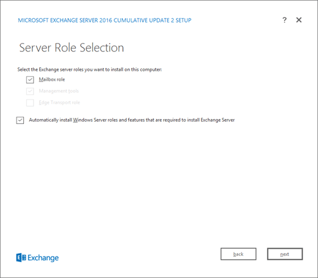
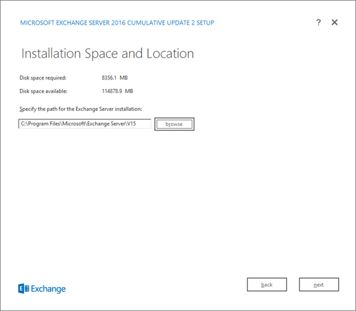
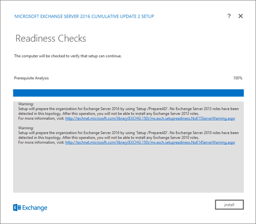

# Install Exchange Mailbox servers using the Setup wizard

Before you install an Exchange Server 2016 or Exchange Server 2019 Mailbox server, verify the following prerequisites:
  
- Verify the network, computer hardware, operating system, and software requirements at: [Exchange Server system requirements](../../plan-and-deploy/system-requirements.md) and [Exchange Server prerequisites](../../plan-and-deploy/prerequisites.md).
    
 - The target server must be a member of an Active Directory domain.

- The account that you use to install Exchange requires the following permissions*:
    
  - **Enterprise Admins group membership**: Required if this is the first Exchange server in the organization.
    
  - **Schema Admins group membership**: Required if you haven't previously [extended the Active Directory schema](../../plan-and-deploy/prepare-ad-and-domains.md#step-1-extend-the-active-directory-schema) or [prepared Active Directory](../../plan-and-deploy/prepare-ad-and-domains.md#step-2-prepare-active-directory) for Exchange 2016 or Exchange 2019.
    
  - **Exchange Organization Management role group membership**: Required if you've already [prepared the Active Directory domain](../../plan-and-deploy/prepare-ad-and-domains.md#step-3-prepare-active-directory-domains) that will contain the Exchange server, or if other Exchange servers already exist in the organization.
    
    * Members of the **Delegated Setup** role group can install Exchange on servers that have already been provisioned in Active Directory by an Exchange administrator. For more information, see [Delegate the installation of Exchange servers](../../plan-and-deploy/deploy-new-installations/delegate-installations.md).
    
- Verify that you've read the release notes at [Release notes for Exchange Server](../../release-notes.md).
    
For more information about planning and deploying Exchange, see [Planning and deployment for Exchange Server](../../plan-and-deploy/plan-and-deploy.md).
  
To install the Edge Transport role on a computer, see [Install Exchange Edge Transport servers using the Setup wizard](install-edge-transport-role.md). Note that you can't install the Edge Transport role on a Mailbox server.
  
## What do you need to know before you begin?

- Estimated time to complete: 60 minutes
    
- For information about keyboard shortcuts that may apply to the procedures in this topic, see [Keyboard shortcuts in the Exchange admin center](../../about-documentation/exchange-admin-center-keyboard-shortcuts.md).
    
> [!CAUTION]
> After you install Exchange on a server, you must not change the server name. Renaming a server after you've installed an Exchange server role is not supported.
  
## Install the Exchange Mailbox server role

1. Download the latest version of version of Exchange. For more information, see [Updates for Exchange Server](../updates.md).
    
2. In File Explorer, right-click on the Exchange ISO image file that you downloaded, and then select **Mount**. In the resulting virtual DVD drive that appears, start Exchange Setup by double-clicking `Setup.exe`.
    
3. The Exchange Server Setup wizard opens. On the **Check for Updates?** page, choose one of the following options, and then click **Next** to continue: 
    
  - **Connect to the Internet and check for updates**: We recommend this option, which searches for updates to the version of Exchange _that you're currently installing_ (it doesn't detect newer Cumulative Updates). This option takes you to the **Downloading Updates** page that searches for updates. Click **Next** to continue.
    
  - **Don't check for updates right now**
    
    
  
4. The **Copying Files** page shows the progress of copying files to the local hard drive. Typically, the files are copied to `%WinDir%\Temp\ExchangeSetup`, but you can confirm the location in the Exchange Setup log at `C:\ExchangeSetupLogs\ExchangeSetup.log`.

    
  
5. On the **Introduction** page, we recommend that you visit the Exchange Server deployment planning links if you haven't already reviewed them. Click **Next** to continue.

    
  
6. On the **License Agreement** page, review the software license terms, select **I accept the terms in the license agreement**, and then click **Next** to continue.

    
  
7. On the **Recommended Settings** page, choose one of the following settings: 
    
   - **Use recommended settings**: Exchange automatically sends error reports and information about your computer hardware and how you use Exchange to Microsoft. For information about what's sent to Microsoft and how it's used, click **?** or the help links on the page.
    
    - **Don't use recommended settings**: These settings are disabled, but you can enable them at any time after Setup completes.
    
    Click **Next** to continue.

    
  
8. On the **Server Role Selection** page, configure the following options: 
    
    - **Mailbox role**: Select this option, which also automatically installs the **Management Tools**.
    
    - **Automatically install Windows Server roles and features that are required to install Exchange**: Select this option to have the Setup wizard install the required Windows prerequisites. You might need to reboot the computer to complete the installation of some Windows features. If you don't select this option, you need to install the Windows features manually.
    
      **Note**: Selecting this option installs only the _Windows features_ that are required by Exchange. You need to install other prerequisites manually. For more information, see [Exchange Server prerequisites](../../plan-and-deploy/prerequisites.md).
    
    Click **Next** to continue.

    
  
9. On the **Installation Space and Location** page, either accept the default installation location (`C:\Program Files\Microsoft\Exchange Server\V15`), or click **Browse** to choose a new location. Make sure that you have enough disk space available in the location where you want to install Exchange. Click **Next** to continue.

    
  
10. If this is the first Exchange 2016 or Exchange 2019 server in your organization and you haven't already done the steps in [Prepare Active Directory and domains for Exchange](../../plan-and-deploy/prepare-ad-and-domains.md), you arrive on the **Exchange Organization** page. On this page, configure the following settings: 
    
    - **Specify the name for this Exchange organization**: The default value is **First Organization**, but you typically use the company name for this value. The organization name is used internally by Exchange, isn't typically seen by users, doesn't affect the functionality of Exchange, and doesn't determine what you can use for email addresses.
    
      - The organization name can't contain more than 64 characters, and can't be blank.
    
      - Valid characters are A to Z, a to z, 0 to 9, hyphen or dash (-), and space, but leading or trailing spaces aren't allowed.
    
      - You can't change the organization name after it's set.
    
    - **Apply Active Directory split permission security model to the Exchange organization**: Most organizations don't need to select this option. If you need to separate management of Active Directory security principals and the Exchange configuration, split permissions might work for you. For more information, click **?**.
    
    Click **Next** to continue.

    
  
11. On the **Malware Protection Settings** page, choose whether you want disable malware scanning. Malware scanning is enabled by default (the value **No** is selected). If you disable malware scanning, you can enable it in the future. Click **Next** to continue.

    
  
12. On the **Readiness Checks** page, verify that the organization and server role prerequisite checks completed successfully. If they haven't, the only option on the page is **Retry**, so you need to resolve the errors before you can continue.

    
  
    After you resolve the errors, click **Retry** to run the prerequisite checks again. You can fix some errors without exiting Setup, while the fix for other errors requires you to restart the computer. If you restart the computer, you need to start over at Step 1.
    
    When no more errors are detected on the **Readiness Checks** page, the **Retry** button changes to **Install** so you can continue. Be sure to review any warnings, and then click **Install** to install Exchange.

    
  
13. On the **Setup Progress** page, a progress bar indicates how the installation is proceeding.

    
  
14. On the **Setup Completed** page, click **Finish**, and then restart the computer.

    
  
## Next steps

- To verify that you've successfully installed Exchange, see [Verify an Exchange installation](../../plan-and-deploy/post-installation-tasks/verify-installation.md).
 
- Complete your deployment by performing the tasks provided in [Exchange post-installation tasks](../../plan-and-deploy/post-installation-tasks/post-installation-tasks.md).

- Having problems? Ask for help in the Exchange forums. Visit the forums at: [Exchange Server](https://go.microsoft.com/fwlink/p/?linkId=60612), [Exchange Online](https://go.microsoft.com/fwlink/p/?linkId=267542), or [Exchange Online Protection](https://go.microsoft.com/fwlink/p/?linkId=285351).
