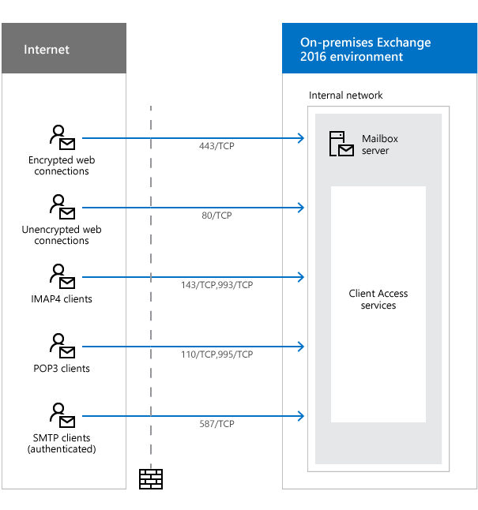
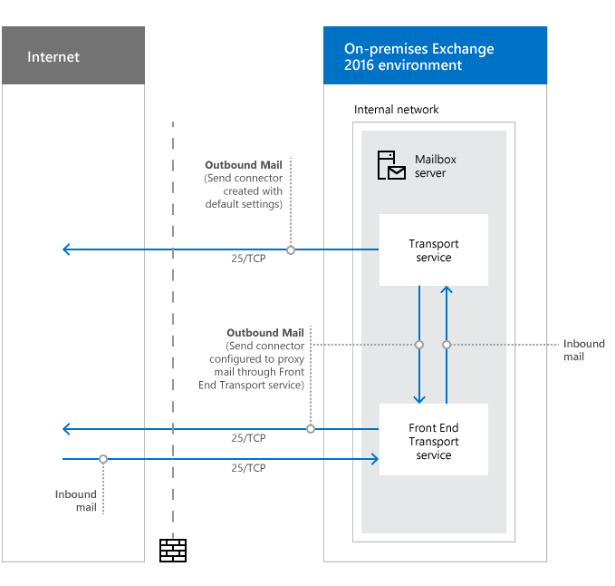
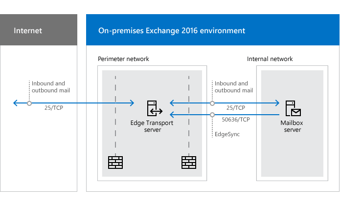

# Network ports for clients and mail flow in Exchange
  
This topic provides information about the network ports that are used by Exchange Server 2016 and Exchange Server 2019 for communication with email clients, Internet mail servers, and other services that are external to your local Exchange organization. Before we get into that, understand the following ground rules:
  
- We do not support restricting or altering network traffic between internal Exchange servers, between internal Exchange servers and internal Lync or Skype for Business servers, or between internal Exchange servers and internal Active Directory domain controllers in any and all types of topologies. If you have firewalls or network devices that could potentially restrict or alter this kind of network traffic, you need to configure rules that allow free and unrestricted communication between these servers (rules that allow incoming and outgoing network traffic on any port—including random RPC ports—and any protocol that never alter bits on the wire).
    
- Edge Transport servers are almost always located in a perimeter network, so it's expected that you'll restrict network traffic between the Edge Transport server and the Internet, and between the Edge Transport server and your internal Exchange organization. These network ports are described in this topic.
    
- It's expected that you'll restrict network traffic between external clients and services and your internal Exchange organization. It's also OK if you decide to restrict network traffic between internal clients and internal Exchange servers. These network ports are described in this topic.
    
## Network ports required for clients and services

The network ports that are required for email clients to access mailboxes and other services in the Exchange organization are described in the following diagram and table.
  
 **Notes:**
  
- The destination for these clients and services is the Client Access services on a Mailbox server. In Exchange 2016 and Exchange 2019, Client Access (frontend) and backend services are installed together on the same Mailbox server. For more information, see [Client Access protocol architecture](../../architecture/architecture.md#client-access-protocol-architecture).
    
- Although the diagram shows clients and services from the Internet, the concepts are the same for internal clients (for example, clients in an accounts forest accessing Exchange servers in a resource forest). Similarly, the table doesn't have a source column because the source could be any location that's external to the Exchange organization (for example, the Internet or an accounts forest).
    
- Edge Transport servers have no involvement in the network traffic that's associated with these clients and services.
    

  
|**Purpose**|**Ports**|**Comments**|
|:-----|:-----|:-----|
|Encrypted web connections are used by the following clients and services:  • Autodiscover service   • Exchange ActiveSync   • Exchange Web Services (EWS)  • Offline address book (OAB) distribution  • Outlook Anywhere (RPC over HTTP)  • Outlook MAPI over HTTP   • Outlook on the web (formerly known as Outlook Web App)|443/TCP (HTTPS)|For more information about these clients and services, see the following topics:  • [Autodiscover service in Exchange Server](../../architecture/client-access/autodiscover.md)  • [Exchange ActiveSync](../../clients/exchange-activesync/exchange-activesync.md)  • [EWS reference for Exchange](https://go.microsoft.com/fwlink/p/?LinkId=529544)  • [Offline address books in Exchange Server](../../email-addresses-and-address-books/offline-address-books/offline-address-books.md)  • [Outlook Anywhere](https://technet.microsoft.com/library/bb123741(v=exchg.150).aspx)  • [MAPI over HTTP in Exchange Server](../../clients/mapi-over-http/mapi-over-http.md)|
|Unencrypted web connections are used by the following clients and services:  • Internet calendar publishing  • Outlook on the web (redirect to 443/TCP)  • Autodiscover (fallback when 443/TCP isn't available)|80/TCP (HTTP)|Whenever possible, we recommend using encrypted web connections on 443/TCP to help protect data and credentials. However, you may find that some services must be configured to use unencrypted web connections on 80/TCP to the Client Access services on Mailbox servers.   For more information about these clients and services, see the following topics:  • [Enable Internet Calendar Publishing](https://technet.microsoft.com/library/jj853046(v=exchg.150).aspx)  • [Autodiscover service in Exchange Server](../../architecture/client-access/autodiscover.md)|
|IMAP4 clients|143/TCP (IMAP), 993/TCP (secure IMAP)|IMAP4 is disabled by default. For more information, see [POP3 and IMAP4 in Exchange Server](../../clients/pop3-and-imap4/pop3-and-imap4.md).    The IMAP4 service in the Client Access services on the Mailbox server proxies connections to the IMAP4 Backend service on a Mailbox server.|
|POP3 clients|110/TCP (POP3), 995/TCP (secure POP3)|POP3 is disabled by default. For more information, see [POP3 and IMAP4 in Exchange Server](../../clients/pop3-and-imap4/pop3-and-imap4.md).    The POP3 service in the Client Access services on the Mailbox server proxies connections to the POP3 Backend service on a Mailbox server.|
|SMTP clients (authenticated)|587/TCP (authenticated SMTP)|The default Received connector named "Client Frontend _\<Server name\>_" in the Front End Transport service listens for authenticated SMTP client submissions on port 587.   **Note:**: If you have mail clients that can submit authenticated SMTP mail only on port 25, you can modify the network adapter bindings value of this Receive connector to also listen for authenticated SMTP mail submissions on port 25.|
   
## Network ports required for mail flow

How mail is delivered to and from your Exchange organization depends on your Exchange topology. The most important factor is whether you have a subscribed Edge Transport server deployed in your perimeter network.
  
### Network ports required for mail flow (no Edge Transport servers)

The network ports that are required for mail flow in an Exchange organization that has only Mailbox servers are described in the following diagram and table.
  

  
|**Purpose**|**Ports**|**Source**|**Destination**|**Comments**|
|:-----|:-----|:-----|:-----|:-----|
|Inbound mail|25/TCP (SMTP)|Internet (any) |Mailbox server|The default Receive connector named "Default Frontend _\<Mailbox server name\>_" in the Front End Transport service listens for anonymous inbound SMTP mail on port 25.   Mail is relayed from the Front End Transport service to the Transport service on a Mailbox server using the implicit and invisible intra-organization Send connector that automatically routes mail between Exchange servers in the same organization. For more information, see [Implicit Send connectors](../../mail-flow/connectors/send-connectors.md#implicit-send-connectors).|
|Outbound mail|25/TCP (SMTP)|Mailbox server|Internet (any)|By default, Exchange doesn't create any Send connectors that allow you to send mail to the Internet. You have to create Send connectors manually. For more information, see [Create a Send connector to send mail to the Internet](../../mail-flow/connectors/internet-mail-send-connectors.md).|
|Outbound mail (if proxied through the Front End transport service)|25/TCP (SMTP)|Mailbox server|Internet (any)|Outbound mail is proxied through the Front End Transport service only when a Send connector is configured with **Proxy through Client Access server** in the Exchange admin center or `-FrontEndProxyEnabled $true` in the Exchange Management Shell.   In this case, the default Receive connector named "Outbound Proxy Frontend _\<Mailbox server name\>_" in the Front End Transport service listens for outbound mail from the Transport service on a Mailbox server. For more information, see [Configure Send connectors to proxy outbound mail](../../mail-flow/connectors/proxy-outbound-mail.md). |
|DNS for name resolution of the next mail hop (not pictured)|53/UDP,53/TCP (DNS)|Mailbox server|DNS server|See the [Name resolution](#name-resolution) section in this topic.|
   
### Network ports required for mail flow with Edge Transport servers

A subscribed Edge Transport server that's installed in your perimeter network affects mail flow in the following ways:
  
- Outbound mail from the Exchange organization never flows through the Front End Transport service on Mailbox servers. Mail always flows from the Transport service on a Mailbox server in the subscribed Active Directory site to the Edge Transport server (regardless of the version of Exchange on the Edge Transport server).
    
- Inbound mail flows from the Edge Transport server to a Mailbox server in the subscribed Active Directory site. Specifically:
    
  - Mail from an Exchange 2013 or later Edge Transport server first arrives at the Front End Transport service before it flows to the Transport service on an Exchange 2016 or Exchange 2019 Mailbox server.
    
  - In Exchange 2016, mail from an Exchange 2010 Edge Transport server always delivers mail directly to the Transport service on an Exchange 2016 Mailbox server. Note that coexistance with Exchange 2010 isn't supported in Exchange 2019.
    
For more information, see [Mail flow and the transport pipeline](../../mail-flow/mail-flow.md).
  
The network ports that are required for mail flow in Exchange organizations that have Edge Transport servers are described in the following diagram and table.
  

  
|**Purpose**|**Ports**|**Source**|**Destination**|**Comments**|
|:-----|:-----|:-----|:-----|:-----|
|Inbound mail - Internet to Edge Transport server|25/TCP (SMTP)|Internet (any)|Edge Transport server|The default Receive connector named "Default internal Receive connector _\<Edge Transport server name\>_" on the Edge Transport server listens for anonymous SMTP mail on port 25.|
|Inbound mail - Edge Transport server to internal Exchange organization|25/TCP (SMTP)|Edge Transport server|Mailbox servers in the subscribed Active Directory site|The default Send connector named "EdgeSync - Inbound to _\<Active Directory site name\>_" relays inbound mail on port 25 to any Mailbox server in the subscribed Active Directory site. For more information, see [Send connectors created automatically by the Edge Subscription](../../architecture/edge-transport-servers/edge-subscriptions.md#send-connectors-created-automatically-by-the-edge-subscription).    The default Receive connector named "Default Frontend _\<Mailbox server name\>_" in the Front End Transport service on the Mailbox server listens for all inbound mail (including mail from Exchange 2013 or later Edge Transport servers) on port 25.|
|Outbound mail - Internal Exchange organization to Edge Transport server|25/TCP (SMTP)|Mailbox servers in the subscribed Active Directory site|Edge Transport servers|Outbound mail always bypasses the Front End Transport service on Mailbox servers.   Mail is relayed from the Transport service on any Mailbox server in the subscribed Active Directory site to an Edge Transport server using the implicit and invisible intra-organization Send connector that automatically routes mail between Exchange servers in the same organization.   The default Receive connector named "Default internal Receive connector _\<Edge Transport server name\>_" on the Edge Transport server listens for SMTP mail on port 25 from the Transport service on any Mailbox server in the subscribed Active Directory site.|
|Outbound mail - Edge Transport server to Internet|25/TCP (SMTP)|Edge Transport server|Internet (any)|The default Send connector named "EdgeSync - _\<Active Directory site name\>_ to Internet" relays outbound mail on port 25 from the Edge Transport server to the Internet.|
|EdgeSync synchronization|50636/TCP (secure LDAP)|Mailbox servers in the subscribed Active Directory site that participate in EdgeSync synchronization|Edge Transport servers|When the Edge Transport server is subscribed to the Active Directory site, all Mailbox servers that exist in the site _at the time_ participate in EdgeSync synchronization. However, any Mailbox servers that you add later don't _automatically_ participate in EdgeSync synchronization.|
|DNS for name resolution of the next mail hop (not pictured)|53/UDP,53/TCP (DNS)|Edge Transport server|DNS server|See the [Name resolution](#name-resolution) section later in this topic.|
|Open proxy server detection in sender reputation (not pictured)|see comments|Edge Transport server|Internet|By default, sender reputation (the Protocol Analysis agent) uses open proxy server detection as one of the criteria to calculate the sender reputation level (SRL) of the source messaging server. For more information, see [Sender reputation and the Protocol Analysis agent](../../antispam-and-antimalware/antispam-protection/sender-reputation.md).   Open proxy server detection uses the following protocols and TCP ports to test source messaging servers for open proxy:   • SOCKS4, SOCKS5: 1081, 1080    • Wingate, Telnet, Cisco: 23    • HTTP CONNECT, HTTP POST: 6588, 3128, 80    Also, if your organization uses a proxy server to control outbound Internet traffic, you need to define the proxy server name, type, and TCP port that sender reputation requires to access the Internet for open proxy server detection.   Alternatively, you can disable open proxy server detection in sender reputation.    For more information, see [Sender reputation procedures](../../antispam-and-antimalware/antispam-protection/sender-reputation-procedures.md).|
   
### Name resolution

DNS resolution of the next mail hop is a fundamental part of mail flow in any Exchange organization. Exchange servers that are responsible for receiving inbound mail or delivering outbound mail must be able to resolve both internal and external host names for proper mail routing. And all internal Exchange servers must be able to resolve internal host names for proper mail routing. There are many different ways to design a DNS infrastructure, but the important result is to ensure name resolution for the next hop is working properly for all of your Exchange servers.
  
## Network ports required for hybrid deployments

The network ports that are required for an organization that uses both on-premises Exchange and Microsoft Office 365 are covered in the "Hybrid deployment protocols, port and endpoints" section in [Hybrid deployment prerequisites](../../../ExchangeHybrid/hybrid-deployment-prerequisites.md).
  
## Network ports required for Unified Messaging in Exchange 2016

The network ports that are required for Unified Messaging in Exchange 2013 and Exchange 2016 are covered in the topic [UM protocols, ports, and services](https://technet.microsoft.com/library/aa998265(v=exchg.150).aspx).
