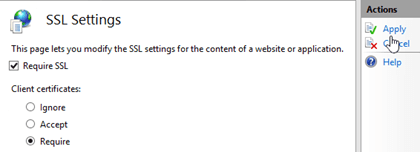
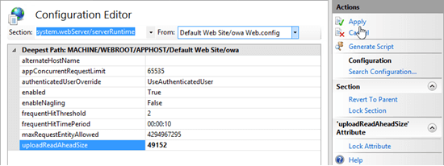

# Configure certificate based authentication in Exchange 2016

Certificate based authentication (CBA) in Exchange allows Outlook on the web (formerly known as Outlook Web App) and Exchange ActiveSync clients to be authenticated by client certificates instead of entering a username and password.

Before you configure Exchange, you need to issue a client certificate to each user. Because of the sheer number of certificates involved, you should use an automated internal public key infrastructure (PKI) to issue and manage the client certificates. An example of an automated internal PKI is Active Directory Certificate Services (AD CS). For more information about AD CS, see [Active Directory Certificate Services Overview](https://docs.microsoft.com/previous-versions/windows/it-pro/windows-server-2012-R2-and-2012/hh831740(v=ws.11)). Here's more information about the certificate requirements:

- The client certificate must be issued for client authentication (for example, the default **User** certificate template in AD CS).

- The client certificate must contain the user principal name (UPN) of the user (in the certificate's **Subject** or **Subject Alternative Name** fields).

- The client certificate must be associated with the user account in Active Directory.

- All servers and devices that are involved in access to Outlook on the web and ActiveSync (including proxy servers and client devices) must trust the entire chain of trust for the client certificates (the root certificate of the certification authority, and any intermediate CAs that were used to issue certificates).

For CBA in Outlook on the web, the client certificate needs to be installed on the local computer, device, or on a smart card. For CBA in ActiveSync, the client certificate needs to be installed on the local device. You can automate the installation of certificates on devices by using a mobile device management (MDM) solution like Intune. For more information about Intune, see [Overview of Microsoft Intune](https://www.microsoft.com/microsoft-365/enterprise-mobility-security/microsoft-intune).

## What do you need to know before you begin?

- Estimated time to complete this task: 20 minutes

- You need to be assigned permissions before you can perform this procedure or procedures. To see what permissions you need, see the "IIS Manager" entry in the Outlook on the web permissions section of the [Clients and mobile devices permissions](../../permissions/feature-permissions/client-and-mobile-device-permissions.md) topic.

- To learn how to open the Exchange Management Shell in your on-premises Exchange organization, see [Open the Exchange Management Shell](https://docs.microsoft.com/powershell/exchange/open-the-exchange-management-shell).

- For information about keyboard shortcuts that may apply to the procedures in this topic, see [Keyboard shortcuts in the Exchange admin center](../../about-documentation/exchange-admin-center-keyboard-shortcuts.md).

> [!TIP]
> Having problems? Ask for help in the Exchange forums. Visit the forums at: [Exchange Server](https://go.microsoft.com/fwlink/p/?linkId=60612), [Exchange Online](https://go.microsoft.com/fwlink/p/?linkId=267542), or [Exchange Online Protection](https://go.microsoft.com/fwlink/p/?linkId=285351).

## Step 1: Use the Exchange Management Shell to install the Client Certificate Mapping Authentication feature on all of your Exchange servers

All Exchange servers that share the same namespace and URLs need to use the same authentication methods. You need to install the Client Certificate Mapping Authentication feature on all of your Exchange servers.

In the Exchange Management Shell, run the following command:

```powershell
Install-WindowsFeature Web-Client-Auth
```

For detailed syntax and parameter information, see [Install-WindowsFeature](https://docs.microsoft.com/powershell/module/servermanager/install-windowsfeature).

## Step 2: Use IIS Manager to enable Active Directory Client Certificate Authentication for the Exchange server

1. Open IIS Manager on the Exchange server. An easy way to do this in Windows Server 2012 or later is to press Windows key + Q, type inetmgr, and select **Internet Information Services (IIS) Manager** in the results.

2. Select the server, and verify **Features View** is selected at the bottom of the page.

3. In the **IIS** section, double-click **Authentication**.

    

4. On the **Authentication** page that opens, select **Active Directory Client Certificate Authentication** from the list, and in the **Actions** pane, click **Enable**.

    

    You'll see a warning that SSL must be enabled to use Active Directory Client Certificate Mapping.

## Step 3: Use IIS Manager to configure the Outlook on the web, Exchange admin center, and ActiveSync virtual directories to require client certificates

 **Note**: You need to *require* client certificates, because *accepting* client certificates (to support both CBA and regular username and password authentication) doesn't work consistently across all types of ActiveSync devices.

1. In IIS Manager, expand the server, expand **Sites**, and then expand **Default Web Site**.

2. Select the **owa** virtual directory, and verify **Features View** is selected at the bottom of the page.

3. In the **IIS** section, double-click **SSL Settings**.

4. On the **SSL Settings** page, verify **Require SSL** is checked, and select the **Client certificates** value **Require**.

5. In the **Actions** pane, click **Apply**.

    

6. Select the **Microsoft-Server-ActiveSync** virtual directory.

7. In the **IIS** section, double-click **SSL Settings**.

8. On the **SSL Settings** page, verify **Require SSL** is checked, and select the **Client certificates** value **Require**.

9. In the **Actions** pane, click **Apply**.

 **Note**: Although you can perform these procedures on the command line, the steps might not configure a required registry key. You can use the earlier procedures in IIS Manager (which will definitely set the registry key correctly), or you need to verify that the registry key `HKEY_LOCAL_MACHINE\SYSTEM\CurrentControlSet\Services\HTTP\Parameters\SslBindingInfo\0.0.0.0:443` is set to the value `1` after you perform the procedures on the command line.

 To perform these procedures on the command line, open an elevated command prompt on the Exchange server (a Command Prompt window you open by selecting **Run as administrator**) and run the following commands:

```console
%windir%\system32\inetsrv\appcmd.exe set config "Default Web Site/owa/" -section:system.webserver/security/access /sslFlags:"Ssl, SslRequireCert" /commit:apphost
```

```console
%windir%\system32\inetsrv\appcmd.exe set config "Default Web Site/ecp/" -section:system.webserver/security/access /sslFlags:"Ssl, SslRequireCert" /commit:apphost
```

```console
%windir%\system32\inetsrv\appcmd.exe set config "Default Web Site/Microsoft-Server-ActiveSync/" -section:system.webserver/security/access /sslFlags:"Ssl, SslRequireCert" /commit:apphost
```

## Step 4: Use the Exchange Management Shell to disable authentication other authentication methods on the Outlook on the web, Exchange admin center, and ActiveSync virtual directories

After you require client certificates for authentication, you need to disable all other authentication methods on the Outlook on the web, Exchange admin center (EAC) and ActiveSync virtual directories. By default, only Basic authentication and Forms authentication are enabled.

1. In the Exchange Management Shell, replace _\<ServerName\>_ with the name of your Exchange server, and run the following command to disable all other authentication methods on the Outlook on the web virtual directory:

    ```powershell
    Set-OwaVirtualDirectory "<ServerName>\owa (Default Web Site)" -BasicAuthentication $false -WindowsAuthentication $false -DigestAuthentication $false -FormsAuthentication $false -AdfsAuthentication $false -OAuthAuthentication $false
    ```

    For detailed syntax and parameter information, see [Set-OwaVirtualDirectory](https://docs.microsoft.com/powershell/module/exchange/set-owavirtualdirectory).

2. In the Exchange Management Shell, replace _\<ServerName\>_ with the name of your Exchange server, and run the following command to disable all other authentication methods on the EAC virtual directory:

    ```powershell
    Set-EcpVirtualDirectory "<ServerName>\ecp (Default Web Site)" -BasicAuthentication $false -WindowsAuthentication $false -DigestAuthentication $false -FormsAuthentication $false -AdfsAuthentication $false
    ```

    For detailed syntax and parameter information, see [Set-EcpVirtualDirectory](https://docs.microsoft.com/powershell/module/exchange/set-ecpvirtualdirectory).

3. Replace _\<ServerName\>_ with the name of your Exchange server, and run the following command to disable all other authentication methods on the ActiveSync virtual directory:

    ```powershell
    Set-ActiveSyncVirtualDirectory "<ServerName>\Microsoft-Server-ActiveSync (Default Web Site)" -BasicAuthEnabled $false -WindowsAuthEnabled $false
    ```

    For detailed syntax and parameter information, see [Set-ActiveSyncVirtualDirectory](https://docs.microsoft.com/powershell/module/exchange/set-activesyncvirtualdirectory).

## Step 5: Use IIS Manager to enable client certificate mapping for the Outlook on the web, Exchange admin center, and ActiveSync virtual directories

> [!IMPORTANT]
> After you perform this step, running the **Set-ActiveSyncVirtualDirectory** cmdlet might disable the client certificate mapping for ActiveSync.

1. In IIS Manager, expand the server, expand **Sites**, and then expand **Default Web Site**.

2. Select the **owa** virtual directory, and verify **Features View** is selected at the bottom of the page.

3. In the **Management** section, double-click **Configuration Editor**.

4. On the **Configuration Editor** page, click the drop down on **Section**, and navigate to **system.webServer** \> **security** \> **authentication** \> **clientCertificateMappingAuthentication**.

    

5. Set the **enabled** value to **True**, and in the **Actions** pane, click **Apply**.

    

6. Select the **ecp** virtual directory.

7. In the **Management** section, double-click **Configuration Editor**.

8. On the **Configuration Editor** page, click the drop down on **Section**, and navigate to **system.webServer** \> **security** \> **authentication** \> **clientCertificateMappingAuthentication**.

9. Set the **enabled** value to **True**, and in the **Actions** pane, click **Apply**.

10. Select the **Microsoft-Server-ActiveSync** virtual directory.

11. In the **Management** section, double-click **Configuration Editor**.

12. On the **Configuration Editor** page, click the drop down on **Section**, and navigate to **system.webServer** \> **security** \> **authentication** \> **clientCertificateMappingAuthentication**.

13. Set the **enabled** value to **True**, and in the **Actions** pane, click **Apply**.

 **Note**: To perform these procedures on the command line, open an elevated command prompt on the Exchange server and run the following commands:

```console
%windir%\system32\inetsrv\appcmd.exe set config "Default Web Site/owa/" -section:system.webserver/security/authentication/clientCertificateMappingAuthentication /enabled:"True" /commit:apphost
```

```console
%windir%\system32\inetsrv\appcmd.exe set config "Default Web Site/ecp/" -section:system.webserver/security/authentication/clientCertificateMappingAuthentication /enabled:"True" /commit:apphost
```

```console
%windir%\system32\inetsrv\appcmd.exe set config "Default Web Site/Microsoft-Server-ActiveSync/" -section:system.webserver/security/authentication/clientCertificateMappingAuthentication /enabled:"True" /commit:apphost
```

## Step 6 (Optional): Add the root certificate of a third-party certification authority to the Enterprise NTAuth store in Active Directory

You only need to perform this step if you aren't using AD CS to issue the client certificates. This setting indicates that the certification authority (CA) is trusted to issue client certificates for Active Directory authentication.

1. Export the CA's root certificate to a Base-64 encoded or DER binary encoded X.509 .cer file. In this example, we'll use C:\Data\CARoot.cer.

2. On any domain member server (for example, a domain controller or an Exchange server), open an elevated command prompt run the following command:

    ```console
    %windir%\system32\certutil.exe -enterprise -addstore NTAuth "C:\Data\CARoot.cer"
    ```

    Note that this step requires membership in the **Enterprise Admins** group.

## Step 7 (Optional): Use IIS Manager to increase the UploadReadAheadSize value for the Outlook on the web and ActiveSync virtual directories

If your clients receive errors, you might need to increase the **uploadReadAheadSize** values in the IIS metabase to allow for the request headers.

1. In IIS Manager, expand the server, expand **Sites**, and then expand **Default Web Site**.

2. Select the **owa** virtual directory, and verify **Features View** is selected at the bottom of the page.

3. In the **Management** section, double-click **Configuration Editor**.

4. On the **Configuration Editor** page, click the drop down on **Section**, and navigate to **systemwebServer** \> **serverRuntime**.

    

5. Set the **uploadReadAheadSize** value to 49152, and in the **Actions** pane, click **Apply**.

    

6. Select the **ecp** virtual directory.

7. In the **Management** section, double-click **Configuration Editor**.

8. On the **Configuration Editor** page, click the drop down on **Section**, and navigate to **systemwebServer** \> **serverRuntime**.

9. Set the **uploadReadAheadSize** value to 49152, and in the **Actions** pane, click **Apply**.

10. Select the **Microsoft-Server-ActiveSync** virtual directory.

11. In the **Management** section, double-click **Configuration Editor**.

12. On the **Configuration Editor** page, click the drop down on **Section**, and navigate to **systemwebServer** \> **serverRuntime**.

13. Set the **uploadReadAheadSize** value to 49152, and in the **Actions** pane, click **Apply**.

 **Note**: To perform these procedures on the command line, open an elevated command prompt on the Exchange server and run the following commands:

```console
%windir%\system32\inetsrv\appcmd.exe set config "Default Web Site/owa/" -section:system.webserver/serverRuntime /uploadReadAheadSize:49152
```

```console
%windir%\system32\inetsrv\appcmd.exe set config "Default Web Site/ecp/" -section:system.webserver/serverRuntime /uploadReadAheadSize:49152
```

```console
%windir%\system32\inetsrv\appcmd.exe set config "Default Web Site/Microsoft-Server-ActiveSync/" -section:system.webserver/serverRuntime /uploadReadAheadSize:49152
```
