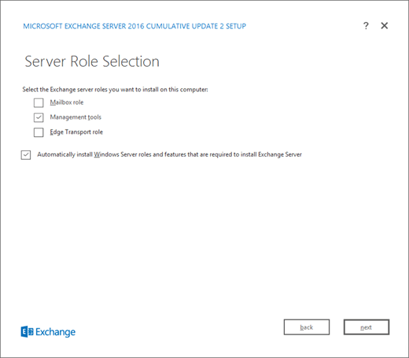
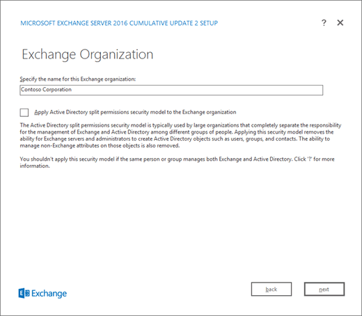
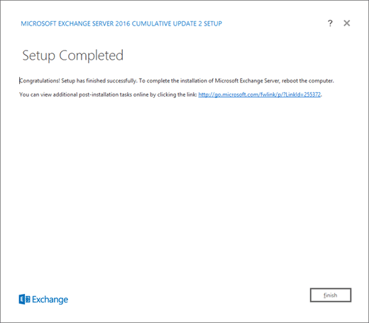

# Install the Exchange management tools

The management tools in Exchange Server 2016 and Exchange Server 2019 include the Exchange Management Shell and the Exchange Toolbox. You can install the management tools on other client computers or servers in the Active Directory domain to help you manage your Exchange organization. The management tools have similar operating system, .NET Framework, and Windows Management Framework (Windows PowerShell) requirements as an Exchange server. The notable exception is: you can install the management tools on client versions of Windows. For more information, see [Exchange Server system requirements](../../plan-and-deploy/system-requirements.md) and [Exchange Server prerequisites](../../plan-and-deploy/prerequisites.md).
  
> [!NOTE]
> The management tools don't include the Exchange admin center (EAC). The EAC is a web-based console that's hosted on Exchange 2016 Mailbox servers, and like any web site, you can access the EAC from other computers. For more information about the EAC, see [Exchange admin center in Exchange Server](../../architecture/client-access/exchange-admin-center.md).
  
For more information about the Exchange Management Shell and the Exchange Toolbox, see [Exchange Server PowerShell (Exchange Management Shell)](https://docs.microsoft.com/powershell/exchange/exchange-server/exchange-management-shell) and [Exchange Toolbox](https://technet.microsoft.com/library/jj556600(v=exchg.150).aspx).
  
## What do you need to know before you begin?

- Estimated time to complete: 20 minutes

- The computer where you want to install the Exchange management tools requires access to Setup.exe in the Exchange installation files. To download the latest version of Exchange, see [Updates for Exchange Server](../updates.md).
    
- For information about keyboard shortcuts that may apply to the procedures in this topic, see [Keyboard shortcuts in the Exchange admin center](../../about-documentation/exchange-admin-center-keyboard-shortcuts.md).
    
> [!TIP]
> Having problems? Ask for help in the Exchange forums. Visit the forums at: [Exchange Server](https://go.microsoft.com/fwlink/p/?linkId=60612), [Exchange Online](https://go.microsoft.com/fwlink/p/?linkId=267542), or [Exchange Online Protection](https://go.microsoft.com/fwlink/p/?linkId=285351).
  
## Use the Exchange 2016 Setup wizard to install the Exchange management tools

1. In File Explorer on the computer where you want to install the management tools, right-click on the Exchange ISO image file that you downloaded, and then select **Mount**. In the resulting virtual DVD drive that appears, start Exchange Setup by double-clicking `Setup.exe`.
    
2. The Exchange Server Setup wizard opens. On the **Check for Updates?** page, choose one of the following options, and then click **Next** to continue: 
    
  - **Connect to the Internet and check for updates**: We recommend this option, which searches for updates to the version of Exchange _that you're currently installing_ (it doesn't detect newer Cumulative Updates). This option takes you to the **Downloading Updates** page that searches for updates. Click **Next** to continue.
    
  - **Don't check for updates right now**
    
    
  
3. The **Copying Files** page shows the progress of copying files to the local hard drive. Typically, the files are copied to `%WinDir%\Temp\ExchangeSetup`, but you can confirm the location in the Exchange Setup log at `C:\ExchangeSetupLogs\ExchangeSetup.log`.

    
  
4. On the **Introduction** page, click **Next** to continue.

    
  
5. On the **License Agreement** page, review the software license terms, select **I accept the terms in the license agreement**, and then click **Next** to continue.

    
  
6. On the **Recommended Settings** page, choose one of the following settings: 
    
    - **Use recommended settings**: Exchange automatically sends error reports and information about your computer hardware and how you use Exchange to Microsoft. For information about what's sent to Microsoft and how it's used, click **?** or the help links on the page.
    
    - **Don't use recommended settings**: These settings are disabled, but you can enable them at any time after Setup completes.
    
    Click **Next** to continue.

    
  
7. On the **Server Role Selection** page, configure the following settings: 
    
    - Select **Management tools**.
    
    - **Automatically install Windows Server roles and features that are required to install Exchange**: Select this option to have the Setup wizard install the required Windows prerequisites. You might need to reboot the computer to complete the installation of some Windows features. If you don't select this option, you need to install the Windows features manually.
    
      **Note**: Selecting this option installs only the _Windows features_ that are required by Exchange. You need to install other prerequisites manually. For more information, see [Exchange Server prerequisites](../../plan-and-deploy/prerequisites.md).
    
    Click **Next** to continue.

    
  
8. On the **Installation Space and Location** page, either accept the default installation location (`C:\Program Files\Microsoft\Exchange Server\V15`), or click **Browse** to choose a new location. Make sure that you have enough disk space available in the location where you want to install the management tools. Click **Next** to continue.

    
  
9. If this is the first installation of Exchange in your organization (Exchange server or the management tools), you arrive on the **Exchange Organization** page. On this page, configure the following settings: 
    
    - **Specify the name for this Exchange organization**: The default value is **First Organization**, but you typically use the company name for this value. The organization name is used internally by Exchange, isn't typically seen by users, doesn't affect the functionality of Exchange, and doesn't determine what you can use for email addresses.
    
      - The organization name can't contain more than 64 characters, and can't be blank.
    
      - Valid characters are A to Z, a to z, 0 to 9, hyphen or dash (-), and space, but leading or trailing spaces aren't allowed.
    
      - You can't change the organization name after it's set.
    
    - **Apply Active Directory split permission security model to the Exchange organization**: Most organizations don't need to select this option. If you need to separate management of Active Directory security principals and the Exchange configuration, split permissions might work for you. For more information, click **?**.
    
    Click **Next** to continue.

    
  
10. On the **Readiness Checks** page, verify that the organization and server role prerequisite checks completed successfully. If they haven't, the only option on the page is **Retry**, so you need to resolve the errors before you can continue.

    
  
    After you resolve the errors, click **Retry** to run the prerequisite checks again. You can fix some errors without exiting Setup, while the fix for other errors requires you to restart the computer. If you restart the computer, you need to start over at Step 2.
    
    When no more errors are detected on the **Readiness Checks** page, the **Retry** button changes to **Install** so you can continue. Be sure to review any warnings, and then click **Install** to install the management tools.
    
    
  
11. On the **Setup Completed** page, click **Finish**, and then restart the computer.

    
  
## Use Exchange unattended Setup mode to install the Exchange management tools

1. In File Explorer on the computer where you want to install the Exchange management tools, right-click on the Exchange ISO image file that you downloaded, and then select **Mount**.

2. To install the Exchange management tools from the command line, use the following syntax in elevated command prompt (a Command Prompt window you opened by selecting **Run as administrator**):

    ```
    <Virtual DVD drive letter>:\Setup.exe /IAcceptExchangeServerLicenseTerms /Role:ManagementTools [/EnableErrorReporting] [/CustomerFeedbackEnabled:<True | False>] [/InstallWindowsComponents] [/TargetDir:<Target folder>] [/OrganizationName:<Name>]
    ```

    This example uses the Exchange Setup files on drive E: to install the management tools on the local server

    ```
    E:\Setup.exe /IAcceptExchangeServerLicenseTerms /Role:ManagementTools
    ```

For more information, see [Install Exchange using unattended mode](../../plan-and-deploy/deploy-new-installations/unattended-installs.md).
