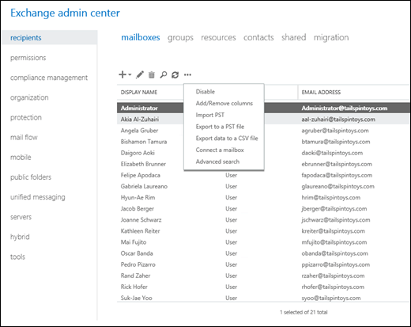
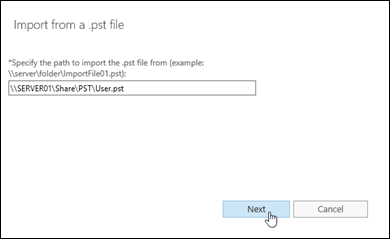
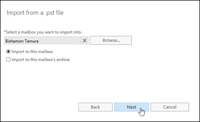
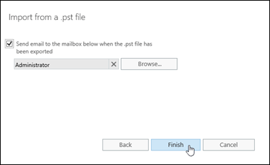

# Procedures for mailbox imports from .pst files in Exchange Server

 **Summary**: Learn how administrators can view, create, modify, delete, suspend and resume requests to import .pst files into mailboxes in Exchange 2016 or Exchange 2019.
  
Mailbox import requests use the Microsoft Exchange Mailbox Replication service (MRS) to import the contents of .pst files into mailboxes. For more information, see [Mailbox imports and exports in Exchange Server](mailbox-import-and-export.md).
  
This topic shows you how to:
  
- Create mailbox import requests
    
- View mailbox import requests.
    
- Modify mailbox import requests that haven't completed.
    
- Suspend mailbox import requests that haven't completed or failed.
    
- Resume suspended or failed mailbox import requests
    
- Remove mailbox import requests.
    
## What do you need to know before you begin?

> [!IMPORTANT]
> The procedures in this topic require the Mailbox Import Export role, which isn't assigned to any role groups by default. To assign the role to a role group that you belong to, see [Add a role to a role group](../../permissions/role-groups.md#AddRemoveRGRole). Note that changes in permission require you to log off and log on for the changes to take effect.
  
- Estimated time to complete each procedure: 5 minutes
    
- You need to import the .pst files from a UNC network share (\\ _\<Server\>_\ _\<Share\>_\ or \\ _\<LocalServerName\>_\c$\). The Exchange Trusted Subsystem security group requires the Read permission to the network share. If the share doesn't have this permission, you'll get errors when you try to import .pst files to mailboxes.
    
- You can create mailbox import requests in the Exchange admin center (EAC) or in the Exchange Management Shell. All other procedures can only be done in the Exchange Management Shell. For more information about accessing and using the EAC, see [Exchange admin center in Exchange Server](../../architecture/client-access/exchange-admin-center.md). To learn how to open the Exchange Management Shell in your on-premises Exchange organization, see **Open the Exchange Management Shell**.
    
- For information about keyboard shortcuts that may apply to the procedures in this topic, see [Keyboard shortcuts in the Exchange admin center](../../about-documentation/exchange-admin-center-keyboard-shortcuts.md).
    
> [!TIP]
> Having problems? Ask for help in the Exchange forums. Visit the forums at: [Exchange Server](https://go.microsoft.com/fwlink/p/?linkId=60612), [Exchange Online](https://go.microsoft.com/fwlink/p/?linkId=267542), or [Exchange Online Protection](https://go.microsoft.com/fwlink/p/?linkId=285351).
  
## Create mailbox import requests

### Use the EAC to create a mailbox import request

1. In the EAC, go to **Recipients** \> **Mailboxes** \> click **More options** , and select **Import PST**.

    
  
2. The **Import from a .pst** wizard opens. On the first page, enter the UNC path and filename of the source .pst file.

    
  
    When you're finished, click **Next**.
    
3. On the next page, select the target mailbox, and then select one of these options:
    
    - **Import to this mailbox**
    
    - **Import to this mailbox's archive**
    
    
  
    When you're finished, click **Next**.
    
4. On the last page, configure one of these settings:
    
    - Leave the **Send email to the mailbox below when the .pst file has been exported** check box selected. Click **Browse** to add or remove notification recipients.
    
    - Clear the **Send email to the mailbox below when the .pst file has been exported** check box.
    
    
  
    When you're finished, click **Finish**.
    
### Use the Exchange Management Shell to create a mailbox import request

To create a mailbox import request, use this syntax:
  
```
New-MailboxImportRequest  [-Name <UniqueName>] -FilePath <UNCPathToPST> -Mailbox <TargetMailboxIdentity> [-IsArchive] [-SourceRootFolder <PSTFolder>] [-TargetRootFolder <MailboxFolder>] [-IncludeFolders <MailboxFolder1>,<MailboxFolder2>...] [-ExcludeFolders <MailboxFolder1>,<MailboxFolder2>...] [-Priority <PriorityValue>]
```

This example creates a new mailbox import request with these settings:
  
- **Mailbox import request name**: The default value `MailboxImport` is used, because we aren't using the _Name_ parameter. The unique identity of the mailbox import request is `<MailboxIdentity>\MailboxImportX` (_X_ is either not present, or has the value 0 to 9).
    
- **Source .pst file**: \\SERVER01\PSTFiles\Archives\Vbarrios.pst
    
- **Target mailbox**: Valeria Barrios
    
- **Content and folders**: Content in all folder paths in the .pst file is replicated in the target mailbox. Content is merged under existing folders and new folders are created if they don't already exist.
    
- **Priority**: `Normal`, because we aren't using the _Priority_ parameter.
    
```
New-MailboxImportRequest-FilePath \\SERVER01\PSTFiles\Archives\Vbarrios.pst -Mailbox "Valeria Barrios"
```

This example creates a new mailbox import request with these settings:
  
- **Mailbox import request name**: The custom name Kathleen Reiter Import is specified by the _Name_ parameter. Specifying a custom name allows more than 10 mailbox import requests for the mailbox. The unique identity value of the mailbox import request is `<MailboxIdentity>\<MailboxImportRequestName>` (for example, `kreiter\Kathleen Reiter Import`).
    
- **Source .pst file**: \\SERVER01\PSTFiles\Archives\Recovered.pst
    
- **Target mailbox**: The archive mailbox for Kathleen Reiter (Kathleen's primary mailbox alias is kreiter).
    
- **Content and folders**: Only content in the Inbox folder of the .pst file is imported (regardless of the localized name of the folder), and it's imported to the Recovered Files folder in the target mailbox.
    
- **Priority**: `High`
    
```
New-MailboxImportRequest -Name "Kathleen Reiter Import" -FilePath \\SERVER01\PSTFiles\Recovered.pst -Mailbox kreiter -IsArchive -IncludeFolders "#Inbox#" -TargetRootFolder "Recovered Files" -Priority High
```

For detailed syntax and parameter information, see [New-MailboxImportRequest](http://technet.microsoft.com/library/4ca9af1a-33fa-4d53-a765-f46a1b7f2d3a.aspx).
  
### How do you know this worked?

To verify that you've successfully created a mailbox import request, do any of these steps:
  
- In the EAC, click the notification viewer  to view the status of the request.
    
- If you created the mailbox import request in the EAC, and selected the option to send notification email messages, check the notification messages. The sender is Microsoft Exchange. The first message has the subject `Your Import PST request has been received`. If the import request completed successfully, you'll receive another message with the subject `Import PST has finished`.
    
- Replace _\<MailboxIdentity\>_ with the name, email address, or alias of the target mailbox, and run this command in the Exchange Management Shell to verify the basic property values: 
    
  ```
  Get-MailboxImportRequest -Mailbox "<MailboxIdentity>" | Format-List Name,FilePath,Mailbox,Status
  ```

- Replace _\<MailboxIdentity\>_ and _\<MailboxImportRequestName\>_ with the appropriate values, and run this command in the Exchange Management Shell to verify the details: 
    
  ```
  Get-MailboxImportRequestStatistics -Identity "<MailboxIdentity>\<MailboxImportRequestName>"
  ```

## Use the Exchange Management Shell to view mailbox import requests

By default, the **Get-MailboxImportRequest** cmdlet returns the name, target mailbox, and status of mailbox import requests. If you pipeline the command to the **Format-List** cmdlet, you'll only get a limited number of additional useful details: 
  
- **FilePath**: The source .pst file.
    
- **RequestGUID**: The unique GUID value of the mailbox import request.
    
- **RequestQueue**: The mailbox database that the import request is being run on.
    
- **BatchName**: The optional batch name for the mailbox import request.
    
- **Identity**: The unique identity value of the mailbox import request (_\<MailboxIdentity\>_\ _\<MailboxImportRequestName\>_).
    
By default, the **Get-MailboxImportRequestStatistics** cmdlet returns the name, status, alias of the target mailbox, and the completion percentage of mailbox import requests. If you pipeline the command to the **Format-List** cmdlet, you'll see detailed information about the mailbox import request.
  
This example returns the summary list of all mailbox import requests.
  
```
Get-MailboxImportRequest
```

This example returns additional information for mailbox import requests to the mailbox Akia Al-Zuhairi.
  
```
Get-MailboxImportRequest -Mailbox "Akia Al-Zuhairi" | Format-List
```

This example returns the summary list of in-progress mailbox import requests for mailboxes that reside on the mailbox database named DB01.
  
```
Get-MailboxImportRequest -Status InProgress -Database DB01
```

This example returns the summary list of completed mailbox import requests in the batch named Import DB01 PSTs.
  
```
Get-MailboxImportRequest -Status Completed -BatchName "Import DB01 PSTs"
```

For detailed syntax and parameter information, see [Get-MailboxImportRequest](http://technet.microsoft.com/library/7ee34d59-190e-45b4-80be-4479b1935ae4.aspx).
  
To view detailed information about a mailbox import request, use this syntax:
  
```
Get-MailboxImportRequestStatistics -Identity <MailboxImportRequestIdentity> [-IncludeReport] | Format-List
```

Where _\<MailboxImportRequestIdentity\>_ is the identity value of the mailbox import request (_\<MailboxIdentity\>_\ _\<MailboxImportRequestName\>_ or _\<RequestGUID\>_).
  
This example returns detailed information for the mailbox import request named MailboxImport for Akia Al-Zuhairi's mailbox, including the log of actions in the **Report** property.
  
```
Get-MailboxImportRequestStatistics -Identity "aal-zuhairi\MailboxImport" -IncludeReport | Format-List
```

For detailed syntax and parameter information, see [Get-MailboxImportRequestStatistics](http://technet.microsoft.com/library/678ffbbb-469d-4681-ba2e-33d4e0afe94f.aspx).
  
## Use the Exchange Management Shell to modify mailbox import requests

You can modify mailbox import requests that haven't completed. You can't modify the fundamental settings of an existing request (for example, the source .pst file, target mailbox, the source content in the .pst file, or the destination in the target mailbox).
  
To modify a mailbox import request, use this syntax:
  
```
Set-MailboxImportRequest -Identity <MailboxIdentity>\<MailboxImportRequestName> [-BadItemLimit <value>] [-LargeItemLimit <value>] [-AcceptLargeDataLoss]
```

This example modifies the failed mailbox import request for the mailbox of Valeria Barrios to accept up to five corrupted mailbox items.
  
```
Set-MailboxImportRequest -Identity "Valeria Barrios\MailboxImport" -BadItemLimit 5
```

For detailed syntax and parameter information, see [Set-MailboxImportRequest](http://technet.microsoft.com/library/7802e75f-e7db-424f-b68f-751cdabb324b.aspx).
  
 **Note**: After you modify a suspended or failed mailbox import request, you need to resume it by using the **Resume-MailboxImportRequest** cmdlet.
  
### How do you know this worked?

To verify that you've successfully modified a mailbox import request, replace _\<MailboxIdentity\>_ and _\<MailboxImportRequestName\>_ with the appropriate values, and run this command in the Exchange Management Shell to verify the details: 
  
```
Get-MailboxImportRequestStatistics -Identity "<MailboxIdentity>\<MailboxImportRequestName>" | Format-List
```

## Use the Exchange Management Shell to suspend mailbox import requests

You can suspend mailbox import requests that are in progress. You can't suspend completed or failed mailbox import requests.
  
To suspend a mailbox import request, use this syntax:
  
```
Suspend-MailboxImportRequest -Identity <MailboxIdentity>\<MailboxImportRequestName> [-SuspendComment "<Descriptive Comment>"]
```

This example suspends the mailbox import request to Kathleen Reiter's mailbox that's named Kathleen Reiter Import.
  
```
Suspend-MailboxImportRequest -Identity "kreiter@contoso.com\Kathleen Reiter Import"
```

This example suspends all in-progress mailbox import requests with the comment "OK to resume after 10 P.M. on Monday 6/19"
  
```
Get-MailboxImportRequest -Status InProgress | Suspend-MailboxImportRequest -SuspendComment "OK to resume after 10 P.M. on Monday 6/19"
```

For detailed syntax and parameter information, see [Suspend-MailboxImportRequest](http://technet.microsoft.com/library/49836c94-b353-49e8-a1f1-ca59e4a37443.aspx).
  
 **Notes**:
  
- You can also use the **New-MailboxImportRequest** cmdlet with the _Suspend_ switch to create a suspended mailbox import request.
    
- You use the **Resume-MailboxImportRequest** parameter to resume suspended mailbox import requests.
    
### How do you know this worked?

To verify that you've successfully suspended a mailbox import request, do any of these steps:
  
- Replace _\<MailboxIdentity\>_ with the name, email address, or alias of the target mailbox, run this command in the Exchange Management Shell, and verify that the **Status** property has the value `Suspended`:
    
  ```
  Get-MailboxImportRequest -Mailbox "<MailboxIdentity>" | Format-List Name,FilePath,Mailbox,Status
  ```

- Run this command in the Exchange Management Shell, and verify that the suspended mailbox import request is listed:
    
  ```
  Get-MailboxImportRequest -Status Suspended
  ```

## Use the Exchange Management Shell to resume mailbox import requests

You can resume suspended or failed mailbox import requests.
  
To resume a mailbox import request, use this syntax:
  
```
Resume-MailboxImportRequest -Identity <MailboxIdentity>\<MailboxImportRequestName>
```

This example resumes the failed mailbox import request for Valeria Barrios' mailbox.
  
```
Resume-MailboxImportRequest -Identity vbarrios\MailboxImport
```

This example resumes all suspended mailbox import requests.
  
```
Get-MailboxImportRequest -Status Suspended | Resume-MailboxImportRequest
```

For detailed syntax and parameter information, see [Resume-MailboxImportRequest](http://technet.microsoft.com/library/4175a9af-6651-4094-bb6b-ef292d753107.aspx).
  
### How do you know this worked?

To verify that you've successfully resumed a mailbox import request, replace _\<MailboxIdentity\>_ with the name, email address, or alias of the target mailbox, run this command in the Exchange Management Shell, and verify that the **Status** property doesn't have the value `Suspended`:
  
```
Get-MailboxImportRequest -Mailbox <MailboxIdentity> | Format-List Name,FilePath,Mailbox,Status
```

## Use the Exchange Management Shell to remove mailbox import requests

You can remove fully or partially completed mailbox import requests.
  
- If you remove a partially completed mailbox import request, the request is removed from the MRS job queue. Any content that's already been imported from the .pst file isn't removed from the target mailbox.
    
- By default, completed mailbox import request are removed after 30 days (you can override this value with the _CompletedRequestAgeLimit_ parameter), and failed requests aren't automatically removed. But, if you use the _RequestExpiryInterval_ parameter when you create or modify a mailbox import request, these results are available: 
    
  - **RequestExpiryInterval with a timespan value**: Completed and failed requests are automatically removed after the specified timespan.
    
  - **RequestExpiryInterval with the value unlimited**: Completed and failed requests aren't automatically removed.
    
This example removes the mailbox import request named MailboxImport for Akia Al-Zuhairi's mailbox.
  
```
Remove-MailboxImportRequest -Identity "aal-zuhairi\MailboxImport"
```

This example removes all completed mailbox import requests.
  
```
Get-MailboxImportRequest -Status Completed | Remove-MailboxImportRequest
```

For detailed syntax and parameter information, see [Remove-MailboxImportRequest](http://technet.microsoft.com/library/4e8deb88-b078-4032-a47a-702ac0efe4eb.aspx).
  
### How do you know this worked?

To verify that you've successfully removed a mailbox import request, replace _\<MailboxIdentity\>_ with the name, email address, or alias of the target mailbox, run this command in the Exchange Management Shell, and verify that the mailbox import request isn't listed: 
  
```
Get-MailboxImportRequest -Mailbox <MailboxIdentity> | Format-List Name,FilePath,Mailbox,Status
```


