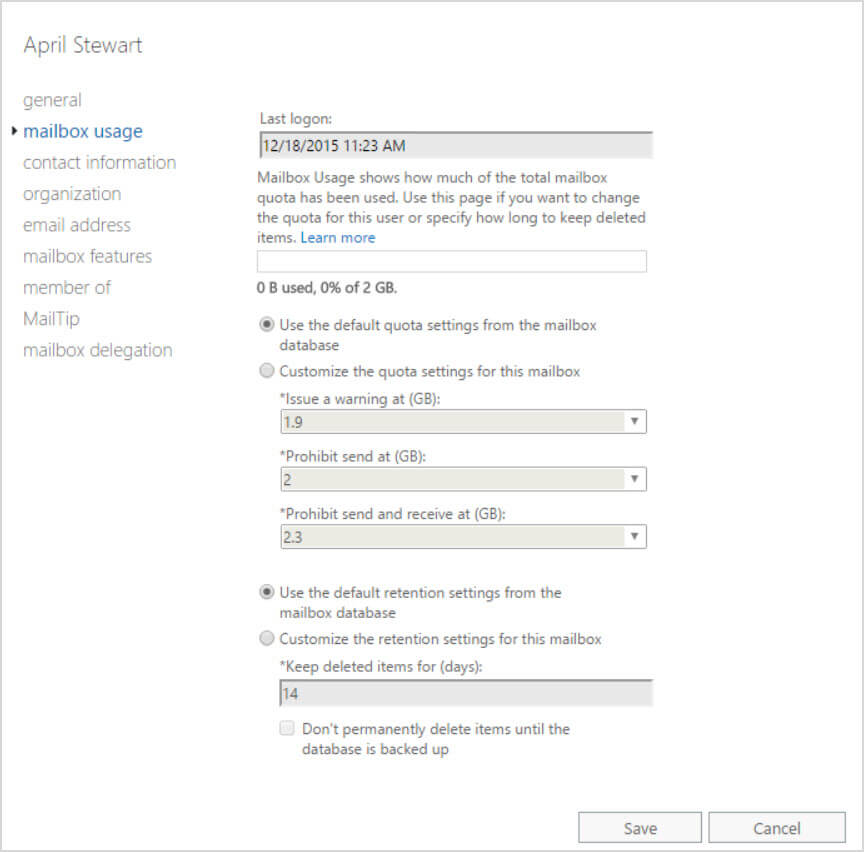

# Configure Deleted Item retention and Recoverable Items quotas

 **Summary**: Learn how to configure the deleted item retention period for a mailbox or mailbox database in Exchange 2016.
  
When a user deletes items from the Deleted Items default folder by using the Delete, Shift+Delete, or **Empty Deleted Items Folder** actions, the items are moved to the **Recoverable Items\Deletions** folder. The duration that deleted items remain in this folder is based on the deleted item retention settings configured for the mailbox database or the mailbox. By default, a mailbox database is configured to retain deleted items for 14 days, and the recoverable items warning quota and recoverable items quota are set to 20 gigabytes (GB) and 30 GB respectively. 
  
> [!NOTE]
> Before the retention time for deleted items elapses,Outlook and Outlook on the web users can recover deleted items by using the Recover Deleted Items feature. To learn more about these features, see the "Recover deleted items" topic for [Outlook 2013 and Outlook 2016](https://go.microsoft.com/fwlink/p/?LinkId=821537) or [Outlook on the web](https://go.microsoft.com/fwlink/p/?linkId=198207). 
  
You can use the Exchange Management Shell to configure deleted item retention settings and recoverable items quotas for a mailbox or mailbox database. Deleted item retention settings are ignored when a mailbox is placed on In-Place Hold or litigation hold.
  
To learn more about deleted item retention, the Recoverable Items folder, In-Place Hold, and litigation hold, see [Recoverable Items folder in Exchange 2016](../../policy-and-compliance/recoverable-items-folder/recoverable-items-folder.md).
  
## What do you need to know before you begin?

- Estimated time to completion: 5 minutes.
    
- You need to be assigned permissions before you can perform this procedure or procedures. To see what permissions you need, see the "Messaging records management" entry in the [Messaging policy and compliance permissions in Exchange 2016](../../permissions/feature-permissions/policy-and-compliance-permissions.md) topic. 
    
- For information about keyboard shortcuts that may apply to the procedures in this topic, see [Keyboard shortcuts in the Exchange admin center](../../about-documentation/exchange-admin-center-keyboard-shortcuts.md).
    
> [!TIP]
> Having problems? Ask for help in the Exchange forums. Visit the forums at: [Exchange Server](https://go.microsoft.com/fwlink/p/?linkId=60612), [Exchange Online](https://go.microsoft.com/fwlink/p/?linkId=267542), or [Exchange Online Protection](https://go.microsoft.com/fwlink/p/?linkId=285351). 
  
## Configure deleted item retention for a mailbox

 **Use the Exchange admin center (EAC) to configure deleted item retention for a mailbox**
  
1. Navigate to **Recipients** \> **Mailboxes**.
    
2. In the list view, select a mailbox, and then click **Edit**.
    
3. On the mailbox property page, click **Mailbox usage**, click **More options**, and then select one of the following:
    
  - **Use the default retention settings from the mailbox database**: Use the deleted item retention setting that's configured for the mailbox database.
    
  - **Customize the settings for this mailbox**: Configure deleted item retention settings for the mailbox.
    
    **\*Keep deleted items for (days)**: Displays the length of time that deleted items are retained before they're permanently deleted and can't be recovered by the user. When the mailbox is created, this value is based on the deleted item retention settings configured for the mailbox database. By default, a mailbox database is configured to retain deleted items for 14 days. The value range for this property is from 0 through 24,855 days.
    
  - **Don't permanently delete items until the database is backed up**: Check this box to prevent mailboxes and email messages from being deleted until after the mailbox database on which the mailbox is located has been backed up.
    

  
 **Use the Exchange Management Shell to configure deleted item retention for a mailbox**
  
This example configures April Stewart's mailbox to retain deleted items for 30 days.
  
```
Set-Mailbox -Identity - "April Stewart" -RetainDeletedItemsFor 30
```

For detailed syntax and parameter information, see [Set-Mailbox](http://technet.microsoft.com/library/a0d413b9-d949-4df6-ba96-ac0906dedae2.aspx).
  
## Use the Exchange Management Shell to configure recoverable items quotas for a mailbox

> [!NOTE]
> You can't use the EAC to configure recoverable items quotas for a mailbox. 
  
This example configures a recoverable items warning quota of 12 GB and a recoverable items quota of 15 GB for April Stewart's mailbox.
  
```
Set-Mailbox -Identity "April Stewart" -RecoverableItemsWarningQuota 12GB -RecoverableItemsQuota 15GB -UseDatabaseQuotaDefaults $false
```

> [!NOTE]
> To configure a mailbox to use different recoverable items quotas than the mailbox database in which it resides, you must set the _UseDatabaseQuotaDefaults_ parameter to `$false`. 
  
For detailed syntax and parameter information, see [Set-Mailbox](http://technet.microsoft.com/library/a0d413b9-d949-4df6-ba96-ac0906dedae2.aspx).
  
## Use the Exchange Management Shell to configure deleted item retention for a mailbox database

> [!NOTE]
> You can't use the EAC to configure deleted item retention for a mailbox database. 
  
This example configures a deleted item retention period of 10 days for the mailbox database MDB2.
  
```
Set-MailboxDatabase -Identity MDB2 -DeletedItemRetention 10
```

For detailed syntax and parameter information, see [Set-MailboxDatabase](http://technet.microsoft.com/library/a01edc66-bc10-4f65-9df4-432cb9e88f58.aspx).
  
## Use the Exchange Management Shell to configure recoverable items quotas for a mailbox database

> [!NOTE]
> You can't use the EAC to configure recoverable items quotas for a mailbox database 
  
This example configures a recoverable items warning quota of 15 GB and a recoverable items quota of 20 GB on mailbox database MDB2.
  
```
Set-MailboxDatabase -Identity MDB2 -RecoverableItemsWarningQuota 15GB -RecoverableItemsQuota 20GB
```

For detailed syntax and parameter information, see [Set-MailboxDatabase](http://technet.microsoft.com/library/a01edc66-bc10-4f65-9df4-432cb9e88f58.aspx).
  

