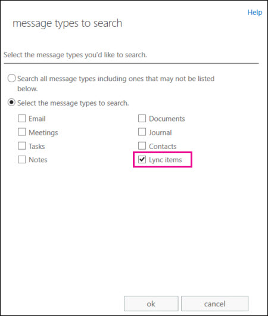

# Archive Lync conversations and meeting content to Exchange 2013

_**Applies to:** Exchange Server 2013_

In on-premises deployments, you can archive Lync 2013 content to Exchange 2013 mailboxes. This requires placing a Litigation Hold or an In-Place Hold on the user's mailbox. When Lync content is permanently deleted by a user whose mailbox is on hold, the archived Lync content is preserved in the Recoverable Items folder in the user's mailbox. It's not visible to users but it's included in eDiscovery searches.

When you place a mailbox on Litigation Hold, all content types, including Lync items, are preserved. By default, this is also the case when you create an In-Place Hold. However, if you want to use an In-Place Hold to preserve only Lync items, you can use the **select message types** option from the **In-Place eDiscovery & Hold** wizard to select **Lync items**, as shown in the screenshot below.

> [!NOTE]
> You can also configure an In-Place Hold to exclude Lync items. For example, organizations may prefer to preserve instant message and voice mail items for a shorter period of time than other types of content. To implement this type of hold policy, you would create an In-Place Hold to preserve content for a long period of time (for example, 7 years) and exclude Lync items from this hold. Then you would create another In-Place Hold with a shorter hold duration that preserves only Lync items. You can also specify how long the content should be preserved. For more information about creating a hold with a specific duration, see [In-Place Hold and Litigation Hold](in-place-and-litigation-holds-exchange-2013-help.md).

See the following topics for step-by-step instructions for placing a user on hold:

- [Create or remove an In-Place Hold](create-or-remove-in-place-holds-exchange-2013-help.md)

- [Place a mailbox on Litigation Hold](place-a-mailbox-on-litigation-hold-exchange-2013-help.md)

For additional management tasks related to archiving, see [Manage In-Place Archives in Exchange 2013](http://technet.microsoft.com/library/49ef4a3e-d209-4fb2-80a3-6132b0f69bd0.aspx).

## More information

- Archiving of Lync content occurs on the server, independent of whether the user has Lync client configured to [save Lync IM conversations in the Conversation History folder](https://go.microsoft.com/fwlink/p/?LinkId=400589).

- Archiving of Lync content begins after the user is placed on Litigation Hold or In-Place Hold. To ensure user's Lync communications are archived from the time their account is created, place the account on hold immediately after it's created.

Additionally, in on-premises Exchange 2013 and Lync 2013 deployments:

- You must configure OAuth authentication between Lync 2013 and Exchange 2013. For details, see [Integration with SharePoint and Lync](http://technet.microsoft.com/library/056b29f6-e0e9-4974-b763-002518857a93.aspx).

- You can also archive Lync 2013 content to Exchange 2013 regardless of whether a user is placed on hold. This is done by configuring the user's Exchange Archiving Policy. Use the `Set-CsUser` cmdlet on Lync 2013 server to set the Lync user's _ExchangeArchivingPolicy_ property to `ArchivingToExchange`.

- For more details about archiving Lync content in on-premises deployments, see [Planning for Archiving](https://go.microsoft.com/fwlink/p/?LinkId=400590) in Lync 2013 documentation.
