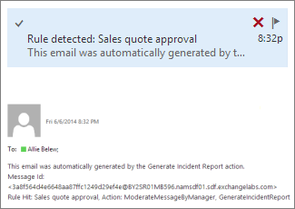
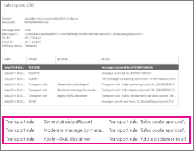

# Test a transport rule in Exchange 2013

_**Applies to:**: Exchange Server 2013_

Each time you create a transport rule, you should test it before turning it on. This way, if you accidentally create a condition that doesn't do exactly what you want or interacts with other rules in unexpected ways, you won't have any unintended consequences.

> [!IMPORTANT]
> Wait 30 minutes after creating a rule before you test it. If you test immediately after you create the rule, you may get inconsistent behavior. If you're using Exchange Server and have multiple Exchange servers, it may take even longer for all the servers to receive the rule.

## Step 1: Create a rule in test mode

You can evaluate the conditions for a rule without taking any actions that impact mail flow by choosing a test mode. You can set up a rule so that you get an email notification any time the rule is matched, or you can [look at the message trace](#look-at-the-message-trace) for messages that might match the rule. There are two test modes:

- **Test without Policy Tips**: Use this mode together with an incident report action, and you can receive an email message each time an email matches the rule.

- **Test with Policy Tips**: This mode is only available if you're using [Data loss prevention](data-loss-prevention-exchange-2013-help.md) (DLP). With this mode, a message is set to the sender when a message they are sending matches a policy, but no mail flow actions are taken.

Here's what you'll see when a rule is matched if you include the incident report action:

### Use a test mode with an incident report action

1. In the Exchange admin center (EAC), go to **Mail flow** \> **Rules**.

2. Create a new rule, or select an existing rule, and then select **Edit**.

3. Scroll down to the **Choose a mode for this rule** section, and then select **Test without Policy Tips** or **Test with Policy Tips**.

4. Add an incident report action:

   1. Select **Add action**, or, if this isn't visible, select **More options**, and then select **Add action**.

   2. Select **Generate incident report and send it to**.

   3. Click **Select one...** and select yourself or someone else.

   4. Select **Include message properties**, and then select any message properties that you want included in the email you receive. If you don't select any, you will still get an email when the rule is matched.

   5. Select **Save**.

## Step 2: Evaluate whether your rule does what you intend

To test a rule, you can either send enough test messages to confirm that what you expect happens, or look at the message trace for messages that people in your organization send. Be sure to evaluate the following types of messages:

- Messages that you expect to match the rule

- Messages that you don't expect to match the rule

- Messages sent to and from people in your organization

- Messages sent to and from people outside your organization

- Replies to messages that match the rule

- Messages that might cause interactions between multiple rules

### Tips for sending test messages

One way to test is to sign in as both the sender and recipient of a test message.

Because a web browser typically doesn't let you have simultaneous open sessions on the same computer signed in to multiple accounts, you can use [Internet Explorer InPrivate Browsing](https://go.microsoft.com/fwlink/p/?LinkId=402784), or a different computer, device, or web browser for each user.

### Look at the message trace

The message trace includes an entry for each rule that is matched for the message, and an entry for each action the rule takes. This is useful for tracking what happens to test messages, and also for tracking what happens to real messages going through your organization.

1. In the EAC, go to **Mail flow** \> **Message trace**.

2. Find the messages that you want to trace by using criteria such as the sender and the date sent. For help specifying criteria, see [Run a Message Trace and View Results](http://technet.microsoft.com/library/74a9fc59-7e0e-4832-baf9-2a86418b0079.aspx).

3. After locating the message you want to trace, double-click it to view details about the message.

4. Look in the **Event** column for **Transport rule**. The **Action** column shows the specific action taken.

## Step 3: When you're done testing, set the rule to enforce

1. In the EAC, go to **Mail flow** \> **Rules**.

2. Select a rule, and then select **Edit**.

3. Select **Enforce**.

4. If you used an action to generate an incident report, select the action and then select **Remove**.

5. Select **Save**.

> [!TIP]
> To avoid surprises, inform your users about new rules.

## Troubleshooting suggestions

Here are some common problems and resolutions:

- **Everything looks right, but the rule isn't working**:

  Occasionally it takes longer than 15 minutes for a new mail flow to be available. Wait a few hours, and then test again. Also check to see if another rule might be interfering. Try changing this rule to priority 0 by moving it to the top of the list.

- **Disclaimer is added to original message and all replies, instead of just the original message**:

  To avoid this, you can add an exception to your disclaimer rule to look for a unique phrase in the disclaimer.

- **My rule has two conditions, and I want the action to happen when either of the conditions is met, but it only is matched when both conditions are met**:

  You need to create two rules, one for each condition. You can easily copy the rule by selecting **Copy** and then remove one condition from the original and the other condition from the copy.

- **I'm working with distribution groups, and 'The sender is' (SentTo) doesn't seem to be working**:

  **SentTo** matches messages where one of the recipients is a mailbox, mail-enabled user, or contact, but you can't specify a distribution group with this condition. Instead, use **To box contains a member of this group** (**SentToMemberOf**).

## Need more help?

[Manage transport rules in Exchange 2013](manage-transport-rules-exchange-2013-help.md)

[Transport Rules](http://technet.microsoft.com/library/c3d2031c-fb7b-4866-8ae1-32928d0138ef.aspx)
