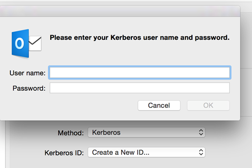

# Use Kerberos authentication with Outlook 2016 for Mac

Outlook 2016 for Mac supports Kerberos protocol as a method of authentication with Microsoft Exchange Server and standalone LDAP accounts. Kerberos protocol uses cryptography to help provide secure mutual authentication for a network connection between a client and a server, or between two servers. 
  
Kerberos protocol is based on ticketing. In this scheme, a client must provide a valid user name and password only once to prove their identity to an authentication server. Then, the authentication server grants the client strongly encrypted tickets that include client information and the session key that expires after a specified period of time. The client then attempts to decrypt the ticket by using its password. If the client successfully decrypts the ticket, it keeps the ticket, which is now shared by the client and the server. This decrypted ticket indicates the proof of the client's identity and is used to authenticate the client. The timestamp included in the ticket indicates that it's a recently generated ticket and is not a replay attack. If an attacker tries to capture and decrypt the information in a ticket, the breach will be limited to the current session. The client can use the same ticket on the network to request other network resources. To use this ticketing scheme, both the client and the server must have a trusted connection to the domain Key Distribution Center (KDC). 
  
Mac OS X includes built-in support for Microsoft Kerberos authentication and Active Directory authentication policies, such as password changes, expiration and forced password changes, and Active Directory replication and failover. By leveraging the Mac OS X Kerberos service, Outlook for Mac uses the single sign-on mechanism to offer better password handling and a cleaner setup experience.
  
## Benefits of using Kerberos authentication

Kerberos provides a secure, single sign-on, trusted third-party, mutual authentication service.
  
- **Secure** Kerberos is secure because it does not transmit passwords over the network in clear text. 
    
- **Single sign-on** End users only need to log in once to access all network resources that support Kerberos authentication. After a user is authenticated through Kerberos at the start of a login session, their credentials are transparently passed to every resource that they access during the day. 
    
- **Trusted third-party** Kerberos works through a centralized authentication server that all systems on the network inherently trust. All authentication requests are routed through the centralized Kerberos server. 
    
- **Mutual authentication** Protects the confidentiality of sensitive information by verifying a user's identity and the identity of the server that they are communicating with. 
    
## Kerberos authentication and Outlook

You should determine the type of authentication that your organization's Exchange server uses. You can use Kerberos protocol or the other supported authentication methods: NTLM, basic authentication, or forms-based authentication for the Exchange server. In Outlook for Mac, you do not have control over the type of authentication methods that users choose. You should ask your users to choose Kerberos authentication if your organization's Exchange server uses it and their computers are connected to the corporate network.
  
When you set up your Exchange account in Outlook for Mac, you must click **Kerberos** on the **Method** pop-up menu, or for all other types of authentication, click **User Name and Password**. When you choose the Kerberos authentication method, the **User Name** (which includes the domain) and **Password** fields are hidden. When Kerberos protocol is enabled, it is used to attempt authentication against all of the servers related to the account, such as HTTP or LDAP. When Kerberos protocol is disabled in the account settings, Kerberos authentication will not be attempted against any of the servers related to the account. 
  
For new Exchange accounts, Kerberos protocol is disabled by default with **None** selected on the **Kerberos ID** pop-up menu. When you enable Kerberos protocol, Outlook for Mac allows the user to choose or create a valid Kerberos ID. If the account is created using auto-detect, the **Kerberos ID** pop-up menu is populated with the existing ID. Kerberos protocol attempts auto-detect against servers if there is at least one Kerberos ticket present in the Mac OS X credential cache or a _kerberos._tcp.\<domain\> record is available from the Domain Name Server (DNS). If the auto-detect process is successful, the ticket is populated on the account's **Kerberos ID** pop-up menu. If the auto-detect process does not include a successful Kerberos authentication, the account's Kerberos setting will be disabled and **Kerberos ID** pop-up menu is set to **None**.
  
To create a new Kerberos ID, select **Create a New ID** on the **Kerberos ID** pop-up menu, and provide the user name and password of the new Kerberos ID when prompted as shown in the following image. 
  

  
## Kerberos authentication for administrators

Kerberos authentication might fail if the account's primary mailbox server does not support Kerberos protocol or if the KDC fails. To ensure that users are authenticated successfully by using Kerberos protocol, you should make sure that the KDC is up and running for users to access the different network services. In enterprise and mission-critical environments, it's important for administrators to create at least one failover KDC. 
  
When Kerberos authentication fails, Outlook for Mac provides the option of using the other supported authentication mechanisms. The types of authentication methods that are available for Microsoft Exchange e-mail accounts can vary depending on whether authentication is performed on a front-end server or on a back-end server.
  

