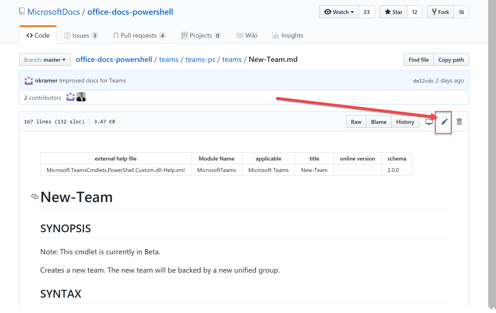
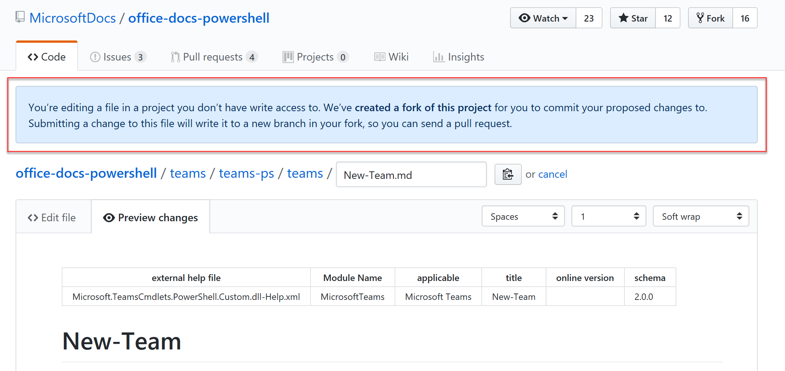

# Overview
A repository to hold the help content for Exchange Server, Exchange Online, and Outlook. The expert knowledge around Exchange is distributed amongst customers, MVPs, partners, product teams, support, and other community members. This open repo is designed to provide a mechanism for those that wish to contribute their knowledge back into the docs so others can benefit.

# Learn How To Contribute
Anyone who's interested can contribute to the topics. When you contribute your work will go directly into the content set after being merged. It will then show up on docs.microsoft.com and you will be listed as a contributor at: https://github.com/MicrosoftDocs/OfficeDocs-Exchange/graphs/contributors

# Quick Start

## Contribute using the GitHub website 

### NOTE: The following guidance is for Office PowerShell but the same process applies for any Markdown document on GitHub.

1. Open your browser, login to GitHub, and then navigate to https://github.com/microsoftdocs/office-docs-powershell
2. Browse to the file you want to edit. In this example we will edit https://github.com/MicrosoftDocs/office-docs-powershell/blob/master/teams/teams-ps/teams/New-Team.md and add a link in the Related Links section.
3. Click the Edit icon which looks like a pencil in the upper right corner. 

4. Your browser will then open the file in an edit window. We want to add a link so we scroll down to the Related Links section and add the link in the correct format.

**Note** Since you are likely not a maintainer of the Git repository GitHub will automatically 'Fork' the project into your personal GitHub account. A fork is just an exact copy of the repository in your own account so that you have total access to make edits. You are now 'editing' a copy of the project in your own GitHub account. You can always find it again by looking at your GitHub Repositories in your GitHub Profile (drop-down from your name in top right).

5. You can click the Preview changes link to see what the changes will look like.

6. Once you are satisified with your work, go to the **Propose file change** area at the bottom of the topic. Enter a title title and other description informaton and then click **Propose file change**.

7. On the next screen, click **Create pull request**.

# Microsoft Open Source Code of Conduct

## Contributing

This project welcomes contributions and suggestions.  Most contributions require you to agree to a
Contributor License Agreement (CLA) declaring that you have the right to, and actually do, grant us
the rights to use your contribution. For details, visit https://cla.microsoft.com.

When you submit a pull request, a CLA-bot will automatically determine whether you need to provide
a CLA and decorate the PR appropriately (e.g, label, comment). Simply follow the instructions
provided by the bot. You will only need to do this once across all repos using our CLA.

This project has adopted the [Microsoft Open Source Code of Conduct](https://opensource.microsoft.com/codeofconduct/).
For more information see the [Code of Conduct FAQ](https://opensource.microsoft.com/codeofconduct/faq/) or
contact [opencode@microsoft.com](mailto:opencode@microsoft.com) with any additional questions or comments.

## Legal Notices

Microsoft and any contributors grant you a license to the Microsoft documentation and other content
in this repository under the [Creative Commons Attribution 4.0 International Public License](https://creativecommons.org/licenses/by/4.0/legalcode),
see the [LICENSE](LICENSE) file, and grant you a license to any code in the repository under the [MIT License](https://opensource.org/licenses/MIT), see the
[LICENSE-CODE](LICENSE-CODE) file.

Microsoft, Windows, Microsoft Azure and/or other Microsoft products and services referenced in the documentation
may be either trademarks or registered trademarks of Microsoft in the United States and/or other countries.
The licenses for this project do not grant you rights to use any Microsoft names, logos, or trademarks.
Microsoft's general trademark guidelines can be found at http://go.microsoft.com/fwlink/?LinkID=254653.

Privacy information can be found at https://privacy.microsoft.com/en-us/.

Microsoft and any contributors reserve all others rights, whether under their respective copyrights, patents,
or trademarks, whether by implication, estoppel or otherwise.
